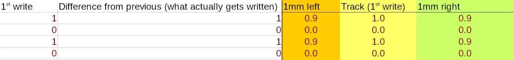
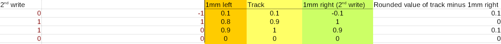

Community Dataverses
====================

This document is a collection of essays, theories, and explanations of
Systemspace lore, written by our community.

Note that the theories present here are mostly conjecture, and may
not be true - those confirmed by Tsuki to be correct will be marked 
as "[TSUKI CONFIRMED]", and those commented on by Tsuki will be marked as
"[TSUKI VERIFIED]".

---------

.. contents::

---------

1336's Auroraic Echoing hypothesis [TSUKI CONFIRMED]
====================================================

Section 1: How do hard drives (and tapes) work?
-----------------------------------------------

Disclaimer: this section is about old hard drives. The new ones work a bit 
differently. It's also a *huge* simplification.

Hard drives (and tapes) store data on magnetic tracks. A magnetized
read/write head moves over the track, magnetizing portions of it with varying 
strength. The strength of the magnetic field dictates what value a section of 
the track (most often, a "bit") holds. When overwriting data, if the portion 
being overwritten is the same, the head does nothing; if it's different, it 
overwrites it with the difference between the old and new data.

It is possible to recover overwritten data from tapes and old hard drives. 
Because the positioning of the read/write head can never be perfectly reproduced
(nothing can be physically perfectly reproduced), presumably the read/write head
was positioned a bit differently during the first write and the overwriting. 
Let's, for the sake of this explanation, imagine that a 1mm difference (this is 
obviously nowhere near correct) in distance makes the magnetic field weaker by 
10%.

Let's write the values ``1 0 1 0`` into four cells on the tape first. Assume our
writing head happened to be perfectly above the center of the track:

Now we overwrite the data with ``0 1 1 0``. Assume the writing head happened to
be 1mm off the track to the right.

  
As you can see, the values on the actual track rarely are perfectly equal to one
and zero - the computer rounds them to the nearest value to get the actual 
result. Due to this property, we can use a particular trick. If we take the
intended values (the rounded ones) on the track, and subtract the values offset
exactly as much as the writing head was during the second pass, we get *the
original values from the first write, except diminished by a factor of ten!* It
is now trivial to simply multiply the values by ten - and we have recovered the
original data.

Those tiny differences that allowed us to recover the original data are called
"remnant data".

Section 2: "Why should I care?" and a few words about Life and Aurora
---------------------------------------------------------------------
We've heard about Auroraic Echoing. It's a way for stuff from a system, or from
the past, to appear in a different system. I think that Aurora is like space on 
a hard drive. Things in Systems, like programs and files on your computer, take 
up Aurora (the space on your drive), and it's freed again when you remove those 
files. My theory is, now, that when you free ("negate") the Aurora, it can be 
assigned to a different System to use. 

Tsuki mentioned today that a good system should always assign the same Aurora to
the same thing. The main issues with Life are that 1) it doesn't negate Aurora 
and 2) it doesn't reuse Aurora. This is super important. It means all Aurora 
that Life uses is from outside Life. Now, if we consider Aurora to be like space
on a hard drive, it means that technically all of the Aurora in Life could come 
from different Systems, and have the "remnant data" that I explained above. This
remnant Aurora data might be the mechanism behind Auroraic Echoing.

~1336

Tsuki's response:
-----------------

You pretty much hit the nail perfectly on the head. The Aurora is still slightly
in its previous state when it enters Life, causing it to bend things as they 
would in their previous state.

-----------------

404's Life -> LFE time conversion table [TSUKI CONFIRMED]
=========================================================

::

    LFE vs Life: AOC edition (confirmed)
    ---------------------------
    0.3 LFE seconds = 1 Life second
    3 LFE sec = 10 Life sec
    18 LFE sec = 60 Life sec = 1 Life minute
    1080 LFE sec = 60 Life minutes
    25920 LFE sec / 24 Life hours = 1 Life day
    ----------------------------
    32 hrs of 64 mins = 24 hrs of 60 mins
    16 hrs of 128 mins = 12 hrs of 120 mins
    8 hrs of 256 mins = 6 hrs of 240 mins
    24 hrs of 768 mins = 18 hrs of 720 mins
    -----------------------------
    233 280 LFE sec (2.7 lfe days)
    = 12960 minutes Life (9 days)
    -----------------------------
    86,400 LFE sec / LFE day
    32 hrs per day
    64 mins per hour
    -----------------------------
    1 day     = 32 hours
    1 hour    = 64 minutes
    1 minute  = 42.1875 (42 3/16) seconds
    2 700 sec = hour
    42.1875 s = 1 min
    48 min    = 2,025 sec = 3/4 of one hour
    4050 s    = 1.5 hours
    8100 s    = 3 hours
    16200 s   = 6 hours
    32400 s   = 12 hours
    64800 s   = 24 hours = .75 days
    48 hours  = 1.5 days
    96 hours  = 3 days

    32 hours  = 1 day
    512 days  = 1 Halcyon
    4 Halcyon = 1 year

    1 year = 2,048 days
        
~404

Note:

1 omniversal cycle = 720 Hanacyons

1 Hanacyon = 4 Halcyons

1 Halcyon = 16 Parcyons

1 Parcyon = 32 Hi

1 Hi = 32 Fen

1 Fen = 64 Tan

1 Tan = 64 Kan

An omniversal cycle is kinda like a Life millenium.

A Hanacyon is kinda like a Life year.

A Halcyon is kinda like a quarter of a Life year.

A Parcyon is kinda like a Life week.

A Hi is kinda like a quarter of a Life day.

A Fen is kinda like fifteen Life minutes.

A Systemspatial spin is the smallest possible division of time - kinda like a Life Planck time.

~1336

1426 on the reality of Systems [TSUKI VERIFIED]
===============================================

Original message
----------------

I always thought Aurora creates "real" physical worlds. When you "program" it to 
create a metal box in a system, it doesn't simulate a metal box, it creates a 
real, physical metal box. The same goes for laws of phisics and everything else.
Referring to it as a simulation just makes it all way easier to understand, as 
it is a concept we are very used to, and it shares a lot in common with how 
Systemspace works. So Systems would be different realities that exist in an 
"upper-level space" called Systemspace, if that makes sense.

~1426

Tsuki's response
----------------

Systems are as much of a simulation as an SQL database is a simulation of a
drawer with folders and stuff. Is a .txt file a simulation of a book? Is an
image a simulation of an event? You can't say it's a simulation because it 
doesn't copy anything, just like .txt files aren't trying to be books.

The theory expanded
-------------------

To expand on the previous point, Tsuki confirmed that from the point of view of Systemspace, Systems are indeed physical and not digital. So Aurora is a physical energy that can be used to create physical realities by influencing it, "programming" it with means we know nothing about.

Still, this does not mean Systems are "real" in an absolute sense. Of course they are real for those who live inside them, Life is real to us as we can touch it, feel it and percieve it with all of our senses all the times in a consistent way. Now we know Systems are real from Systemspace's perspective too as they are not emulated by machines but take full physical form thanks to Aurora.

Now we have a base understanding of the nature of Systems, what we miss is knowledge about Systemspace's nature. We know there is an "outside", an even higher level, how does Systemspace relate to the  "outside"?

We know nothing about it, the only thing Tsuki hinted at is the existence of an "hyperdimensional server room" which could point to Systemspace being a digital creation but this is only a speculation, we will need more information before progressing this topic further.

~1426

1336 and 536 on how a System can have infinite realities yet take up a finite amount of Aurora [TSUKI VERIFIED/CONFIRMED?]
==========================================================================================================================

536's question on infinite realities
------------------------------------

  I've been meaning to ask this for a while. It's been said before that Life "simulates" every possible version of itself. How does
  that work? Wouldn't that use an infinite amount of Aurora? Are all of those versions as "real" as each other, is there a Tsukirep
  in all of them, or just our reality? If just ours, why is it ours in particular?
  
1336, explaining Systemspace with maths
---------------------------------------

  Assume that the state of a particular reality at a particular point in time is stored as, let's say, a sequence of ten numbers. Let's
  say that storing one number takes 1A. Naively, this means that a reality takes 10A, and storing infinitely many realities would take
  up an infinite amount of Aurora, right? What's even more concerning is that in a System, time passes, and the numbers change with
  time, so there is seemingly no way to store them persistently and efficiently. However, there is a much better way. If we say that a
  reality is like a sequence of numbers, we can define a System as all the possible sequences that fit a certain definition - that are
  part of one System. Thus, imagine that our Life was the first ten Fibonacci numbers:
  
  0 1 1 2 3 5 8 13 21 34
  
  Let's say that we could move forwards and backwards in time by finding the previous/next numbers of the sequence:
  
  1 1 2 3 5 7 13 21 34 55
  
  I mentioned we can define a System as all the possible sequences that fit a certain definition. Let's do that now. We can define all
  possible sequences that are similar to the Fibonacci sequence as, for example:
  
  ::
  
    aₙ = aₙ₋₁ + aₙ₋₂
  
  for some a₀, a₁.
  
  Since we implicitly defined a particular reality as a defined sequence of numbers, we can now say that it is the above sequence for
  a given a₀, a₁. Thus, we can find different realities simply by changing the values of a₀ and a₁.
  
  Since we defined the state of a particular reality at a particular point in time as a sequence of ten numbers, we can say that to find
  a point in time ``n`` for a reality defined as a sequence ``a``, you just grab ``aₙ, aₙ₊₁, ..., aₙ₊₉``.
  
  We have now defined a complete System, with a method to find all of its infinite alternate realities and all of its infinite points in
  time, within just a few lines. We didn't have to use an infinite amount of space for storing it!
  
  There are some interesting takeaways, though. Notice that a sequence ``aₙ = aₙ₋₁ + aₙ₋₂; a₀ = 0, a₁ = 1`` (the Fibonacci sequence: 
  0 1 1 2 3 ...), and, for example, the sequence ``aₙ = aₙ₋₁ + aₙ₋₂; a₀ = 1, a₁ = 2`` (1 2 3 5 8 ...) are *the exact same sequence*, but
  "offset" a bit.
  
  Let's call the sequence representing our reality ``r``. The above paragraph means we can *always* find a sequence ``a`` where 
  ``aₙ = rₙ₋₁`` - a reality where the earliest possible point in time comes *after* the "start" of our reality. We can also find
  a sequence ``a`` where ``aₙ = rₙ₊₁`` - a reality where the earliest possible point in time was *before* the "start" of our reality - an
  example would be a sequence ``-8 5 -3 2 -1 1 0 1 1 2 ...`` (google "bidirectional Fibonacci").
  
  This means two important things. First of all, the Last Thursday hypothesis is true, but it is true in a peculiar way - namely, 
  *for all possible points in time, there exists a reality of Life that didn't exist before that point of time*. To put it another way,
  there exists a point in Systemspace time at which the Life was created, for every point in Life time there exists a reality of Life
  that didn't exist before then, but there doesn't exist a singular point in Life time at which all realities of Life were created.
  
Tsuki's response
----------------

  There is no start or finish to Life, but there are points in time where a System is linked and unlinked.
  You cannot travel back in time farther than the last link, because you'll be thrown out, as there won't be a path from that point in
  time to the System. You can't travel further in time than the next unlink either.
  *However*, Last Thursdayism isn't wrong.
  You can make a System, make everyone forget the link date, and put a mechanism in place to generate "fake" time before the link date.
  Something having happened before the link date doesn't mean it's not noticeable or doesn't have an impact on post-link history.
  
536 on "fake" time
------------------

  Tsuki did describe that there are many timelines, and that the souls collectively decide which one is "real", or the "active" one.
  Am I right in assuming, if that's the case, that apparent pre-human history is the result of the link letting in souls that "decided
  on" one of the infinite Life timelines floating around from before the Link?
  
Tsuki with the in-depth response
--------------------------------

  Pretty much.
