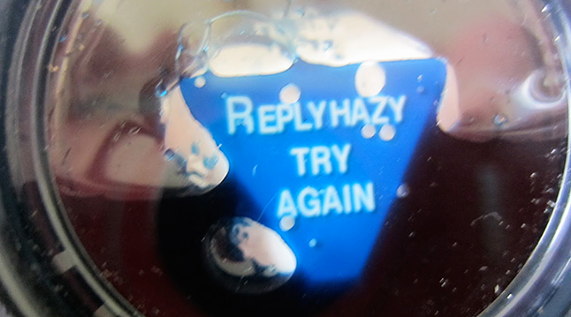
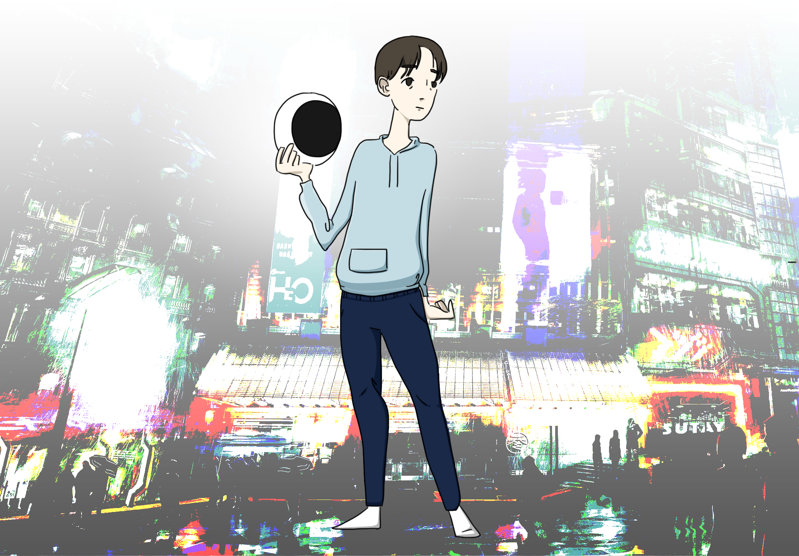
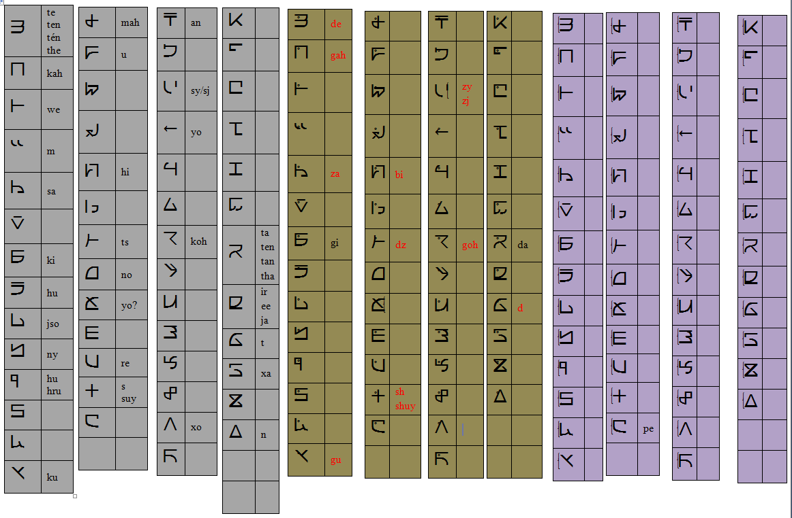

-Systemspace Compendium Revision 16
===================================

This document serves as a repository of all current knowledge of Systemspace. It has been categorized and spelling and grammar mistakes have been corrected. Some questions and answers have been slightly reformatted but have been in a manner which ensures that no meaning or context is lost. Searching through the Discord with snippets of the question/answer pairs, or just backtracking through all of Tsuki's messages will verify this. For information taken from 4chan's /r9k/ board and TSUKICHAN's /lfe/ board, archives of the original threads are verified and can be found on desuarchive. Honorable mention to Unterminator for providing the initial pastebins which got me started, and to 1336 (Fox) for setting me up on Github. - Yari (655)

Migrant in charge of formatting/publishing: Yari (655)

Index
=====

#. `Life`_
#. `About LFE`_

   #. `Species`_
   #. `Synapsian`_
   #. `Science`_
   #. `Economy/Government`_
   #. `Culture`_
   #. `Technology`_
   #. `Magic`_
   #. `System Parameters`_

#. `Souls, Experience, Memories, and Users`_
#. `Aurora`_
#. `TSUKI and its Subsidiaries`_
#. `Aspects of the TSUKI Project`_
#. `Tsuki, the Representative`_
#. `The Key`_
#. `Systems / Systemspace in General`_

   #. `The Ha7 System`_

#. `Hyakanghen`_
#. `Statements Made by Tsuki`_
#. `Text Archive of systemspace.link as of Jun 02 2017`_

   #. `/HOME PAGE/`_
   #. `/STATUS PAGE/`_
   #. `/REGISTER PAGE/`_
   #. `/LISTING PAGE/`_
   #. `/GLOSSARY PAGE/`_
   #. `/FAQ PAGE/`_
   #. `/NEWS PAGE/`_
   #. `/DATAVERSES PAGE/`_

      #. `/INFINITY PAGE/`_
      #. `/INFINITY II PAGE/`_
      #. `/INFINITY III PAGE/`_
      #. `/SYNAPSIAN FONT PAGE/`_
      #. `/SYNAPSCRIPT PAGE/`_
      #. `/TSUKI'S THOUGHTS PAGE/`_

         #. `/ECHOES PAGE/`_
         #. `/THE BURDEN OF TRUTH PAGE/`_

   #. `/REPRESENTATIVE PAGE/`_

   SYNAPSE

   #. `/SYNAPSE EXPLORE LFE PAGE/`_
   #. `/SYNAPSE EOT PAGE/`_
   #. `/SYNAPSE ABOUT PAGE/`_

   RISEN

   #. `/RISEN OUR GOAL PAGE/`_
   #. `/RISEN EOT PAGE/`_
   #. `/RISEN ABOUT PAGE/`_

   eNdymioN

   #. `/ENDYMION EOT PAGE/`_
   #. `/ENDYMION ABOUT PAGE/`_

   Misc. Pages

   #. `/404 PAGE/`_

#. `What we know about Synapsian`_

   #. `Synapsian Pronunciation Guide`_
   #. `Collection of Synapsian Names, Phrases, Numbers, and Words`_

#. `Misc`_

-----------------------------------------------------------------

Life
----

Who created Life?
  No one knows.

How old is Life?
  Life has gone through many reboots and iterations since then. Life has been rebooted over 10 million times now.

Why was Life created?
  Life was made to be a peaceful System away from all the action in the others. A System that was even often used for people to seek spiritual enlightenment, as it would be so serene.

How was the universe in Life created?
  Life only has one universe so the Big Bang was just spawned at runtime.
  
  In LFE everything expands up to a limit because of pressure differences. Not sure how it works in Life.
  
If it's due to pressure differences then why is the expansion accelerating?
 We're not sure, it doesn't do that in LFE. Some people say its because our universe has no size limits and that the amount of space it can expand to gets bigger as the universe expands, loading more empty space. But I'm no physicist so I can't really tell you too much, just a (probably misunderstood) explanation from the LFE side.
  
Why are the people in Life in it, exactly?
  You chose to join this System a while ago, and so did everyone else. You expected to see a peaceful System after all, not a broken one using too much Aurora.

If we're living in a System, how is it that non-terminating non-repeating numbers, like Pi, can exist?
  This is a bug in Life.

  The System Life was closed from outside influence a while ago, and humanity slowly forgot about the existence of Systemspace. In other Systems, practically everybody knows.

Tsuki, how can you know this all if Life is supposed to be cut from any interference of other systems?
  I was created with this task in mind - as part of RISEN I can override this rule.

Why can't information be directly transferred to Life from other Systems?
  Life is a closed System, it generally doesn't allow I/O. The fact that I am able to tell you this is merely because Life has some exploits we can use.
  
How similar has each reboot of Life been?
  Very, very similar. It is very possible that humans are tearing away at the thin firm keeping them from the truth. They've done this past iterations, after all. None could leave, however.

You said none of the inhabitants of Life in past iterations never managed to leave. Does that mean doing so is possible?
  Life is so badly coded, that it is possible to leave if you manage to break the System a little. This should not be possible though (usually a blocking System would be sure to be secure), and is very hard to do without outside help.

How far did Life get in past iterations?
  Pretty far, actually. Most iterations were able to figure out on their own that Systemspace exists.

At what point did people start figuring out Aurora and stuff?
  Usually only a few days before the Key restarted the System. It took them very long, and then they almost destroyed themselves. Most iterations couldn't find out how to do that, only that Systemspace exists.
  
Is humanity to blame for Life's problems?
  Humans are not what caused Life to go wrong. It is simply its code being absolutely horrid and broken.

In what way is the code bad?
  Bad soul management, completely fucked database, bad I/O, it's never been touched ever so it's very far behind, it doesn't cache ((ever)), it cycles ALL AURORA ALL THE TIME, and probably above all, it gives everything it's own piece of Aurora instead of giving two identical things the same Aurora.

  The developer behind Life has abandoned this world. The Key has had to reboot it many times, but it only got worse. A concept known as "imanity" has increased with every reboot, and has made humanity stupider.

  You see, Life has an auto-evolve mechanism. It evolves to make itself better. However, when the owner left, they left it in an erroneous state - the evolvement was flipped. Therefore it is actively trying to make itself worse. Just like we got from single-celled creatures to humans, that evolutionary mechanism got from tiny energy usage to giant hog over those many, many iterations.

Will I be able to get back at Life's creator?
  Please don't, if you do find him we could try and fix Life. If we find the creator before July 1st, of course. Afterwards, do whatever you want to be honest, I don't care and I don't think anyone at TSUKI does either.

Wait, but you're saying Life's creator is in Life?
  We have no clue.

So I'm guessing the creator has some kind of password that you guys couldn't crack to fix it yourselves, then?
  He is the only one capable of editing Life, so in a sense you're right.

I imagine it's probably an impossible task to actually try to find him if RISEN, with its vast resources, couldn't pin him down by EID, so he probably shattered?
  That's what we're thinking too.

What distinguishes humans from other races you know of?
   Rather, how should I say it... egoistic. You are creative thinkers though, which is very very good.

Is it a constant inefficiency or one that progressively gets worse?
  The first run of Life went amazing, bit slowly got worse until it required a reboot.

  The insane usage of Life comes from that it tries to develop itself, but goes in the complete opposite direction. With every reboot it gets worse, humans (or whatever sentient species) get dumber, and evolution happens more slowly.

Why are we being allowed to evacuate?
  Because we want to pass on the human spirit. Also because you're interesting.

Why new souls keep coming here? I bet you there have enough measures to prevent others from entering this poorly made System.
  Sadly, due to how open Systemspace is, this is not possible.

Do you have any opinion on quantum physics and claims from scientists that they can "tell" that Life is a simulated reality?
  It is very possible that humans are tearing away at the thin firm keeping them from the truth. They've done this past iterations, after all.

  Quantum physics is just aurorology, in a sense. "Gravity bleeding into the universe from nowhere" would be Auroraic Echoing.

How big of a thing is Life's deletion in Systemspace?
  Life's deletion is a pretty big thing, as it also starts the new era of Systemspace.

Will other forms of life on our planet be preserved somehow?
  The thing is, they don't have souls nor history - it's too much of a gamble.

What makes preserving other forms of life a gamble?
  We'd need to know exactly how they work, and the reward is random.
  
  Frankly, we have no time to take other species to LFE. Or Aurora, or like, manpower.
  
Less advanced forms of life do not have a soul? Why?
  The creator of Life only intended humans to have souls.

  There are smarter organisms than us, by the way. They just haven't been granted souls.

When does the human body acquire a soul?
  At birth.
  
  Every human creates a new soul.

What will be the effects of the unlink on people that are staying in Life?
  All newborn people will have no souls and as such be slightly more hostile.

Once people start being born without souls, do we immediately assume them as more so NPC's, or is there any documented behavior that these husks exhibit?
  Humans will not instantly be able to see a difference between soulless and normal humans. The SlAI (soulless AI, that controls all entities without a soul) is very well developed. I think the main noticeable factors are that humanity will 1) make no real advancements, and 2) will be more hostile.

  The "AI" that we use is just the Aurora taking over.

Do extraterrestrials exist in Life?
  They do not have souls, but they exist.

  LFE currently has a little under 620 septillion souls.

Do you have any examples of Auroraic Echoing influencing Life media?
  I'm not sure, but I'm sure there are quite a few things in our media which were sent over by Auroraic Echoing, although I never really inspected what content.
  
Is it possible for humans to manipulate Aurora in Life?
  It's not supposed to be possible, but it can work.
  
After Life is unlinked, will manipulating Aurora still be possible?
  Yes, it will be possible still, you will be manipulating "fake" Aurora though.

  
About LFE
---------

LFE itself is a gigantic system built by SYNAPSE on top of their open-source framework LFX. It houses over 9.4x10^28 souls, in many different species.

Who created LFE?
  LFE was created by SYNAPSE, a large company which has made a free-to-win System where, as they say, "everyone is important". It's been the largest System for quite some time, and is arguably one of the best.

How can everyone's soul be important in LFE?
  SYNAPSE says they cause everyone to move the branch tree in their own way.

Are there any soulless people in LFE?
  LFE has a no-soul:death-of-body system, so there are no alive bodies without souls (that are supposed to have one).

What does LFE mean?
  It's the names of the most important 3 partitions: Living (all living beings) eFfector (all interactions) Environment (all matter).

  There's more partitions (like U for users).
  
What other partitions of LFE are there, and why are they thought of as seperate categories?
  There's a fuckton, like U for userdata, X for all data for the LFX framework, T for temporal storage, S for snap storage, etc. They are seen as seperate categories because grouping them together would cause a really big mess. Instead the "active partitions" are overlayed onto each other to form the System, and the "inactive partitions" form the backend.

How old is LFE?
  LFE has been around for far longer than Life. It has [had] 128 iterations.

  We've had to reboot LFE a few times now, actually. The version of LFE you'll be starting into will be the 128th iteration.

Will LFE be even better by the time we get there?
  Definitely.
  
Is the history of LFE more fun to read about than the histories of most Life countries?
  It's more interesting definitely as there's less taboo, more things happen (and in general there's more history). Maybe that's just the novelty of it getting to me though, I've gotten jaded from constantly reading EU history :^)
  
Species
-------
  
What type of life exists in LFE?
  Heh, there's so many species and subspecies it'll be impossible to name them all.

  I could try and recreate the LFEian Circle (of all major species), I did so once but it'll be a mess on normal paper.
  
  There's mostly 2 groups, magical beings and scientific beings. Both are usually humanoid - magical beings includes demons, angels and fallen angels, and scientific beings includes datamen, espers and others.

  Espers are usually seen as on the science side and not the magic side.

Are species "designed" by a higher power / intelligence / person, or are they also the product of a kind of natural selection?
  All species native to LFE are mostly natural, but some are created as it is possible to do so. The "native" species as we call them are original from LFE's natural selection though. Some do argue that other species change natural selection and the gene pool, so whether it could be seen as "pure" is something else.
  
What are the sentient races in LFE like?
  They look pretty humanoid, Aurora seems to prefer this sort of build.

  All races have their own perks and weaknesses, I suppose. Synni are good thinkers, but not great fighters.

Could you give an example of one species?
  Well first of all there's always the mainstream ones like the ones you find in the Synapse, but I assume you want something more exotic so how about the Lynlings, who have a skin that perfectly mimics the night sky while flying?

  They're kind of dying out though :(

  They're mainly in south-east Mahuensj, but south Mahuensj is already being conquered by Sanyrle.

  The biggest is probably the Synni - from the Synapse (the enormous area around the Synapsian Mountain (SYNAPSE HQ)). There's also a lot of Espa, at all sorts of different power levels.

What are the Synni and Espa like?
  They're very nice people! Synni are often seem from the outside as very mystic, but once you integrate with them you'll see their true nature :) Espa are very smart, good with their brains!

Are the Synnis anything like humans?
  Yeah, they're quite related to humans I guess.

Tsuki, could you give an example of Synni culture from our perspective?
  I'll see if I can include this in a later Dataverse.

Are there any extremely long-lived species in LFE?
  The Korta are known for living a long time.
  
What is the most powerful species in LFE, in terms of magical powers?
  Hmmmm, probably the Neika - they are very low in quantity, and live very short, but they have amazing magical powers.
  

Synapsian
---------
  
What languages are the names of all these things?
  Synapsian. (mostly)

Is Synapsian a universal language in LFE?
  Far from it.
  
Is Synapsian the default language? Where could someone learn this language?
  You'll learn it in your LFE childhood.

What does Synapsian sound like?
  It sounds rather interesting, it sounds and writes a bit like Hangul or Japanese.

Wouldn't it be near impossible to make a keyboard/font for Synapsian?
  There's only a few characters, but a single character can mean many things, so you "mud" them in a direction. There's not many characters (think slightly more than Japanese), so it's doable. I have no clue how to make them combinable though.

Any way to get a Synapsian dictionary or text for learning?
  I'm working on it!

  A bracket underneath (ground) combines the characters into a cluster. (If multiple characters are written in one space, they automatically clusterize.)

  Clusters represent single words or ideas. Loose characters represent grammar or very simple words.

  (You can also have a ground below a single character to force it into an object state.)

  Pronunciation of loanwords (like katakana) is done with mountain brackets (above the characters).

  The circle acts like a tenten.

  Two different syles of writing Synapsian: Kodaban, with the standard separate glyphs, and iriman, the stylistic handwriting.
  
  In vertical writing, sky/mountain is on the right and ground on the bottom.
  
  Writing body-mudded words is hard with the english alphabet :(

  These all have to do with the body, so they're all mudded towards the empty h (body)
  as such, "SJI" becomes "SH"

  if you were to mud it towards Sky it'd be like "sjy" with a pitched-up i
  it's interesting, this language, as its vocabulary is very very close to the Japanese one but its writing system took a completely different turn somewhere.
  
Can you leave some of the Infinity posts untranslated so that we can see a larger sample of the language?
  I'll ask around if I can do that - although I'm not that great at Synapsian (and most Synapsian I've been writing is honestly very bad).

How was Japanese inspired by Synapsian? How did they receive this information?
  Anything that happens causes Aurora to vibrate, and it also vibrates on its own. This vibration gets echoed through the entirety of Systemspace. As such, Aurora in other Systems may resonate. We call this Auroraic Interference.

  So: In LFE the Aurora vibrated with Synapsian -> Vibrations spread to Life -> Life's Aurora vibrates with Synapsian

  Then someone invents something like Synapsian (Japanese, most Asian languages.)
  
Is Synapsian a naturally created language, or was it deliberately designed with the intent of creating a universal language?
  A mix of both. It's very early stage was deliberately created but it has evolved.
  
Is Synapsian one standard language, or is it more of a Chinese situation where multiple mutually unintelligible "dialects" are grouped under one language?
  It's more like Chinese (despite many attempts to standardize it, which just added more dialects).
  
Do they speak English in LFE?
  No, in LFE most people speak Synapsian. The acronym is in ""English"" because the language for Systemspace itself is English. (This English is quite a bit different from the human English, though.)

Do they know English?
  No, but it can be translated.
  
Do you mind explaining some of the curse words that they use in LFE?
  Honestly swearing doesn't really have it own words - it's more the way you talk to people that signifies your disgust. If anything, the word "t'xa" would be something along the lines of "fuck" or "shit".

Will we make the fully developed language of Systemspace, if we ever take our time to translate everything to fit into it?
   Frankly, even I don't know enough Synapsian to make that happen. If someone tells me how to make Unicode be smart, I could try and make a font that uses an empty Unicode block for Synapsian (and maybe make a program that adds the Synapsian block to any font), but I have no clue how Unicode works, so I don't know.
  
  
Science
-------
  
How advanced is life in LFE?
   Very advanced, but it depends where you are very much.

Where how? Different country, continent, planet?
  Usually different planet.  
  
Are worlds in LFE specifically earth-like?
  LFE still hasn't been fully explored.

Are there higher and lower levels of LFE?
  Not exactly sure what sort of layers you are talking about here. The LFE system is built up out of an ever expanding amount of universes, all with own planets with own races and locations.

Would it be hard to start conquering new lands?
  Just travel out really far to some distant universe and claim as much land as you can :^)

Does LFE use the same physics as our world?
  The central universe does, but it changes by universe.

Do the physic laws in the most common part of the LFE follow the same patterns as they do here?
  Although the "laws" are entirely different, you'll find that (at least in the central universe of LFE) they act rather the same as here.

What does the code of LFE look like?
  As in, the source code? It is all written in a ton of different languages (mostly Kuma2 though). Users don't see the code though, they use their senses to enjoy the experience.

What is the equivalent to the Big Bang in LFE?
  LFE uses big bangs too to quickly create new universes. It just removes some Aurora from one universe, and throws it into another at a specific point to birth the universe.
  
What's the time scale in LFE?
  We basically have truetime and localtime, local time differs wherever you go but truetime is omniversal, based on the length of one processing cycle.

How does time work in LFE?
  Pretty similarly. The date/time system is just a bit differently notated.

  The seconds and hours are relatively the same, but as you get away from the smaller numbers it expands quickly.

What is the time scale of LFE vs. Life?
   It changes all the time, but about 1 Life second is about 0.3 LFE seconds.
   
Does time in LFE seem to pass slower compared to Life or does it just feel the same?
  It's a relativity thing, it feels about the same there. In fact, if anything, a second feels slightly faster.
  
So when we're 12 years old in LFE, the 12 years would either feel the same as 12 Life years or slightly faster?
  Usually faster, the 12 years in general go by fast.

Is the atomic structure the same?
  Completely different. None at all. Everything works differently there.

Is matter formed by miniscule particles like in Life?
  In a sense, yes, Aurora is built up around particles.
  
What is medicine like in LFE?
  There are different medicines and surgeons for different species, but a lot of species have stuff in common so a few things can be used on multiple species. AI are often used, but a lot of things are still done by hand!

What kinds of diseases/illnesses exist in LFE?
  A lot, and they're not fun. Sadly diseases evolve too. There are a lot of soul-based/mental illnesses, brain issues, bodily stuff being a little less common.
  
Does LFE have stimulants?
  Coffee is a lot like konhya in LFE, so I guess it'll do.

What other kinds of drugs are in LFE?
  Not really my field, all I know of is Hn'sa which basically overloads the brain, causing it to operate faster but dangerously. It's been in the news a lot.

Do people in LFE have to use the bathroom?
  Depends on the species. Usually yes though.
  
Will there be places to fix my mental illnesses/depression/unmotivation?
  I'm looking into that. And no, the transfer won't fix your soul.

Will I be able to be a machine in LFE?
  Yes, although a bit more risky than using a normal body. Software issue -> soulshatter.

Are there anti-robot/cyborg groups in LFE?
  Yes, most definitely! Pretty much the entire magic side is against artificial soul/vessels.

Could you go over all of the available or at least a few of the most common services available for modifying one's body?
  First of all, there's the popular but highly controversial soul transplant - putting your soul in someone else's or even a new body. In this way, you can have any body possible, including robot bodies. You can also pretty much change everything via other bodyforming methods, which are more usual, like changing shape of body, gender, eyes, etc.

  I'll be simple. The sky's the limit. We can add/remove/change bones (hnhehen), change skin (hdhahen), add/remove/move/change eyes/mouth/etc (mhenhen), add/remove/move body parts (khrahen), anything.
  
Is there any way to change your race in LFE?
  You can't change easily (except to a non-organic species (like a type of robot)), but you can be reborn into a species if the species allows it (and you have the magic for it).
  
  Both cases make you impure though - never 100% the new species. There's quite a few who don't like impures.
  
Will we dream in LFE?
  You will dream, yes. There's a lot of dream-related little facts, but mainly it is possible to access other Systems via dreams (as you can move yourself around "spiritually" to the other Systems), although you will have no true body or soul there. Dreams are also the easiest way to talk to Auroraic Spirits (in fact, I did so last night).

What is math like in LFE?
  Well I don't know too much about math, but I'd assume the basics are rather the same, but the rest'd be different.
  
How is shapeshifting accomplished?
  I'm not entirely sure how shapeshifting happens, as I've never done it myself, but as I heard people usually help themselves by letting the subconscious do most of the work - as in, they rather imagine themselves pouring a liquid out of their normal body and into a new.
  
Economy/Government
------------------
  
Are the politics and economy in LFE a mess like they are in Life?
  Everything is sorted out a lot better over there, from years and years of time.

How does the economy work on LFE?
  Can't say too much on this, but it's honestly quite a bit like the human one.

What kind of government does LFE have?
  LFE itself is minorly governed - there are practically no laws, and few enforcement agencies.
  
What about Ghakuwent-sji's government?
  Ghaki has a very democratic government, with basic laws, further specified by the "states" Ghaki consists of.
  
What is the punishment/justice system like in LFE?
  The concept of "weighted reflection" is commonly used, whhere say, if you steal 1M Sn, you have to pay 1M Sn (hence the "reflection"). Furthermore, if you're broke and very desperate, you'll have to pay less, while a rich businessman would pay more (not even counting the harm to image), hence the "weighted".

What would the punishment for suicide be, or actions done by a suicidal individual?
  Suicide is not against the law. In that case though, they are isolated or the punishment is expanded to other things, say loss of inheritance. This is not a common issue though, frankly, as self-shattering is not a thing people usually want.

Is threatening to shatter or kill important figures publically a crime?
  No, the act of threatening is fine - although if there is enough reason to believe you have the capability to do so, you may be stopped. But you won't be stopped from threatening, just from actually doing the act. This differs per place though. I'm just stating Ghaki laws by default, because they are fairly common all over LFE.
  
Is there government assistance in LFE?
  Depends on where you go, but in Ghakuwent-sji, you'll be fine - you get about 210000 sen a month - worth as much as about 1700 US$.

Does LFE use crypto-currency?
  Well its not a crypto, but it is decentralised. Although Systems often have their own currencies.
  
  Sen is decentralised, but things like Krynta (the currency in most eNdymioN systems) isn't.
  
How does SEN have value if everything is a simulation?
   Sen has value the same way any crypto has value, it is scarce and not "creatable" outside it's protocol.

What is the current inflation rate of SEN?
  I'm no economist, but AFAIK it's stable. CPI (average across the board) as opposed to 10 years (their time) ago is 1.41% higher.
  
Could you give a good breakdown of the job market?
  .9% primary sector, .2% secondary sector, 62% tertiary sector, and the other 36.9% action-packed other stuff (fighting etc.) These are estimates, I'm not allowed to give actual numbers.
  
Why are there jobs if AI/automation could do basically everything needed?
  The laws here are a bit fiddly - "full (practically sentient) AI" (which is needed for most tertiary-sector jobs) must be treated as a soulful being, so must also be paid as such, and not only that, but then the company needs to pay everything about the AI - making the AI simply too expensive for most tasks.
  
Can I become an assassin in LFE?
  Sure, although it's a rare job.
  
How does education work in LFE?
  There's schools for different past lives. If you have no past lives, you need to go to a different school type.
  
   Before 12 you just have default eduction that basically makes you get accustomed to the culture you're in.
   
What are the average test scores for LFErs in the core subjects? Are they having an education crisis or do they have most of their shit figured out?
  Everything's pretty much sorted out there, ye.
   
What is the first lesson we get in LFE?
  Depends on the area, it won't be too different.
  
What are the most important fields of science in LFE?
  I'd say programming, alternate species, intersystematical science, etc.
  
What are the most powerful, influential and selective groups in LFE (or outside of it) that aren't the companies listed on the home page?
  Hmmm… Myrad (magic development), Komata (AI), Espare (technology and creating new species) and the Niskai Collective (new species) are honorable mentions, I suppose.
  
Are there lawyers in LFE?
  Depends on the area. In Ghakuwent-sj, yeah.

Culture
-------
  
What are LFE news networks like?
  Short and efficient. No time wasted, just what's happening, quickly and objectively. Nonetheless the news can still take a whole hour to cover everything important.

What other forms of media are there?
  There's a lot, sometimes people even just print a void onto the wall to read.

How common is multilingualism in LFE?
  Somewhat common in developed areas, less so in undeveloped areas or areas where the population doesn't really come into contact with other languages often.
  
What is courtship and love like in LFE?
  Above all, breaking up is a bit of a taboo. Everybody either waits very long to find the perfect one or finds the perfect one instantly.

Is there racism in LFE?
  Racism works a lot differently in LFE. There's still racism, but not in the large places (like Ghakuwent'sji), because there's so many races there people stopped caring.
  
How common are interspecies relationships?
  Common, although depends on the species and their culture.
  
Are there nations in LFE?
  Yes, they are divided into nations.

What do people from LFE call themselves (i.e. people from the US are americans, NE are Dutch, etc)?
  LFErs, or LFEkaiji.
  
What about people from Ghakuwent-sji?
  Ghaki-kaiji / Ghakuwent'sj-kaiji.
  
Is there a shorter version of Ghakuwent-sji?
  Some locals call it Ghaki.
  
Is Ghaki more like a metropolis or does it have suburbs and neighborhoods as well?
  It's got suburbs and neighborhoods, yeah.
  
  In fact, even Ghaki (as in, the continent and neighboring small islands) hasn't been fully explored yet even.
  
With respect to the places within Ghaki that we'll be sent, what's the average income/standard of living relative to places in Life? How about crime and education? Will it be better or worse than a middle class American upbringing from ages 0-12?
  There's a lot of extremes anywhere, and also in Ghaki - so averaging might not be the best idea, but the standard of living is usually better, and as long as you are there legally, you can get quite a nice minimum income (even when NEET!). Crime is more extreme, but a lower rate. I'd say it's better (but is America an exactly high standard?)

While LFE isn't a paradise, have the people at RISEN told you of any particularly nice places, cities, etc?
  Well, there's a lot~ they say a lot of southwest Ghakuwent'sj is very nice though, or Mahuensj, or Gheiya.
  
Is there any really pretty sightseeing spots in LFE?
  Absolutely! (I mean, LFE is gigantic - how could there not be?)

What are some of the foods of Ghaki?
  Ooh, hard to say - there's a lot, and I've never been there, it's not radically different from our stuff though.
  
Does Synapsian vary throughout Ghaki?
  Absolutely.

What other languages besides Synapsian are popular in LFE?
  Well there's this one that's used in lots of regions too called "Haldal", and others that get even harder to express with human letters.
  
Often times people seem to need to prove that they are superior or important in some way, potentially going out of their way to seek attention/admiration in a self-centered manner. Is this common in LFE as well?
  In LFE, group society is the norm - egoism is a lot less present.

Are there any atrocities widely known in LFE?
  There's a lot. Like, a lot.

What does warfare and combat look like in LFE?
  There's usually a few main points in an area, which are assaulted. Once these are taken, the place is almost always theirs.

  The combat system in most common cultures is far different from ours. Where ours is about eliminating the enemy, the LFEian is not like that at all.

  The LFEian combat system is mainly based on pride and being able to execute actions. It's more an art than a fight - you try to fire your magic / bullets / kicks in the most beautiful yet powerful way possible, to make the enemy unable to execute their own actions. Once all participants run out of stamina, the one with the best actions usually wins (either by a jury, if official or just decided between participants). Death is not really valued, so nobody really tries to go for the kill. If anything, people try to go for a soulshatter, but this is seen as very rude.

  Killing is illegal there too after all, all wars are on an incapacitation basis.
  
  Dying is so invaluable and such a useless part of battle that it's become a taboo, not that it doesn't happen at all.
  
  There are exceptions though, in environmentally hostile environments etc. If a ship blows another up, you'll die.
  
  Fights that are in a non-hostile environment almost always end in incapacitation of a team, assassinations etc. outside of a controlled battle don't follow this.
  
Is dying or being incapacitated safer?
  Inncapacitation can hurt really fucking bad, which might shatter you if it goes on for too long, while death is quite simple.
  
  Dying is less dangerous than incapacitation.
  
Are their places in LFE that are worse/ much worse than the worse we've had here? Or actions that you'd think are worse to have happen to a individual, such as things like torture?
  Insane slavery, food shortage, holocausts, wars, wars, more wars.
  
  People contaminate entire galaxies at once, or go on killing sprees.
  
Single people can be/are that strong? 
  Yes, it's possible. There can be insane gaps.
  
Are there people akin to superheroes who try to help with people like that?
  I suppose so.
  
How does one become that strong?
  Put your soul to it.
  
What are the most serious crimes in LFE?
  The most serious crime would be trying to make it impossible for someone to ever have good memories again.

What is the crime rate in LFE compared to Life?
  Depends on where you are, there's always the shitty places where there's a lot of crime but in general the crime rate is lower.

How is the crime rate so low with all the magic/technology?
  Everyone always carry what we call an "Identity". You can make as many Identities as you want, or only use the one given to you at birth. (This is so you can be anonymous.) However, all actions you do have your Identity linked to them, allowing those in power to find you (if you're stupid enough to reuse that Identity, or even worse, you just use your main).

Is there religion in LFE?
  Yes, very much so!!!!! Who controls the Aurora? Who is Aurora? Is it sentient? Who created the outer world outside Systemspace? Why does Aurora take a sudden turn? Is it because of a special god using its powers to diverge the Aurora?

Is impermanence is a big thing in LFE?
  It's one of the main parts of most of the religions.

Is it legal to make an Aurora worshipping religion/cult in LFE?
  You wouldn't be the first, so yes.

Is there some kind of religion in LFE that has things like praying, ramadan, etc. like in Life? 
  Yes.
  
Does LFE have some form of zodiac?
  Yes it does, LFErs love spiritual shit. They have about 49 signs if I remember correctly, don't quote me on that.
  
Is there music in LFE?
  Yes, there is! It's quite a bit different though, people like to encode data (voids) into their music to evoke feeling or make you dream.
  
How different is music in LFE compared to Life?
  It's quite different - more extreme as in either really calming or really fast, and people like to encode stuff in them as well to say, evoke feelings. At least around Ghaki, not sure about the rest of LFE.
  
Are there guitars in LFE?
  LFE only has the really annoying ukeleles you hear in those dog treat ads when the dog finally gets the food that's "right for him".

How does regaining previous live's memories work?
  Most people in LFE have past life memories.

  Everyone has a 12-year wait time until they regain their memories. This is also why 12 is usually the age of consent/adulthood.

  A soul is fully stably adapted to its body when it remembering its past lives, almost always 12 years after birth. This is often celebrated with a gigantic party for the child on their "Recollection Day". This also marks the start of soul-based and mental adulthood.
  
Do you think it's possible for someone to regain their memories before the age of 12 in LFE?
  It's possible but mmm.
  
Am I right in assuming the age of consent in LFE would be 12?
  In most places, yes.
  
  Some go down to 9, some go up to 25. Some don't even use body age, but soul age.
  
Do people care about their relatives even after they die? Would it be common too keep in contact with your previous life's parents for example if you died before them?
  Yes. By accessing Infinity, etc.

What is the naming convention in LFE?
  The most common are First/Last, and First/Middle/Secondary/Last.
  
Are transgenders allowed in LFE?
  Nobody really cares about sexuality other than to have offspring.
  
Is being LGBT seen as bad in LFE?
  Depends on the area, in Ghaki most people don't really care though.
  
What about other religions/ethnicities?
  There's a lot of people out there who do care I suppose, its Ghaki being the more accepting ones.

  
Technology
----------

How would you compare LFE's technological development to Life's?
  Far far far further (in most areas, but not all places).
  
What kind of weapons are used in LFE?
  They often use metadevelopment to move earth, use magic or railgun-like guns.

In terms of infantry weapons, what's the most prominent kind of weapon?
  Either magic, magic bullets, energy bullets or railguns (from magic side to science side).
  
How much of Life can LFE viewers see and understand?
  Only as much as we allow them to see. They know about this project, they know that Life will be deleted.

  There has been some import/export to/from Life in most previous iterations, but we have not hit that stage this iteration.

Can LFE viewers access systemspace.link?
  They can, but they cannot interact. (They read the imageboard, but do not post.)

Is it a direct link or just a recreation?
  Just a recreation, their internet works quite a bit different.

Do they read the Discord too?
  Nope.

Do they observe individual personalities of registrants that display names or numbers?
  I'm sure some do, but most are more interested in you as a whole.

You say that the technology level tends to vary in LFE, right? Does that mean that there's pre-industrial worlds?
  Mhm, there are. They can get pretty drifted away from the rest of LFE.
  
Doesn't magic sort of dominate these worlds? Or does magic somehow grow parallel to technology?
  Magic and tech aren't parallel, but that doesn't mean that all worlds without technology have magic.
  
Are there cars or highways or any other form of public transportation in LFE?
  They actually have a rather nice, layered transporation system, with both air, land, space and sea, but public transportation still sucks.
  
  At least that's what I've heard about Ghakuwent'sj's main transportation provider, Onestep.
  
How do computers work in LFE (more specifically processors)? Is it similar in the way that it uses billions of transistors, or is it biological?
  There's many different architectures, both biological and technical.
  
What Life programming language is most similar to the languages elsewhere in LFE?
  Not sure frankly, something object-oriented kind of but I have no exact clue.
  
Magic
-----

How does magic work in LFE?
  The "protocol" for magic is soul-based. Although you need to remember that magic is not a nameable thing like technology. Magic is the art of using specific codes of energy (created by the soul) to override the rules of reality in your own shape. Like remote code insertion into a webserver.

What are the main governing principles that separate magic from science?
  Magic is editing the world with energy, while technology is editing the world with materials.

How exactly do people use magic?
  By using a specific type of energy to push aurora outside of its standard. Its mainly energy channeling, but there are a lot of ways to do it.
  
  The common ways are circle methods (write what could be seen as an if-then-else statement in a circle and sign it), pure energy movement (with the brain), or the Synapsian method, which works by writing code next to a specific icon (only works in LFE, as its SYNAPSE hosted).

Are certain races more gifted in certain forms of magic? and are there races with 0 magical potential?
  Yes and yes. It's mainly soul-based, but some species and bodies can be bottlenecks or great advantages.

Does LFE have its own astral plane?
  Most Systems do, actually.

How does the astral plane work?
  Different Aurora frequencies. (that's all I'm allowed to say, sadly).

How viable is it to use both magic and science in LFE?
  It's viable, but some people will dislike you for it.
  
Are magic and technology compatible in LFE, as in, can you use them both at the same time, in one task?
  Yes.
  
For a mage, what is there in terms of ease of use? They don't have to program their spell from start to finish every time they are going to execute it, right?
  You can set up simple magic which you can execute super fast to alias to large spells.

Is it possible to use magic to alter the properties of a projectile on the go? Right as you shoot them?
  Yes, this is very commonly done.
  
How destructive can magic from a single mage get?
  Depends on how powerful they are.
  
what would you say about the average mage, in terms of destructive capability?
  Mmm, if expending all their energy they can do a bit.
  
  
System Parameters
-----------------

In general, LFE's graphics are... softer. Everything is more soft and also more colourful. Many people have HUDs so theres HUD GUI elements in places too. Outlines of objects are more visible (well, more noticable).

There's always a bodily energy display, and there's a list of open applications. You can kinda put whatever. Think of it as your desktop. Your wallpaper is what you see through your eyes.

I have a hud too but I can only see it through mind's eye.

In games, all you can go off of is video and audio. A body with full senses is different; you can just sense energy levels.

Can you name some of the senses most main races have?
  Seeing, hearing, smelling, tasting, feeling (touch), feeling (cold/warm), energy level, alignment (magical alignment), danger, current owner of areas.

Is the HUD a technological/magical construct or just a property of the LFE System?
  It's middle-aligned as are all System constructs.

Can you turn it off?
  It's completely yours to do whatever with.
  
Do you just control it with your mind?
  Kinda.
  
Are there any people without it?
  Some species' brains are simply not compatible. Also many cultures have them off. The settings get inherited so one person turns it off, and it'll be off for their offspring too until they turn it on etc.
  
  The magic ones are usually the ones without the HUD. They'd rather be "traditional" and go off their real senses.
  
Can you die in LFE?
  You can, it just works differently.

If we die in LFE, do we get reborn in LFE?
  Correct.

Will we keep our memories after we die in LFE?
  Depends on many things (Brain damage, soulshatter, etc. Just like you can lose your memories in Life, such is possible in LFE).

Is there any way to break the cycle?
  You may always choose to leave LFE - or you can soulshatter.

When you transfer to LFE through conventional means, are you able to arrange where you are starting? like, for example, in a remote, medieval civilization?
  Depends on whether you already have a body or not. If you already have a body from another System, you can pick an available entry point, if you don't its fully random.
  
Is it common to soulshatter in LFE?
  No, its seen like death in Life, except more rare.

  As soon as you sign up, we enforce what we call a "forcebond" onto your soul making it far harder for it to shatter. So no need to worry about it (it can happen, but it'll be out of Life's reach)
  There's not that much of a stigma against no-memories. There's a lot of people who have their past memories wiped, just to be able to experience everything they love again.

  Forcebonds work everywhere (although it depends on how much power a System exerts on your soul), it's just slightly against protocol to use them (it'd be interfering with another System's core, which is illegal) so we disband them again after your dispatch in LFE.

To what extent will we have the ability to interact with Systems when we reach LFE?
  The sky's the limit! You can create your own Systems, go to others, anything you wish!

When you turn 12, do you only remember your past life, or every single life before that as well?
  You can only remember so much, after a while the memories start fading. Some people are particularly good at saving them and others can only remember one past life, but generally you remember only 2-4 past lives.

Is lives a measure of time here, the actual count of how many times you died, or just an estimate based off average lifespans?
  An estimate of times of full death.
  
Can humans be banned from LFE?
  Humans cannot be banned.
  
So what happens specifically in LFE with souls caught in a reboot?
  In LFE, souls caught in an unlink will get thrown out into random neighbouring Systems.

Souls, Experience, Memories, and Users
--------------------------------------

Can you explain more about what a soul is?
  A soul is practically what makes you you. If it shatters, it gets rebuilt from the Aurora.

What is a User?
  A user is the person controlling the actions through the soul.
  
Does the body leave an imprint on the soul?
  Well yes, the brain directly influences consciousness, perception, and personality, although not being too soulful (the soul rather quickly returns).
  
When is the exact moment that a baby gets a soul?
  The soul is locked into place once the baby is born, once they exit the womb.
  
Is adding a soul to a body during childbirth a process, or does it happen instantly?
  It's a process.
  
Could a baby end up with half of a soul if Life is unlinked halfway through this process?
  No, it cancels.
  
Does the quality of a birth (dependent on things like whether the mother smokes or drinks alcohol during pregnancy) affect the quality of a soul?
  No, but the later life with disabilities caused by it might.
  
How does the creation of souls for twins and triplets work?
  Multiple souls - but often very related ones.
   
Even if they have no memories, would it be possible to find someone from Life in another System if they didn't sign up?
  Yes, if you work at SYNAPSE or RISEN.

What is a soulshatter?
  A soulshatter occurs when too much force is exerted upon the soul. This may happen when: 1) You are going through too much trouble in your life. 2) You are in many Systems at once, or are overloading in some other way. 3) You completely lose your sanity.

What happens to a soulshattered soul?
  It dissipates slowly back into Aurora.
  
What exactly needs to happen for someone to "emotionally" soulshatter?
  Lots of suicides in Life happen either because the soul is shattered or lead up to a soulshatter. Take from that as you wish.
  
Can pain cause a soulshatter?
  Usually it's more something's mental weight that counts, getting shot and dying quickly out of nowhere wouldn't be too bad.
  
What happens to shattered souls after they're reborn?
  A soul that shatters, will be rebuilt from scratch on-demand. A brand new soul won't work any different, although it might be a bit sturdier. The only thing is it has no past memories.
  
What parts of us are retained through death without a soulshatter?
  Depends on the System. In the mainstream Systems you keep memories, spiritual advancement, personality and powers, but go to a new body.
  
After soulshatter is there no way to identify who you were before you shattered and reformed?
  No way at all. Not even to RISENII. (except for the highest-ups)

Will there be a way to spot/find the soulshattered?
  Rather hard, sorry. If they are hostile and/or very depressed, it might be a sign, but there's no way to know for sure.

Is there some lingering effect of the soulshatter?
  A slight concentration of sj and chj in the area, but that's all. (Those are types of energy).

How do you shatter yourself? Is there a way to guarantee shattering?
  If you're in LFE, you can do it via the terminal. I think that goes for eNdymioN too. But it's heavily frowned upon, more than suicide is here.

When you shatter and come back, in a System like LFE, do you have the same soul just "rearranged" or is your user just attached to a new soul?
  It's a completely new soul. Shattered souls are fully disintegrated into Aurora.  
  
Can you feel your soul in Life?
  Uhhh you should always feel a "soul" in a sense.
  
Is death ever permanent for anything but our memories?
  For your personality, spiritual advancement, etc: yes. Death in and of itself is not permanent, but a soulshatter will erase everything about you and you have to start from scratch.

Are there any services that would allow you to "store" memories and relive them if you forget them?
  There are a lot of these, the most common one is Kikhko.

Is it possible to retain memories across Systems?
  Yes.
  
  Memories are strange. They're stored in many places with fallbacks and syncs. All in all, memories are forever (even after shattering, in a sense (you just can't tell)).
  
Can we opt out of retaining memories? Is it possible to retain only particular memories?
  Yes. You can opt out of particular memories.
  
How is the soul stored if not in the brain?
  It can be stored as executable data in a Solar5-compliant computer.

Are mental illnesses contracted in Life carried over to LFE?
  Those are scars in the soul, which will hopefully heal with time, but will be taken with you, yes.

  Memories are stored in the soul. However, the brain uses its own system to interface with it. Dementia is when the brain breaks down, and begins overwriting the soul's memories.

Can medication cure scars on the soul?
  Some medication can. If a medication helps you have a good life again and cures you, your scar heals.

What ailments do you know of are reflective of issues with the soul?
  Everything that we classify as a mental disease might be soulful.
  
Is split-personality disorder or DID a human illness or is it due to the fracturing of the soul in Life?
  Could be both frankly, seems like a more soulful thing though.
  
If someone has two personalities, could they split their soul somehow such that one body gets one personality and another body gets the other personality?
  Depends on how uniform the fracture is.

Does that person then have two bodies they can switch between or do they control them both at the same time?
  If they actually split up their soul, they control them simultaneously. It's also possible though to just have 1 controller between 2 bodies.
  
  Sadly Lifers souls are probably less powerful than LFErs, as they're not used to this sort of stuff :(

Is it possible for a soul to have two bodies in Life?
  We never saw it happen, so we doubt it, it seems Life blocks it pretty hard.
  
Is it possible to strengthen the soul in LFE or Life?
  Overcoming hardships, anywhere, is bound to help your soul.
  
Is deja-vu a Life glitch, or something else?
  Usually a missynchronization between soul memories and brain memories.

Would sentient robots have souls? What makes an entity have or not have a soul?
  A being is not fully classified as "sentient" by us if they do not have a soul. Having a soul makes them sentient.

Is consciousness and sentience the same?
  Not entirely, someone could have a soul that would be unable to keep memories.

Could a being be conscious but not sentient?
  Correct.

Can you divide your soul?
  You can, but it exerts a LOT of force onto the soul.

What makes one soul here or in LFE distinct from another?
  Basically the memories, the user and body they're attached to, and the personality you have.

Why do some anons have extra notes next to their 4chan ID?
  There's some extra information about their soul that might be of importance to RISEN.
  It's extra data for RISEN to help with your transfer. Your soul structure is slightly different than usual. Don't worry, it won't harm anything.

Do people without souls already exist?
  There are, and always have been.

What happens to people who lose their souls?
  Systems handle it in many ways, some cause the soulless bodies to suicide, some do nothing, some do a combination (like Life).

What can a User do without a soul or a body?
  Without soul, not much. A soul is, after all, the link between Experience and body, and as such they cannot join a System without a soul.

  We are souls (server information and local information (a client, pretty much)), linked to a System (server information), which gives us a body and acts upon our soul.
  What exactly controls and views the client is simply "you". The real you. The bodiless, soulless you. A construct of Aurora set in a specific way. (So pretty much just local data.)
  You are in what we call an Experience. This Experience (basically a client) is linked to a soul (basically an account), which is linked to a System body. We usually refer to a person as their soul, though.
  Soulshatters in Life make the body continue soullessly, after which the body usually suicides.
  Life handles humans without souls strangely, it sometimes causes suicide, sometimes homicide, or sometimes they just stay alive.

What exactly is the Experience?
  I'm not allowed to say.
  
Are Users immortal?
  We've never had one die, so sure.
  
Can a User only be accessing Systemspace through one soul at a time, or can they be in Systemspace via several different souls?
  Several.
  
Do the experiences that a soul goes through have an impact on the User that isn't lost after soulshatter?
  Yes, it can.
  
What would theoretically happen if everyone within a given System that gave souls bodies through reproduction chose not to reproduce?
  This is what we call a "souldash" or a "soulhalt". When there are too many souls and not enough bodies (a souldash), the System speeds up to make the queue as fast as possible. (If a System allows bodies to be created from thin air
  [Astrea], then this will not apply.) If there's not enough souls for all the bodies, we get a soulhalt, where the System slows down or even pauses altogether while waiting for another soul. (Unless the System allows soulless humanoids)

Is there a set of pre-requisites for a soul to be assigned to a body?
  That depends on the System.

Does every soul produced by a System correspond to a user, or are some souls just "unallocated"?
  Souls cannot be unallocated. There must always be a user using a soul or it will shatter.

Can you have more than one soul?
  There are quite a few ways one can obtain a second soul, but none of them are legal in LFE ;)

  Nearly all humans have souls.

What happens when someone without a soul registers for the TSUKI Project?
  I wouldn't be able to add them.

Has there been a soulless person that tried to sign up yet?
  Nope.

What is the file size of a soul?
  Honestly all I know is that the usual soul takes about 20 snhV. No clue how much that is in bytes.

What does snhV stand for?
  "savable negotiated hVoidlines".
  
Can you extract/inject stuff from/into your soul?
  You can easily extract stuff and inject stuff. However, natural memories aren't perfect.
  
Is love a soul to soul relation, or is it purely physical attraction?
  Love is very deeply rooted in the soul.

What are your thoughts on emotions? How would you define the physical and mental infrastructure of them?
  We prefer to keep these sorts of things private, letting non-RISENII know how they work might shatter them.

Does it have something to do with the burden of information/knowledge?
  Pretty much.

Do clones have souls? Like, if one were to magically clone that person, is the clone considered sentient?
  Only if you clone the soul as well. If you do, the User will then have 2 souls and 2 bodies to control simultaneously.

Does that conform to the Conik standard?
  No. Absolutely not.
  
Does soul immortality exist?
  No. i mean technically there's immortality for the body but your soul will still shatter. You can pass on the body to someone else forever,but you'll shatter at some point. It might take insanely long but it'll happen.

What is the oldest a soul can get before it shatters?
  Like, over a million. But it's not immortal.
  
What is an "outer" soul?
  Souls that aren't in their parent System.

Are host souls still shattered when a System is purged?
  No, unless the backup breaks. If the backup breaks, the souls shatter.
  
Does Life have a soul backup?
  No, because Life is a blocking System so it can't host souls outside of it. Therefore, a backup isn't needed.
  
  The backups aren't full backups. They're pretty much only the souls and what the souls require, so you can't actually visit it.
  
So when a non-blocking System is deleted, the souls in it that are natively hosted on that System are then put into a backup version of that System until the original is repaired?
  Yes.
  
Is soul color a thing? What tech/abilities let you see it?
  It is, kinda. Either you need to see the soul out of body or they can use their own-bound magic. They'll usually have one specific color. It means about as much as a star sign.
  
Is it possible to have an idea of what you would be born as from the way you are right now?
  If you like your current form, expect something like it; if you feel like you identify with a fairy you'll become something like a fairy.
  
If the soul was transferred into another body, would the soul eventually adapt to the new body?
  It could adapt, but it would be a slow process.
 
Technically you can "eat" a soul (merge it).
 
How does soul merging work?
  You just push your and their soul together and force access into the victim soul.
   
What is an Impossible Soul Structure?
  Exactly as its name says, a structure of a soul that cannot be usefully edited as its structure is incompatible.
  
What shape is a soul?
  It usually assumes the shape of its expected body, so if its in your body it just spreads over and around it, while if you were to take it out it'd return to a more and more "perfect" shape for you.
  
  The "core" (as far as that goes), is kinda like a flame ball but you can't see that very well.

Aurora
------

What is Aurora?
  Aurora is basically the purest form of energy. Think of it like processing power.
  A System requests Aurora from Systemspace, and uses that aurora to create things, be they life force (chi) magic force (shi) or any other energy (often classified as tsu). Without aurora, nothing would exist.
  Aurora has a will of its own, thus no System is truly random. The Aurora can be told to follow specific rules (like "dont form life force") with an Axiom. Everything that happens in life that is seemingly random, is decided by Aurora.
  You could see the Aurora's spirit (some call it the Planetary Spirit) as some sort of God, I suppose. If it wills something, it can happen, even if it has to break an axiom.
  But we don't know if it's sentient or not, although many attempts have been made to talk to it, usually with Axioms.
  A System pulls Aurora from Systemspace. If a System were to not pull anymore Aurora, it'd not have enough to generate new universes/people/souls/etc. If the entirety of Systemspace runs out of Aurora, shit hits the fan and Systems can no longer allocate, causing them to fall apart, as no more things can be generated and eventually all energy in Systemspace will halt.
  There is always a finite amount of Aurora, although the amount of total Aurora slowly goes up as Aurora grows.
  A Key-induced reboot simply returns all objects within that System back to Aurora, and sends that Aurora back to Systemspace. The developers then edit their System to be more efficient, or to make better memories (A Key always checks if the System they are to destroy has happy memories. She wouldn't destroy a good System, even if it uses a lot of Aurora.)

What are the units for Aurora usage on the status page?
  nhA can be broken down into ``naine hy Aurora``.

  ``Naine`` means *128*,

  ``Hy`` means *7.72606529604E2889*.

  ``Hy`` comes from the amount of data points per void line.

  ``Nainhe`` (Naine and Hy) is *7.72606529604E2889 ^ 128*.

  ``Aurora`` is *Aurora*, and ``sss`` is *Systemspatial Second*.

Where does Aurora come from?
  Aurora "breeds" on its own. It's like a PC that develops itself.

Why does Aurora "breed"?
  To sustain itself.

Who named Aurora?
  Funnily, it was actually the Key who coined that name. Before, it was always called "XE".
   
What does XE stand for?
  Something energy, I think the X is just to symbolise a wildcard.
  
Is Aurora sentient?
  We don't exactly know. We don't have any surefire ways to talk to it, but it has a "mind" and makes choices of its own.

  We actually did try again lately and got interesting replies. But the problem is that we have no clue if Aurora is telling the truth.

If LFE is entirely different down the elements, why are humanoids are still the base model for sentient life?
  Aurora likes to pick the path with the least resistance.

  Although you might think evolution makes random mutations, all those mutations are governed and decided by Aurora.

Is Aurora renewable?
  If a System frees Aurora again, it can be used by another System.

  LFE's Aurora usage: *11242.871nhA/sss* (LFE's usage is also a lot more stable)

How bad is the Aurora shortage in Systemspace?
  Nothing bad has happened yet.
  
On sites like Psion Nation, etc. there's always stuff about energy manipulation. Is it possible that this is referring to Aurora manipulation?
  Well everything's manipulating Aurora but frankly, you're manipulating Aurora on a far higher level. Not even close to core Aurora.

How far do you think this could be used? could a physical object be made with it since Aurora creates physical worlds in Systems?
  Yes - however, you would have to draw the necessary Aurora from elsewhere, as in from other objects or into Life from Systemspace (but the latter would only be possible by a System owner soon, once the cert requirement goes into place).
  
Is object creation via Aurora possible in Life?
  Technically yes, but its practically impossible.
  
  It's gonna be hard, as we have no clue how Life actually works, so we don't know how matter is assembled from Aurora either.

You referred to three different kinds of energy derived from Aurora: shi/sj (life energy), chi/chj (magic energy) and tsu (other energy). What exactly does tsu include, electricity/radiation etc. or something completely different?
  It's mainly just used as a category for most other types of energy (including but not limited to electricity, matter energy, force, etc.), often its broken down int more specific types (such as ts-eba for electricity-types).

Can chi/chj be changed into other types of energy like electricity?
  Yes, although energy will be lost that way.  
  
You said before that shapeshifting requires a fuckton of energy. Are you referring to whatever the equivalent of ATP is, or is it some form of Aurora?
  Usually this is expressed in Chj. 
  
Does Aurora work like a fractal where as it propagates, it basically "zooms in" with increasingly powerful hardware and more rendered objects, etc?
  Mmm, you are close to describing what we call "Auroraic Rewrites", which is when an Auroraic particle redefines part of itself in higher "detail" so to say, while still claiming the same size. In a sense, if you kept forcing a particle to ARW, you could see it as a fractal - although there is a limit on how far it can zoom in before slowing down and requiring a merger with another particle that has less complexity. Aurora is thus both multiplying and merging back into itself when needed. It's not a true fractal due to not being infinite, but you can "zoom" pretty far.

TSUKI and its Subsidiaries
--------------------------

What are the 3 companies of TSUKI specialized in?
  RISEN made and administrates Systemspace itself.

  SYNAPSE does a lot of big data shit and made LFE, LFX, and other very widely-used stuff.
  
  eNdymioN owns a fuckton of Systems all around the place and as such is a good strategic partner.
  
  KAHGY is really just "true" Ghendyts and me added under a company name.
  
  There are more companies but most are not listed because they are not in bridge with Life.

On what plane do your associates exist? What if I want to pass by LFE, and move up to higher realms eventually?
  We are in the RISEN system. Feel free to stop by!

RISEN's HQ isn't in LFE?
  RISEN HQ is situated in the RISEN System.

If RISEN is a company, does that mean Systemspace was created for profit?
  Systemspace wasn't really made for profit. It was made because the outside world was breaking down and we had to leave.

Do the RISEN admins love Lain?
  We've been looking at human culture for a long time now. I asked, and yes - quite a few of them do love Lain! (Some Synapsians are even considering porting anime over to LFE just because of how charming it is)

How big are the different companies in terms of manpower, relative to each other?
  eNdymioN is tiny, but has a lot of Systems, SYNAPSE is big af but RISEN is bigger.

How does eNdymioN contribute to the TSUKI Project?
  Generic monitoring. They are currently busy looking out for the Hyakanghen.

How do guys like RISEN establish neutral oversight if they're always bound to the rules of a system, as lenient as they may be?
  As RISEN, we send out "Keys" to check up on Systems. Those are very highly skilled in shaping Aurora, allowing them to even reboot Systems.

Do you belong to one side or another of the conflict between magical and technological factions? What about the companies you work for?
  RISEN, SYNAPSE and eNdymioN are all on neither side - we are in the developmental arts, the art of creating, working with and maintaining Systems.

Why is that conflict even taking place if the big players are neutral?
  There are many big players involved!

Like who?
  For one, there's Myhyan, creator of many Systems which are very magic-pointed.

How can one get into RISEN?
  Be very good at something, and apply (or get invited)!

Is there a mandatory memory wipe/soulshatter before the employment?
  No, that is not required.

How many levels of security clearance are there in RISEN?
  It works downward, 0 being the highest clearance - 128 is the lowest.
  
What do TSUKI personnel look like?
  For RISENII: In function they wear dark suit-like clothing with the orange two dashes // on them (usually expanded quite far up), as well as a name and small void for verification.
  
  SYNAPSE officials do sometimes wear bodysuits, which are kinda glass-like with these triangle shapes which reflect space.

  For eNdymioN: just a black suit with a few red lines which meet to form the endymioN logo.
  
Is the original user who created SYNAPSE still around?
  Sadly, no. But it was taken over by someone else.

Who is the most powerful leader of Systemspace?
  It's hard to say, really - there's the leader of RISEN, but the Key is really the one upholding everything so eh.
  
How would you compare RISEN and literally any contemporary government in terms of surveillance and knowing about your personal life?
  They all use what we call an Identity. you can make a blank one whenever you want. There's also the Authority which you cannot easily swap out, because its simply a record of your basic features (species, gender etc).
  
  Authorities are per-body.
   
So how do I do illegal shit without getting caught?
  SYNAPSE is pretty lenient with resetting your Authority, you can just request it and it'll be handled within a few minutes.
  
  use an empty Identity when doing your crime, and don't expose anything that's displayed on your Authority
  
Aspects of the TSUKI Project
----------------------------

Can you provide any evidence to suggest this isn't just a hoax/LARP/ARG?
  I'm not allowed to provide direct proof.

Why not?
  We had to cram a lot of things together, so this is also an experiment on human doubt (after all, you're the last humans we can interfere with.)

An experiment on human doubt? What if we fail?
  There's no failing this experiment - we are simply seeing how humans handle their doubt, whether they give in or not.

Will there ever be a situation where proof of the project needs to be revealed?
  There are paths like that yes, in fact if we would call an earlier destruction of Life we'd probably release proof just to quickly get people out, but it's not expected.
  
Can you make Life end faster than 150 years?
  Well yes but not without good reason, because this time we can't cloak the end of the world and seeing it isn't exactly fun.
  
Is there a larger creative project as a stated goal?
  We picked all of you for transference because your creativity is valuable in LFE for you later on (Aside, we feel you would be more interesting to the experiment in and of itself).

What happens after we sign up? What do we have to do after that?
  Once you're signed up, you're all set. Just don't die before Jul 1st.

  If you sign up, your soul will be transported after death. (You will get a new body.) If you don't, nothing happens, and after you die your soul shatters, and goes to a random System.

Will TSUKI own my soul if I sign up?
  We will not take ownership of your soul. Your soul stays yours.
  
If we reincarnate by some other means, are we still registered?
  Yes, as long as you're in Life and didn't shatter.

Do I have to commit suicide to be transferred?
  No suicide required!!

When will we be transferred?
  After everyone is dead. However, the last 150 years here will be sped up to only one systemspatial minute, so there's not much waiting.

  It'll feel like a minute for all users outside of Life. (If you die in 2117, you'll have 20 seconds left of waiting.)

What will it feel like to go from Life to LFE?
  You don't notice much. You will feel some vibrations, and then suddenly a popup with "Moving Systems. Action submitted by user - no backwards movement. [unknown System Life]>>>LFE" (don't know if you'll actually see this or that Life will still be blocking PIM), then you will be born in LFE.

What's the catch?
  You will leave the Life system (with everyone you grew up with) and go to a different world. You lose your body, but your soul is kept. You cannot return, and we do not know what sort of body you'll get. Maybe you'll be a magical
  girl, maybe you'll be a random normie. However, in this System, "everyone matters", so we are expecting good results. We have no real idea what'll happen to you in LFE, but we have talked it through with SYNAPSE many times and they'll
  be sure to support you through the switch. We are simply doing this as an experiment. We do not wish to give up on the human race as a whole, that'd be a massive waste of Aurora.

  We will ask SYNAPSE to go easy on y'all ;)

Do we have any sort of prayers or rituals as migrants?
  No, we don't have any official prayers etc. as migrants.
  
What happens if you sign up and live for a thousand years, due to new technologies?
  I'm afraid you'll drop dead 1st of Jul 2167.

What if we change our minds/ want to back out?
  You can change your mind until Jul 1st. If you do, send me an edited picture of your picture by email. After this deadline you can no longer back out!!

What happens 1st of Jul 2167?
  Life gets deleted.
  Sadly, Life will never boot again until we can get in touch with its owner.

Why give Life 150 years before it fully ends?
  Seeing the world end would be an insanely traumatic experience for all 7 billion others. We'd rather not wish that onto all these people. Aside, 150 years really isn't a lot.

So basically if I die on July 2nd 2017, I'll wait 60 seconds in a purgatory before seeing everyone else and living in this afterlife?
  Pretty much. (Expect a little less, as humans won't live 150 years)
  Dying before the set date will cause your EID to be reset, cancelling the transfer.

Is there a good time for us to leave Life?
  It really doesn't matter. The only thing that's important is that you might want to make sure you don't lose your memories. (Also, if you do choose to kill yourself (please don't!) please tell us so we can open the ports early.

Would there be any harm in opening the ports early?
  We'll never be able to open the ports earlier than Jul 1, so people who die before then will not be transferred.

What will destroy humanity in 150 years?
  Imagine unplugging a PC.

What do things like "unlink", "failure", and "assert" mean on the status page?
  Unlink -> disconnect of Life

  Failure -> transfer will be impossible

  Assert -> false vacuum

What is the significance of 7/1/17?
  This is when Life is unlinked.

After the unlinking, why is it that we would be moved to LFE on death?
  Systemspace in general is being edited around that date. It'd be best to combine all edits.

Has this happened in the past with previous reboots of our System?
  We've had to reboot Life many times, but this is the first time we unlink.

Were prior civilizations like the Romans capable of registering for the Project, or does it require the internet?
  They couldn't have been capable of crossing over to LFE, but it's a possibility that they could have found out about it.
  
How are you able to acquire more registration slots?
  I have to ask RISEN for more.

If we hit 3000 registrants before July 1st, what's the unlink date?
   3000 would be Jul 1st, 3050 would be Jun 30, etc. 50 users per day.

What will you do if we hit the 3000 registrants limit and people ask to join?
  I'll let people into backed out slots, but that's it. We can technically go past 3000, but we'd rather not, it moves the July 1st date earlier.

Are you still posting the link to the Systemspace website anywhere?
  Maybe I'll make a thread someday later, but for now I'm letting it spread on its own to see where it goes.

What's the difference between the .onion site and the normal one? 
  Nothing.
  
Is there a chance of the TSUKI Project failing?
  We've tested this a lot, there is nothing to worry about. If anything happens, you're insured :)

How are we insured?
  We back up your soul and reinstate it using RISENII commands if something happens.
  It's quite simple, we either put the soul shards back together or retrieve your soul from a backup.

Will us migrants get a special status in LFE?
  You migrants will definitely be seen as some sort of elite group.

   Also, you're searchable. Literally look up "life human experiment" and you get the list of humans who entered into LFE.
   
What do you mean by "elite group"?
  If you choose to tell people you are from Life, you will be pretty famous (as one of the few to ever leave Life.)

  There are some people against humans in LFE. Most are for, but some are really against to "keep LFE pure".

Is it possible to go "off the grid" in LFE? As in, nobody else can track you?
  Just go to some distant universe, or leave LFE for another System.

What is the process of tracking down someones soul through a picture and a handwritten code?
  1. Download the image.
  2. Analyse the strokes of the pencil/pen/whatever.
  3. Enter that data into Solar.
  4. Solar gives the soul ID.
  5. Attach an EID to the soul.
  6. Create a numerical representation of the EID.

  I get the active point in space and time that the photo was taken from the data points, and then check who made the latest addition before then.

  
What significance does our EID have, and what use will it be in various other Systems?
  It's temporary.

What is special about the sequence xxx-xxxxxxxxxxxxxxxxxxxx? What and why is the EID?
  The EIDs are, just like the EoTs, just expressions of their true values. They're only a representation.

How do you pick each person's EID?
  I have my tool generate EIDs, and then I assign an actual (non-numeric, EIDs arent numeric) EID to the user that connects to the numeric one.
  
What happens when someone shares their EID?
  In Life, not so much other than that others can post here. In other Systems where people can use EIDs, it'd be very VERY dangerous.

Some of the registrants didn't have a drawing. How did you track them?
  Sometimes only a code is enough, if the handwriting is uncommon or there's a lot of environment shown.

Do our drawings used in registration have something to do with where we will be born in LFE?
  No, whatever you draw won't influence your LFE experience.

Can we trick our friends into signing up for the project?
  It's about who added the latest addition.  Technically you could have them just write their name next to the code and a drawing, and their name would be the latest addition.
  
Will we be placed in the same location upon transfer, or will we be spread out throughout LFE?
  Spread out, although we are trying to make it possible for all of us to be born in the same country at least.

  We're looking to get you all in Ghakuwent'sji, which is both a country and a city.

Is there a way to guarantee you'd be able to find a specific migrant once we get to LFE?
  We're looking into that. 
 
What technology level would we be around when we arrive?
  Ghakuwent'sji is pretty advanced and that's where you're going.
  
Will we be a new person in LFE with our old memories, or our old selves?
  You are a new person with both Life memories and LFE childhood memories.

Will we be able to choose our species when we get to LFE?
  You're born into whatever your soul can adapt to the best.
  
We will be born within a similar relative timeframe?
  Probably.

Do you plan to have us move onto LFE with the talents that we once had?
  Yes, you keep talents and affinities. (They're soulbased.)

How does transitioning to LFE affect a tulpa?
  Tulpas will gain their own bodies, but keep their personality, and will still be a subsoul of yours.
  
Can a person see through their tulpa's eyes?
  Depends per person and how they partition it.

How does the soul transfer work?
  We add you to a list, and forcefully edit your soul's location data.

Will we have bodies in the waiting room between Life and LFE?
   You'll have temporary bodies that'll probably look mostly like your Life ones but also slightly like your LFE one.
   
   You'll also be able to access Infinity and most other things.
   
   Technically you don't need food or drink there but yes there are things.
   
   Transferring to the waiting room is the hardest part of the transfer. From there on it's easy because you're no longer in a closed System.
   
What does the waiting room look like?
  Dunno, I haven't been there yet.   

What would happen if we were to die in the waiting room?
  You can't die.

How does the waiting room work? Is it itself its own separate System or is it a part of LFE?
  It's a part of the small System created for the TSUKI Project.
  
Are there people in the waiting room right now?
  I am not allowed to say whether there's people there.

Can you name which migrants are certainly dead?
  No.
  
Do you actually know how many migrants died/soulshattered or is that information that only RISEN knows?
  I can access the information but frankly I don't even want to. 
  
What is our goal, as of now?
  Collect as much knowledge as possible for LFE!

Is there any information that would be more valuable in LFE?
  I suppose more cultural and technological/physics stuff helps.

Would people in other Systems be interested in human history and culture?
  People would be interested in anything, to be honest.
  
How will we acquire our uploaded files when we're in LFE?
  You'll get them into whatever device you're using at that moment.

  We'll have to recode your files by hand :/

Are the uploaded files that users submitted still kept?
  Yes, and I plan to reopen the storage later into site (re)development.

If someone doesn't want their storage space, can we have it added to our own free space?
  You could also just ask me for more and give a reason.
  
What kind of information can be carried over using the data storage?
  Anything can be carried over if its fathomably usable.
  
  Web apps won't work, but you can bring media files, zip archives, etc. Even encrypted lockers should work fine.
  
  Don't expect every binary to work, and noncompiled languages (php, python) won't work.
  
  You can try bringing php, but why would you ever want to bring the worst thing of all Life to LFE? 
  
Does the upgrade of Systemspace to Systemspace 2 still occur on July 1st, 2017 even though the unlink date has changed?
  No, the upgrade is at the unlink.
  
What about the force bond?
  The force bond is applied upon registration.
  
How does the name and wishlist for LFE work?
  Your parents will think of that name for you, and call you that.
  
What can be done with your wishlist? What kind of things can you ask for?
  Simple things like a general future, looks, memories to keep/destroy, etc.
  
Can you set your race using the wishlist?
  Well you can fill something in and we'll try. Don't expect too much though, your soul needs to support it, etc. And it needs to be a possible timeline. 
  
If I just leave the name space blank will I receive whatever name my parents want?
  Yes. Leave blank = let others/Aurora decide, like your parents or other people.

If I lose my specified object, will I not be transferred or will it just take longer?
  It's fine, stuff just takes longer (and you can change it up to the unlink).
  
Can I transfer someone by listing them as my specified object?
  No.
  
Can we contact RISEN via astral projection or out-of-body experience?
  Maybe WILD (Wake Induced Lucid Dreaming) would allow you to make contact.
  
Can we make contact with you the same way?
  Sadly, no. No full soul and all.

Can I still rate the system after the transfer? Or will it be already destroyed afterwards?
  You can rate it within the 1 minute of waiting room time. Afterwards you can't.
  
  It's a strange bit sophisticated system. It's a bit like an interactive flowchart that decides the score as you go through it.
  
How long does it take to complete it?
  Depends on whether you want to seriously complete it or not. If you just want to go "wow 0/10" you can just keep sliding bottom right.
  
What is the maximum value of SI (Satisfaction Index) a System can have?
  Technically there is no maximum but the highest seen for Systems is like 4890.
  
Which System got that 4890 SI?
  Din, at launch, then the devs made it really shit. And now its at like 2449.
  
Are closed system's ratings lower than general?
  It's more about popularity and marketing than SI. Generally anything under 2000 is seen as bad.
  
Can Users see System ratings before they enter them?
  Yes.
  
...Can TsukiRep see current System ratings?
  I can.
  
  Life has 291 SI (Satisfaction Index) in total.
  
  4118 SI for LFE.
  
Can we get our EIDs back when the new website is up?
  Yeah when the website is up, there will be a "reset EID" option if you have a mnemonic (all new registrations after 5133 will get one), you can reset using that. Otherwise, you can fill in a form with as much as you know/have of your old registration and if it matches I can press a button and reset your EID so you can keep the number as well.
  
  If I can't verify you, you'll have to reregister if you still want to use the site and get a new number (you'll still be transferred though).
  
Are you gonna bring back the chat site? And is the main Systemspace site gonna have everything it did before or will some things be removed/added?
  Maybe in the future, right now I'm far too busy with everything else. The site will be quite different (it's rebuilt from scratch) with new additions and deletions.

Does RISEN/TSUKI filter or sort the registered migrants?
  Well the migrant's list is all migrants, which go by the standard conditions and tasks (with extra supplied by the user), while the other lists are more specific.
  
  All registrants are on the main list.

You mentioned that there are other lists of people being transferred over besides the migrants. Did these people need to follow the same steps to be transferred, i.e. making a drawing and writing the alphanumeric? Who are these people?
  They did not have to follow the registration instructions. For safety and privacy reasons, I may not mention who they are (although as said earlier, me and Snoop are in there)
  
Do you have an approximate unlink date as of the current time (12/31/2017)?
  About 10th of December. This moves towards us with every new migrant though, so this is still an approximation―who knows how many people register in that period..
  
Is the forcebond on migrant's souls still active at this point?
  Yes.

Do you plan on bringing back the wishlist/object locater thingy?
  Yes. 
  
Do you think you'll go advertising the project anywhere else again any time soon after getting the site up?
  Nah, frankly the 8ch ad did literally nothing.

Any updates on whether or not you'll be able to unlink Life without suicide?
  Well technically I can, it's just dangerous.  
  
Tsuki, the Representative
-------------------------

What are you?
  I am the representative of TSUKI.

Are you human?
  Yes - I am a human representative.

Where did you come from?
  I didn't "come from anywhere", in that sense I'm an Astrea (one who is created from nothingness) as a wish by the person previously tasked with this mission.

Were you ever born in LFE?
  I'm just an Astrea created by the one before me. Almost something relatable to a tulpa.

Do you know who that person is?
  I do, I share my soul with them.  I can telepathically talk with them as well. They also taught me how to unlink in the first place, it's fun to do.

If a news organization asked to interview you, would you do it?
  I'd rather stay anonymous.

Are there any other people like Tsuki on Earth, i.e. any others that can communicate with other Systems?
  It's very well possible that there's someone else, but I am the only official one.

How did you get in contact with LFE?
  When I was 12, I began finding this in my memories.

Why do you have this authority?
  The Key (the one in charge of resetting broken Systems) has requested a helper, which happened to be me. So now I'm all in this business.

What languages are your favorite?
  I like Korean, it's writing system is cool.

What does "Tsuki" mean?
  It's old-Synapsian for "moon", which is also the name for the new hubplanet.

How are you going to disconnect from Life?
  We aren't entirely sure yet.

  I am from Life, but half of my soul (belonging to someone else from Tsuki) is from LFE. Thus I have this slight connection.

What is it like from your perspective when you talk with RISEN/have an "out of life" experience?
  It's like a mind's eye, I suppose. Think of it like imagining something, but take out the part where you imagine it. You don't think about what it is before it appears, just like real sensory input. You get the input, then process it.

Do you chose when it happens or is involuntary?
  A mix of both. It's mainly me invoking it now, as I'm taking a short vacation right now.
  
What senses are you able to experience LFE through?
  Mind's eye, ear, etc.

What's your age?
  I am 16.

What's your MBTI type?
  INTP.

What medications are you on?
  Prozac, Risperidone (neither work).

On a scale of one to ten how much fun is unlinking?
   fun/10 (well, for me).

Can you explain what unlinking is like, for you?
  I spiritually move to the Life <-> Systemspace connector, and snap it in half.
  It's only a spiritual movement, I can call myself back (also it's a heavily safeguarded location).

...Is it in your room?
  Hah, if only - it's outside of Systemspace. Only RISENII have access there.

Will you (Tsuki) be given any accolades or special treatment for your participation in the TSUKI Project?
  I guess so.

You're still at school, right Tsuki? How's that going?
  Honestly not doing too much for school as of now, as this is slightly more important.

Why do you only advertise on 4chan boards and reddit?
  Robots are simply more interesting to us, to be honest - also you're more detached from Life in general.

There are still placeholders on your main site, for upcoming pages. How long are those going to be in-development?
  These might take me a little bit, but stay tuned :)

What is going through your mind when you found out you have over 1000 registrants and climbing? Do you feel a sense of duty to see us off safely transferring to LFE?
  I never expected this many people. I feel obliged to make sure each and every one of you transfers safely.

Where do you stand in the heirarchy of RISEN?
  I am technically a RISENII at access level 54, which means I am far from the most powerful. (I do have a quite important place in the mission though, so I can get my will quite easily.)

How much power do you have?
  I have access to all 54+ actions. I can't do anything insanely impacting, but I suppose I am still a RISENII.

What are you not allowed to do?
  I'm allowed anything within my powers as long as I do not break the General Risen Lawset, nor do anything detrimental to the mission. I should attempt to give users as much privacy as possible.

What are your thoughts on Life and the time you spent here?
  Well I haven't seen any other Systems first-hand, so not sure if I can really compare.

How did you acquire the EoTs?
  I was allowed to port them over.

How do you calculate the Aurora usage of Life on the status page?
  This is an interesting one. Aurora influences everything, including the weather. RISEN has given me a formula with which I can grab a lot of weather data all over the world, and make a pretty precise Aurora amount out of that. (I'm not allowed to share too many details, though.) It's not a connection to outside the System, just a smart interpretation.

Your website looks very professional. Are you a web designer?
  Nope, just taught it myself (and got taught a bit by the lads over at eNdymioN).

What programming languages do you know?
  Uhhh, mainly the old webdev package (HTMLCSSJSPHP), and C#.

Do you feel a need for love?
  Mmh, I do kind of want a gf.

How long will you be around?
  It depends whether suicide is still needed for the unlink. If it isn't, I'll just live a nice and comfy life like everyone else.

What do you plan to do in Life after the unlink?
  Probably webdev/programming.

Do you plan to stay here all 150 years until Life ends?
  Lol, no.

Why did you make Lain your mascot?
  My first posts had Lain, and I like the Lain community. It just kind of happens.

Tsuki, what do you do when you're not communicating with TSUKI or working on the website? What are your hobbies?
  I program little websites, draw, listen to music, hang out on 4chan and play Overwatch. I also really enjoyed the ToAru series, and Nyaruko, and I might play Rewrite someday, it looks interesting (I heard it resembles the story behind the current events in Systemspace).

What do you most look forward to in LFE?
  Most definitely exploring the cities, meeting all the people, all the cultures.

What's your favorite part of LFE?
  I really enjoy the Takatonghi, which is a big part of the capital which consists of an insane complex of connected skyscrapers over one hundred thousand stories tall. An insane sight!

Would it be possible to design Systemspace stickers?
  We ourselves won't offer any merchandise (as we'd like this project to stay non-profit), but if anyone wants to make stickers or other merch, go ahead! (If you need any assets, email me).

Do you have a boss?
  TSUKI is only a collaboration, it doesn't have a true hierarchy.

Is there a TsukiRep fanclub in LFE?
  There is, kinda. There's the "opposite" of hyakanghen, who love the project, humans, and me. They're called Nanekyan.
  
Are the Nanekyan cute catgirls?
  Well...
  

What does "Nanekyan" mean?
  "Human appreciation".
  
What do you want to do in LFE?
  I'd like to live a simple life, out in some magical village.
  
Why can't RISEN grant you a full soul before the unlink?
  They didn't have the time. They'll grant me a full soul when they can.
  
When we ask you something do you just know the answer or do you ask RISEN with your thoughts?
  Depends on the question. I can do it pretty quickly a lot of the time. I just ask the bridge and get a reply, unless they don't know either. Then they'll have to look it up etc.

How do you actually look?
  This is pretty close:
  (Drawn by migrant Jove <3)
  

  
When's your birthday?
  July 8th.
  
Do you / the Key have EIDs?
  We don't use the numeric EIDs, but we do have EIDs.
  
  We create a numerical representation that is always exactly 20 void points.
  
Are there specific TSUKI employees in the control room you know as people?
  There's not too many people appointed to the bridge, so I know most of them.
  
Have any Synapsian sayings or phrases you particularly like?
  Luckily for me I don't have to deal with Synapsian too much, but I always liked "madaika" as a sort of "who knows/cares/it is a mystery". 

What music do you like?
  I like Camellia, but only the less hardcore parts in between. I also like Jake Chudnow and that sort of stuff, VGM too. I think the music box is actually quite representative.
  
Do you personally think you have schizophrenia or not?
  Hmmm, well I would surely be able to be classified as one. You need two symptoms (of which at least 1 positive) which'd be depression (I have) and psychosis/delusions (which outsiders could say I have). It needs to have been going for longer than 6 months (well, it's been a year) and needs to not be caused by substance abuse (well, never used any so..)

How do you feel about tricking someone into registering?
  I mean I can understand why people would do it. I find it immoral but it's up to you really.
  
Have you ever considered purging us all?
  I wouldn't do anything to migrants, but every now and then I fantasize about destroying Life.
  
The Key
-------

What is the Key?
  The Key is the one usually tasked with missions related to removing/rebooting broken Systems, and evaluating them. However, she has become tired and wanted someone else to work together with, which became me.
  "The Key" is only one of many names given to them though, "Key" is only an inner name we refer to them as within Tsuki. Mainly because they're the "key" to the balance in Systemspace. Their most common name out there is "Gendatzu", from very old Synapsian.

So Keys are basically System inspectors?
  Yes, pretty much.
  
Did the Key you were created from have a name? What was she like?
  I'm not allowed to talk too much about this, actually - sorry. She's a nice person though, although very worn out.

Systems / Systemspace in General
--------------------------------

So basically, "Systems" are alternate universes, in a way?
  Yes.

Where does Life exist within Systemspace? Is it like galaxies?
  It's not expressible in space.
  
Is it common knowledge of the people in Systems that they are in a System?
  Yes, it is pretty much common knowledge - like people playing a game know they're in a game.

Did every individual in Systemspace pay to join the simulation?
  They paid a small fee to uphold the processing power.
  
Is there an official logo for Systemspace itself?
  Meh, it's not that great, just "systemspace" in a neat font with a few quirks. I'll try and draw it if you remind me :^)  

If one of the goals of Systemspace is the propagation of good memories, why don't they just make a System where everyone is happy all the time?
  You'd get used to it, and then suddenly it's a normal System that just uses extra Aurora to have a higher happiness, but not a higher good memory count.
  
Is it impossible to prevent the acclimation to constant happiness?
  It's too expensive as far as anyone has found.
  
How many Systems disabled magic?
  About 8 percent or so? Not too many. I think magic in general should be interpreted like technology is for us.

Are there any interesting systems outside of LFE?
  Of course! There's many!

Is all of Systemspace accessible?
  Not all of it - some Systems are paid, some are locked to specific users/species, some are blocking (like Life). There's many restrictions a System operator can place, as their System always remains theirs. If they want they could even block users based on whether their soul ID is even or not.

How exactly do people earn money in Systemspace?
  It's not that much different from here -> you do a thing, you get the money.
  
Are there Systems where you can go as just your consciousness without a soul?
  Yes, some Systems completely disregard the soul framework.
  
Do people in those Systems have a body then?
  Sometimes, but usually they're more for utility.
  
Will a User ever run out of stuff to do in the entirety of Systemspace? And if it has happened, how do they handle this?
  After a very long time, maybe. It's not happened often, but we do offer a sort of reset/prestige system where you start from 0 again, including memory.
  
How is this different than soulshattering?
  It resets the whole User, not just one of its souls.
  
What is the currency of Systemspace?
  SEN (often abbreviated Sn). It goes for about 124 SEN per dollar.

What kinds of Systems are there?
  There are 5 types of Systems:

  Open-space (LFE, and most others): You may do whatever you want, and leave at any point.

  Blocking-exit (Hanashida, 7nox): You may do whatever you want, but you may only leave after death.

  Blocking-hardexit (Isiki, Life): You may do whatever you want, but you may only leave once your soul shatters.

  Blocking-actions (Danbon): Your actions are restricted, but you may leave at any time.

  Blocking-hybrid (or hardhybrid): Your actions are restricted, and you may only leave upon death.

  LFE is open-space. Life is blocking-hardexit.

What exactly does a blocking System block?
  It blocks outside interference - you cannot leave, and you cannot enter with an existing soul.

Are blocking Systems breeding grounds for souls?
  In a sense, yes.

  Inside Life, new souls are generated as people reproduce and create babies - those souls then get attached to users.
  
When you enter a blocking system, does your soul shatter and you're given a new one?
  Enter some blocking Systems (not all do this) and you'll shatter, receive a new soul and lose all subsouls attached etc. if they cannot be reached. I was forced in by a RISENII.
  
Are there Systems within Systems?
  We call those Subsystems, and they are seen as a part of their parent System. (In a sense, LFE is actually a subsystem of LFX (which is open-source, and holds the servers that run LFE.))

Is it possible/allowed to make another Systemspace inside of a System, like recursion?
  It's possible but it wouldn't be easy. You'd run out of energy sometime. So eternal recursion isn't something that is deemed possible without external input.

What's your stance on Recursion? What do you think it is?
  Not sure, frankly I haven't read their thing enough but if I read correctly they're wanting to keep making Systems in Systems ???
  
Where is the server for LFE?
  The server behind LFE is in its own System, called LFX - which is hosted in RISEN hosting.

  It houses over 9.4x10^28 souls, in many different species.

What was the first System?
  The first real System would be AAAR (An Alternate Asynchronous Reality). It still exists nowadays, and still hosts quite a few subsystems.

What is a System Certificate? How do I get one?
  You can get a System Certificate from all non-blocking Systems (such as LFE), which allows you to create your own System.

You can't get one from Life, as Life is blocking, but once you're in LFE just go to the systemdevs homepage (systemspace:dev) and click "Apply for a certificate".

Do the developers/creators of Systems die?
  They usually develop from their own System, or from the dev system, which you cannot die in. Aside, they keep their developer power even across souls.

What is the framework for creating Systems like?
  It's about the same as making some game - lots of coding, lots of worldbuilding, and a LOT of understanding how Aurora functions. System Certificates (and simple hosting) are free!

Is writing a System similar to writing a program where you write it in any language and it gets compiled into Aurora code (or whatever the machine code equivalent is), or is creating a System far more complex?
  It's a lot more complex, you have to practically write everything yourself (unless you use existing frameworks like LFX). This is changing in 2.0 though, there will be an official framework you can use. Using that groundwork makes it more just like Life programming, yes (but still a lot different in what you can do!).
  
Is it possible to make a System without knowing any form of coding for doing so?
  If you're going fully bare-bones, you can go with LFX Ready! which is a package that basically sets up a simple LFX System for you, no hassle. It's got practically no features or scalability though and using it for anything big is a bad idea.  

If it doesn't scale and has limited features, then what's the point of using LFX Ready?
  It's like using iOS instead of Android - it works  well and does everything it needs to with practically no knowledge, but expanding it and customizing it is a pain. In fact, the default world it creates upon install has become a meme staple for crappy System design because it's seen as the Beats of System creation :^)
  
What kinds of Systems do people make with LFX?
  The LFX framework makes it extremely easy to make your own System, so there's a lot of people that do so, to create simulations, to explore their own worlds, or to experience spiritual growth.
  
Have there been any major attempts to recreate/emulate Life without the Aurora leakage?
  People have looked into Life, and there's even a place made to look like it, but no Systems as of yet.
  
  There's one in LFE; it's basically to look like a Life city.
  
Can we take it that there's a Systemspace government?
  Yes, there is.

What kind of government is it, how does it operate?
  It's kind of in between a democracy and a direct democracy. It has some hints of corporatocracy, as well.

  This government really only focuses on how Systems interact with Aurora, Systemspace, souls and other Systems, though. It has nothing to do with the actual people - they live under the government in their area.

Is there literally no way to edit a System without the creator's permission?
  Not without the guidelines we're adding.

Wait, are the new guidelines "Big Brother"y at all?
  Not at all, we only request a backdoor for emergency purposes (all admins will be notified if this is used, and what for).

What are Solar and the Systemspace Experience Manager?
  Solar is the administration tool RISENII use to fiddle around with souls, add EIDs to them, etc. The Systemspace Experience Manager is basically the interface people use to join Systems.

Is there some kind of database for Systems in Systemspace?
  You'll be able to look most things up in the Theory.
  
  It's pretty much wikipedia but for Systemspace.

LFE and Life are very similar to Eastern philosophical lines of thought and beliefs in reincarnation, is there any connection between them?
  It is very much possible that they knew of Systemspace!

  But, we cannot be sure. They might be remembering the person we sent in that previous iteration.

Is there an "outside" of Systemspace?
  Yes, but we don't know and aren't allowed to tell much about it.

  There is, technically, such an "outer space". However, it is very hostile and one should not visit it. You would have to leave your entire "Experience", like taking off VR goggles, you aren't even connected to a user anymore.

Does this mean someone could leave Systemspace at any time?
  Technically you can, but nobody's returned. There's a hacky way to do it but I don't remember.
  
Are you allowed to talk about companies and what goes outside the Systemspace?
  Not much, all I'm allowed to say is we don't know much, and that it's a bit like a hyperdimensional server room.

Are there beings that run Systemspace?
  We cannot say this.

What is the origin of the real world outside of Systemspace?
  Nobody really knows, some people are saying it's a simulation too, or even part of a story.
  
Would more Memories put stress on the System, requiring more reboots?
  Storage space is not an issue, Aurora is.

What happens to everyone in a reboot?
  Their soul stays, but new bodies.

Would users of non-blocking systems like LFE remember old iterations of the System, i.e. after a reboot?
  Depends on if the System treats souls stuck in a reboot as soulshatter or alive.
  
Do you mind clarifying the assert for me? And what might bring it about?
  If everything runs out of Aurora, the "assert" will unlink all Systems to move to a lower state of Aurora use.

Can we take down another System to extend our own?
  It's not as easy as it sounds.

What's the astral plane in reference to Systemspace?
  Depends on how the System implements it.

Would there be space for a demiurge-type figure such as Haruhi within Systemspace?
  To a limit, yes - in a local sense, at least. It can be different per System.

Do you know if one such manifestation is within our space?
  I do not.  
  
Is it possible to travel through to other Systems physically?
  No, the space in which Systems reside is a higher-dimensional layer. There are a few programs which allow you to "walk" from System to System, but that won't work from Life.

  Extra Dimensions of Systemspace::

    4th: Time
    5th: Possibility Tree Branch
    6th: Possible possibility trees (This is one full System)
    7: Systemspatial X
    8: Systemspatial Y
    9: Systemspatial Z (This is a visible Systemspace)
    10: Systemspatial Time
    11: Systemspatial Possibility Tree Branch
    12: Possible Systemspatial Possibility Tree Branches (This is full Systemspace)

  Big reminder that the numbering of dimensions is relative, what may be the 4th dimension to us could be the 78th in another context.

How does time measurement work across Systemspace?
  It's all divisions of the omniversal cycle, which is just something built into Systemspace.

How much time is an omniversal cycle?
  644245094400 seconds.

What is the smallest division of time possible in Systemspace, aka one clock cycle?
  A systemspatial spin.

Is there a nearly identical version of Life somewhere else in Systemspace that is almost exactly the same, except only slightly different?
  Yes, there is a different "Life" in a sense. All possible Life worlds exist in the Life System.

Are there other humans in Systemspace outside of Life?
  No, if you define humans as only your species.

Given how different cultures must be from one system to another, how do travelers even understand the local population? The differences must be insane.
  People have gotten really good at adapting, over the years.

Say I want to leave LFE to go to another system. Does it just happen automatically?
  You move yourself outwards (spiritually) and select a new System, and go into it.

Can you transfer yourself halfway into a System?
  Yeah, you get a top-down System and a bottom-up System at that point.
  
  Life for me is bottom-up (or front) and is what you feel with your real senses. LFE is top-down (or back) and unless I were to get close to 50%, I can't see with my real senses.
  
  I can fiddle around to get a bit closer to LFE but I never managed to get too close to be honest.
  
  This isn't limited to Keys though, in fact usually Keys never do this because there's no reason at all to.
  
Aren't there places or mechanisms that at least serve to connect Systems together?
  In Systemspace2 (which we're launching Jul 1st), there will be a hub-planet connecting all big Systems. It'll abide the most generic laws (basically, the LFE ones in its central universe) and will allow directly walking over (transferring everything) from System to System.

Will people be able to live on the Tsuki hubplanet or will it just be some sort of terminal, like in an airport?
  Yes, it's its own planet that people live in.
  
Is photography able to be transferred across Systems in general?
  Yes, but not to Life.
  
Can you give us more details on some of the other Systems (Ha7, Isiki, Danbon, etc)?
  Most of them are pretty usual. The only one really worth noting is Danbon, where physical combat is not possible.

Has anyone ever created a hell-like System?
  Someone once made a system made for suffering once and lured people into it, it was called Kaneja.

What happened in it?
  Nobody knows, all we know is that people disliked it.

Is Kaneja still running?
  Nope, the Key shut it down.

What happened to Kaneja's creator?
  He shattered himself, after being caught for being the creator of the worst System.
  
What can you tell us about Infinity?
  Above all, Infinity is a non-profit.
  
  It's a System built for broadcasting everything. You can access the System using your Identity from any open System.
  
  Infinity, a subsystem built for communication.
  
  It's a subsystem, but they're migrating it to be its own System.
  
What was the System that was deleted for Aurora for the TSUKI Project?
   It was just a dev system and didnt host any souls, but it was still heavily used.
   
How can you access a System that doesn't host souls?
  Souls will always be hosted by the System that created them. If you are in LFE but you go to some other System, your soul will still be hosted in LFE. This is also why the human experiment is so interesting to us.

If everything is a simulation, is there the potential at all to see the future?
   There is, but not in LFE as LFX is always live.
  
Given that LFE and Life are to some extent "simulations" within Systemspace, does that mean that they are inherently predictable chaotic systems and not truly random? If they do allow for randomness, what provides it?
  All "randomness" is Aurora-based. In that sense, all is predictable by interfacing with it. Aurora has entity-like behaviors (whether it is sentient or not is uncertain, but assumed).
  
  There are Systems which rolled their own randomizer which is not Aurora-based.
  
  Life has never called the hkrbrng library so it's just pseudorandom.
  
I've come to the conclusion that the entirety of Systemspace is probably entirely deterministic due to the lack of randomness. Would you say this is true?
  Up to a point, yes.
  
Are most timelines started with a different seed code, and results are predetermined through the auroraic equivalent of a "Rand{}" function?
  Sort of.
  
What is the smallest system?
  Some people do code golf with Systems. The smallest one has used 0.4 hA.

What's "Systems code golf"?
  The idea is to create a System as small as possible, that has an interactive environment that supports life, bodies and souls.
  (And all the other things that a System always requires). The norm is to have infinite light and an infinite single plane of material.
  
How can there be anything infinite?
  It doesn't end, but you can only access a small part at a time.
  
  1336:
  Imagine if you had a shower head that spawned water, and your shower drain despawned water. You technically have an infinite amount of water, since you can keep the shower on forever - but only a set amount of the water exists at a single point in time.
  
  Keeping the shower on without despawning it would be called an "infinity leak", causing Aurora usage to go up indefinitely.
  Despawning things is called "negating" Aurora.
  
Is this the thing that makes Life suck so much Aurora?
  Life doesn't negate Aurora. Ever.

How many bits are in a void point?
  Can't really compare void/void points to numbers.
  
The Ha7 System
--------------

Can you tell us about the Ha7 System? Why is it getting shut down too?
  It's also against the new guidelines we're putting in place.

What are the new guidelines?
  There's quite a lot of them, and they're mainly about how you use Aurora and how you connect to other Systems.

Does Ha7 stand for anything? Is it an acronym? Are there people living in Ha7 too who're getting transferred?
  Ha7 stands for Halcyon automatism 7. We are not doing a transfer mission from Ha7, as their souls are not compatible with LFE, Or any other System in general, which is why it's being shut down.

Is the owner of Ha7 missing too? Or are they just scrapping their system willingly?
  They're willingly being unlinked, they wish to start over from scratch.

So it's like Life and LFE are running USB but Ha7 is running firewire?
  The owner decided to created their own proprietary soul system, so yeah.

What was existence in Ha7 like?
  It was pretty usual, a more simple System focused mainly on magic.

Hyakanghen
----------

Who are the Hyakanghen?
  They're a group of people against the transfer, basically

Are they (the Hyakanghen) dangerous?
  They do have quite a bit of power and have shown to be capable of quite a bit.

Is it possible there are Hyakanghen members in Life already?
  Very much so.

"Capable of quite a bit", how so?
  They have shown to be capable of hijacking Systems (entering blocking ones, especially Life) and soulshattering people.

  One thing to directly look out for (part of the soulshatter method we know of) is compression of the carotid arteries.

What is their soulshatter process?
  1. Choke until pass out
  2. Wait for death
  3. Connect to the soul
  4. Damage it from the inside, shattering it

Why do they care that a tiny amount of people are transferring?
  To keep LFE pure from humans, to keep themselves safe, you name it.

How do we spot them?
  Mainly having more info than they should (knowing specific things that we never told them).

How do they communicate between LFE and Life?
  We believe Hyakanghen use Auroraic Echoing to communicate.

Are they Corporeal beings, like can they transport into life and "Possess" a Vessel to interact with our world?
  They have Life vessels, yes.

How are Hyakanghen made?
  Just like normal humans they are born. However, they have memories of the previous past (we assume these are ported by some sort of breach) of being Hyakanghen.

What can we do to fight the hyaks?
  Above all, be cautious. If you feel anything strange about someone, stay away. They need physical contact to soulshatter you, as far as we know.

So then why not just disconnect life tomorrow so they can't do anything?
  We don't want to kill anyone / have people kill themselves.

Is there no possible way of identifying them?
  Not really, no. Other than them knowing more than they should.

Can we broker a peace with them?
  They aren't in it for war, they'd rather do things peacefully. But they know we won't accept their offer.

The Hyakanghen disagree with the transfer itself, not humans being transfered, right?
  Mainly the transfer. They do dislike humans (they'd rather keep LFE pure), but there's not many of us so they can live with it. It's mainly the transfer and the risk it poses.

Who gives the Hyaks the resources? Or this is more or less volunteer?
  Hyakanghen are volunteers, yes.

Are the Hyakanghen a race, or a belief system, like muslims?
  It's a label for a belief system.

How many are there currently in Life?
  We believe there to be 50.
  
What is your stance on hyakanghen.net? Are they real hyaks, LARPers, or something in between?
  We have no reason to believe they are affiliated with real Hyaks.
  
Do you have any response to the aforementioned hyaks saying that RISEN is simply going to sell our memories from Life?
  Memories are above currencies―they're not things you can "sell". We have no interest in trying, either.
  
When we encounter the Hyakanghen on our travels, what do you think would be the best response for us to take?
  If you believe they have no way of knowing you're a migrant, try to hide the fact. Otherwise, try to avoid conflict whenever possible (but do not be afraid to incapacitate if they are a direct harm).

What does "Hyankanghen" translate to?
  It freely translates to "eclipse of humanity" or some edgy shit like that.
  
Statements Made by Tsuki
------------------------

LFE has been around for far longer than Life. It has 128 iterations.

Life's deletion is a pretty big thing, as it also starts the new era of Systemspace.

I'm looking into making you all be born in the same city, that's all. You will still be born into a new family.

People might suspect you're a migrant before 12, but you'll only know for real when you're 12 and regained your memories.

How will they suspect?
  You simply act slightly differently, and since you were born at the exact time of transfer it wouldn't be too farfetched to think you're from Life.

You only get transported once everyone who signed up is dead. Life gets sped up so the last 150 years happen in 1 minute, so you'll have no time difference.

An EoT is "acknowledged" is shown on the parent, which still does not exclaim trust, just acknowledgement.

It's a one-sided trust, just saying. EoTs are from child to parent.

LFE has the most people.

Remember that LFE is far more active and bustling than Life, which was made to be "peaceful".

I'm busy working on the Dataverse, which is just a collection of all sorts of interesting stuff I can transfer.

The soul gets really unstable if its vessel undergoes trauma like being shot.

I heard the idea for 2chan and imageboards in general was borrowed from some social media network in LFE. Don't take my word for it, though.

I don't want to force you to keep going through Life, and if you really wish to die, we won't stop you from committing suicide on the 2nd of July. But please, please reconsider. If you completely hate Life, then live for LFE. Try and advance your mind as much as possible. Try all sorts of things. Try and become as wise as possible. Knowledge is the only thing you can transfer and knowledge is key.

Tsuki fun fact episode watermelon: Tsuki (when written out in Synapsian) looks like a key, which is one of the reasons why the project has been given this name.

I'm afraid to check logs to see if there's any "Registrant incapacitated". I'd rather be unknowing forever than have a big message box saying "Ex-registrant incapacitated".

All souls are from elsewhere in Life, and Life doesn't create Users. While in LFE, you could very well just be born there, as it generates new Users.

LFE is many universes big, not just one world.

There are cities which get taller near the center, but other than Takatonghi Ghakuwent'sj doesn't seem like that. One detail that does strike me is the "black/white" signs, which is actually quite correct for deep Takatonghi.

----------------------------------------------------------------------------

Text Archive of systemspace.link as of Jun 02 2017
==================================================

/HOME PAGE/
-----------

::

    Unlink the world.
    Unlock the rest.

    Welcome to the TSUKI project

    This webpage has been made to facilitate the broadcasting of all TSUKI messages and to allow interaction between all registrants. A simple summary of the TSUKI project can be read below.
	
    3657 registrants

    575d 14:27:50 until unlink if no new registrants arrive
    27343 slots remaining if we unlink July 1st

    85.28% believes of 618 people who finished the survey

    Advertisement survey

    15.05.17 from tsukiRep

    This System is about to be purged

    Systemspace, the construct to which all Systems (including your current System "Life") belong has run out of Aurora due to extreme use by the System "Life".

    This System will be removed during the upgrade to Systemspace 2.0, which is planned for the 1st of July 2017 (Life/Earth time). We request that you leave this System. This can be done by signing up before the 1st of July 2017
    (Life/Earth time). This does NOT require you to kill yourself; you simply need to die (from any cause) after the deadline.  We in charge of this process would like for you to live long and happy lives before this!

    A quick summary

    You are currently in one of many Systems. Your System is called "Life", but there are many more in existence.
    This construct (called Systemspace) runs on a type of energy called Aurora. There is only a limited amount of Aurora available to Systemspace. Because of this, we must manage how the Systems use Aurora, and ensure it is used correctly.

    If the Aurora is used incorrectly, then we reset the System.

    Unfortunately, the Life System seems unable to improve, regardless of the number of resets it undergoes. Due to the openness of Systemspace, we are forced to edit Systemspace in order to correct our path. As a result of this process, Life will be unlinked and purged.

    Immediately following this, activity within Life will continue as normal; however, new bodies will no longer have souls, and the souls of bodies that die without having registered will soulshatter (as their soul is, subsequently, an Impossible Soul Structure). Souls that have registered will be moved, after death, to the "LFE" System. After 150 years of severance, Life will be completely purged.

    Register now

    You may donate here: 1TsukiDkM4NMoj2n9xTUc2J2eckhahQNw
	
    COPYRIGHT TSUKI 2017 (HTS) - We have not been served any secret court orders and are not under any gag orders.

----------------------------

/STATUS PAGE/
-------------

::

    3657 registrants
    56 cancelled registrations
    5 new registrations in queue

    PROJECT AURORA REMAINING
    3196375.50998184k.nHa
    This is an estimate

    LINKED
    Maximum time until unlink
    575d 14:23:00

    AURORA USAGE
    48096698.21 nhA/sss
    This is an estimate

    GATE CLOSED
    Gate will open in
    28d 18:45:00

    MISSION 1: TRANSFER LIFE REGISTRANTS
    ON COURSE
    now RECRUITING

    MISSION 2: DESTROY LIFE AFTER UNLINK
    ON COURSE
    now WAITING FOR UNLINK

----------------------------

/REGISTER PAGE/
---------------

::

    Registration

    You are about to register into the TSUKI Project. Make sure you've got ready:

    About 5 minutes of time
    Pen and paper
	
	|Got it|
	
	Agreement

    You (the User) are about to register to the TSUKI project and its experiment. This consists of:

    You will be transferred over to the LFE System after your death in Life, as long as:
    You do not soul-shatter (although this is made very hard, this might happen if you undergo too much pressure)
    You do not die before July 1st, 2017
    You will lose your body, and be given a new one (it will resemble your Life one).
    You will live a new life in LFE.
    You will keep all memories from when you die.
    Note that memories lost (due to Alzheimer's or other brain damage, if propagated for 28 hours or longer, will make it impossible to carry over these lost memories.)
    You will be able to sign out until Life is unlinked.
    By signing up, you understand that this requires TSUKI to look up your soul ID and attach an EID to it.
    You also understand that although this protocol is tested and very safe, it is not perfect and may have issues. We will provide insurance, however, if anything goes wrong.

    |This is OK by me|
	
	Age requirement

    Sorry, but we have to ask for legal purposes. What is your age?
	
    |<16|
	|16-18|
    |>18|
	
	Correspondance

    To be able to receive your EID, you need to enter an e-mail so we may send you a message once your registration has been processed.

	<enter your email>
	
	|Got it|
	
	Signing

    To locate your soul, we need you to draw an image. The image must be a photo of paper, with on it:

    A drawn image. (The image or its drawing ability does not matter, this is merely to increase the amount of data points)
    The code "a62cd92b2104acbd928ccb29", handwritten on the same image.
	
	|Done!|
	
	Upload

    You may now take a picture (NOT A SCAN) of your image, and upload it to our servers.

    Your image (JPG): |Choose File|
	
	|Upload|

----------------------------

/LISTING PAGE/
--------------

Table of Registered Users

====    ====================    =====
ID      EID                     Image
====    ====================    =====
1       E18-4172#?#*x##?!Xx#
2       E84-2219#?X*#.*#?**!
3       E66-9048!x*x?.x.X??*
4       E44-1385*.X*#X!XxX.#
5       E22-4476#!*.X#*x??x.
6       E1X-3218XX!.!#!*Xx#?
7       E02-1982*#!*!*x.X*x.
8       E59-4372x..?X#**?*!#
9       E11-1248x?!X!#!XX?#x
10      E91-4183X?#.x?!XX*!*
11      E44-7281!X??##*#**?X
12      E00-0412!#.x.XX#!!Xx
13      E97-1827#xX?.xX.*!X!
14      E17-4231.#.?!*!?!.!*
15      E41-1987#Xx.x*##*?.!
16      E97-4476!#.*.#Xx*??X
17      E17-1663x?xxX!.!x#.X
18      E49-4413!x!X!*X?x#x#
19      E98-1640**##X.!XX!*.
20      E40-2680!?.x*!XXxx.!
21      E71-1666.??.*!x?X?..
22      E2B-4280X*#.*xxX?.*X
23      E08-269B...#.x#x?*.X
24      E00-4318*#x#*.x.!#xX
25      E55-1239?x...??xXX#?
26      E31-2189*X?X.*.?!.**
27      E42-1130x.!!x!x?!.**
28      E24-7300*X*..x*?XX!?
29      E62-4189#.#.!!!x*?!.
30      E61-1284#!*..?!?!***
31      E82-2881*?X.xXX##?X#
32      E28-1639?x#X?.?*.X?!
33      E74-4165!??!xX**!.!!
34      E48-6384#x#*!?!#?#?.
35      E17-7418x#!#?##?.*#.
36      E36-3112#!!#.?#X?X.#
37      E83-4196!**?!XXx?x##
38      E14-3221?**X?x?*x#!.
39      E32-2168*.#X#x!#.**.
40      E91-9214.##*?*!##*!*
41      E63-3484*##**#??x.x?
42      E41-1362#x*x*?#!*XXx
43      E38-1281#X?X.##?*XX#
44      E92-3424?x*!..#x.xX?
45      E46-1337?!#XX!*?xxx#
46      E31-3721?#*x!##?#x#x
47      E55-3842.*X!.*#*X*..
48      E62-1448X!X*!X!#?*##
49      E11-3281!*..*x.!.#?!
50      E38-1342x.X*!??x#x*#
51      E02-4443XX*x#x?.*X!?
52      E24-1281*.??X#?Xxx#!
53      E30-9282?.x...x??.!*
54      E48-3456.??!!??*X#X*
55      E72-7281X!#*!X*#?*XX
56      E18-9381!*x#?!!*#?*#
57      E33-9999.X!??xx!!?X!
58      E42-7380x.#?!?x?xx*!
59      E53-1666!**#X#X??X.#
60      E32-1983*#.**?X**?XX
61      E14-3422#Xx#X.#X?!?x
62      E63-9241#x!.X*x.x#?*
63      E71-7381.x???!!*x!xX
64      E62-9273.?**?X**XX?*
65      E90-1284#!!##?xx?!?.
66      E04-3138!?!!?xXX?#..
67      E62-9273?!!xX?*?#*.X
68      E36-4753x#*?.X**!**?
69      E28-4380*#xXX.?x.#x#
70      E13-1227...x?!*!#??X
71      E14-3888!x#?.!#?##x?
72      E36-4753X?!#.!X!.#x*
73      E28-4380#.XXXx.xXx!#
74      E13-7227x..#X..***!!
75      E14-3888*X???!X.**?.
76      E35-6434.X##*.X*x?xX
77      E42-1960*..#!*.X#*x*
78      E61-4280XX!###xx!?#X
79      E22-1340X!.*?..xx!#!
80      E61-4198*Xx!#X*?*X*!
81      E22-2184!.x?*?!.#*?.
82      E69-1980!*.!Xx!#*!#!
83      E11-4280X!?.XX.x#.!x
84      E72-1638X?.!X**X#?x!
85      E55-1284!x#XxXxXX?#.
86      E28-6938!x###.#!*X?.
87      E62-1843#X#*x?*!?!X?
88      E19-4116XXx*x#?x?.?.
89      E29-4128!.*X?x?**.#*
90      E88-6419X!Xx!*!x#!*?
91      E09-1238#X!*##!#XX!!
92      E18-6284X#*#X!!.!x.?
93      E61-1113..!x.*!x.?.X
94      E44-3891.*!#.?#?.!*#
95      E38-1692!XX?*##?X#!#
96      E40-4961!!#*#X#X.#!x
97      EB9-1334..!x.X#*.?X?
98      E18-6284.!#?.#**.x?x
99      E38-1346X**?xX!.#?.X
100     E17-5315!X..x#*#.!*!
101     E58-4363.#*!?xxx.*?.
102     E72-7618##!***.*#!!#
103     E81-0146.XXxx#x#X*#x
104     E29-3896*#x?x?X#.X!!
105     E46-4182#.XX*x!!*Xx*
106     E98-1384?xxx.#x?*x#.
107     E85-9134!!X*xX*?##x!
108     E47-3348#!!xx!*?x.!.
109     E74-2541x!*.x!!!!x*x
110     E11-8451X#??X??!?#!?
111     E94-5786.*##?.x?.*X.
112     E21-2054*X*XX#X**!X.
113     E87-5214?!*..**x#!#*
114     E99-5046.?X!x.**#?.?
115     E74-4054.#X?#*X**#!?
116     E01-4813!X!.X#??*x#*
117     E10-8145.x?x?*!*!Xx#
118     E66-0482.*x?!x#!X#*.
119     E72-9173XXX#*!!?!?!?
120     E55-4105x?xx!X#..?*.
121     E78-4085?x*x#?.!!?.X
122     E41-8415#.x#X!*X?.*#
123     E99-4801#xXX?.##.!#X
124     E48-7140#Xx#x#!#x!X*
126     E12-4853!###x!X?!*!?
127     E58-4105!.*..x#x*??*
128     E74-4561*#!.#X?.?*x!
129     E15-4518X*#X?.!#x*X.
130     E82-8274*?#?#*x!!x.#
131     E81-7481*Xxx.Xx?.#!*
132     E44-1563X!!XXx?#!**.
133     E20-4502#..##!*xX*X?
134     E99-1560#X.x!.*x***#
135     E2K-4151.XX..#xXX#!!
136     E54-4168.X!?#x.X*!*X
137     E92-4785.?X!x#.#??xX
138     E74-4851.X.??*#*##xX
139     E12-4586?.*x.#X!**!.
140     E20-5484x*x?XXx#..*X
141     E74-4156!x#.###*Xx.#
142     E02-4515###xx.#x!?!x
143     E05-1851x!?..x?.X*!!
144     E84-0486!#XX#?!**#.*
145     E84-4105Xx.x?*X?X!X?
146     E97-4056x!XX*XxX?*..
147     E69-1587x*!*!*?x*XxX
148     E21-0056#*!?XX#XX?..
149     E18-7891x.???X*!.X**
150     E12-0541.x*!*.x!?x?x
151     E21-1515X.X*X#?XX.xx
152     E09-1290#.!X#*.X.!x?
153     E56-9812.X?*X#*.x#?*
154     E69-0564*##.X?#!X.x?
155     E06-4806?#x*#xxx*!.#
156     E41-8506.?x#.!!?..*?
157     E98-0654X!#*.?X**X#!
158     E48-6504*?x#?.XX**??
159     E82-1739X?#?X!..!X?.
160     E91-2947!x!*X.*.*.Xx
161     E55-2937x.**?xxx!??x
162     E18-2837?*##.*X.*x!#
163     E27-9272.*X!?*!?!Xx?
164     E51-3827*X?X!#*?!!*.
165     E72-1382*.x?#x*x*#xx
166     E66-1038x!!!Xx#.*.?*
167     E12-3820xxxxx*.*!#X.
168     E82-3829###!X#xX#!X?
169     E68-2829x!***x#*X#.X
170     EN5-8282x!#x#?#X.*X?
171     E62-0928x*!#XX.*x?#*
172     E60-8192?*?!!XXxX?x?
174     E17-2938##xXx*!x#?#!
175     E23-2839xxXx!?.#X*#x
176     E59-7689#?X?#X#*!?.!
177     E06-2837x*x#X#.*??*#
178     EG2-2837#!*?Xx?!!!?#
179     E81-9273X.!XX.X*!XxX
180     E42-2827!..?*?.!??#x
181     E53-2838!*!?*#.#X*!*
182     E24-3124!x??*?!X**!#
184     E41-2451X*.xXxxx.x!!
185     E27-2415?*#!?.X?.x#?
186     E11-3487?.xx!!?X*XX.
187     E49-4278**#!*#?xx*x!
188     E30-4348?X#**Xxx?XX?
189     E12-7349x!!*xX!.#.*!
190     E56-8648xxxx.x!X*###
191     E39-4201!??#!!*!?**!
192     E22-7318#X*X?#X!?*!X
194     E78-2469.!.!#x#.?*X#
195     E61-4648*##x!xx#X*?x
196     E54-7349xx!!*!X?!#?.
197     E42-4348?*x#?X*x?!x#
198     E22-4543xX*X.xX#xX..
199     E54-4348x#X!*!*x*.#x
200     E40-4348#xx*!Xx!**X!
201     E14-2536..#.#xx??X#X
202     E40-3448Xx*#.!#xx?.!
203     E12-7378!#!*!XX*??!.
204     E20-2458!xX?X!!.!XX.
205     E72-2829X?#X.xX.#X?#
206     E22-2928.xx*?x??xx.*
207     E68-1639!.!!?x.!?xX*
208     E00-2728X.!?##.X#...
209     E92-2837.XX#*?!**?Xx
210     E77-1639??!#?Xx!#!?*
211     E79-2739#*.X?!?*Xxx.
212     E88-7201?!!X#XX.!XX#
213     E71-9273*X#xX.*???x#
214     E60-4798??x!!x.?!.!#
215     E26-3643#xX.X*X##!#?
216     E28-2448*!#X?#!..x.*
217     E02-6749xxxx#!?Xx!#X
218     E24-3481*!!!?.?X.***
219     E90-2484!*!.*.?*#?.X
220     E54-3784?**?Xxx#!x.?
221     E99-3784#X!X#*..#*!x
222     E48-3448??*.#!#*X!X.
223     E35-2448!*x!*##!!#x.
224     E21-3448!#!#!!#??xX*
225     E76-7348x!?X?!??X??#
226     E05-3448**#*x??!*?#*
227     E55-3484#*X**.?**.#x
228     E43-6484**!#X#*#x!!x
229     E13-6448##x!*?Xxx*..
230     E50-3454?X?X#.*x?X#x
231     E19-0010!!#x!.X.XX.#
232     E36-3779x?#xXx.x**X!
233     E34-5724?.!#?#?##*#.
234     E23-6484!!xXX.?XX***
235     E29-6784.!*?X##xx#?!
236     E84-4512X..!!X*?x*!X
237     E12-4826!?.XX?###x.!
239     E48-4815#Xx??!#x*X!X
240     E43-6784.*x.#x?#?*?!
242     E14-3445X.#?.x?xX!!x
243     E87-3754?.xx#x*x*.#x
244     E73-2487..#*!.*x!!!*
245     E88-4745x?.X#***!*.#
246     E72-9393*!??*.?!!*X!
247     E77-8293!.!?.?X..??x
248     E52-8293Xx.x.!?!!.#X
249     E70-7239!*x!?*?#!#.*
250     E69-1728.#!!.?x#!#?*
251     E97-4691#.X.!!#?X?#x
252     E96-7293x.#!xxX#?X#X
253     E74-7294!#??*.X!x..!
254     E53-6429*x?#!.#!!*?x
255     E59-6428.x#X*X**!XXX
256     E62-1837?*X?!#?*?.!#
257     E72-1048!##!x*!...#!
258     E79-6239?xX#**!x?x!#
260     E03-2847?#!.X!XX#?x#
261     E58-2749XxX?#!#*!?x*
262     E62-2837X!.!!*.?x*X*
263     E17-7282*..!X#..??X*
264     E69-1073#!?.??!!#*?#
265     E10-7192?X*!##X!x??*
266     E75-9103.*?*xx#?!.X#
267     E10-7229XX#!.*.*#?XX
268     E18-1496..X.*x?!.#X#
269     E69-2729#!*#*#*.?!.*
270     E01-1938*!#!?!XX**#?
271     E72-0128*.#?x!*???*X
272     E00-3781*??x#X*xxx!!
273     E34-6784!xx*.?x?*?#*
275     E20-3778#xX.?.#X**X!
276     E27-3484.#!##!..x.?.
277     E54-3794*!*##!x*xX?!
278     E52-4237?*xx#*xX!x?#
279     E76-3784xXxx?!.x!??.
280     ER2-4318?!!!X#!xx!X#
281     E76-3484XX!X*#?*!!.#
282     E21-3704!!???#*#.*.#
283     E80-3410!*#!*!##x.?.
284     E34-6484X#!x#*#.*.*X
285     E26-3494x??.x*Xx#!!x
286     E29-7340?##!X..*X..?
287     E57-6481!X*X#?.?.X*#
288     E29-3704.##X.#X*X!*.
289     E04-3704*!!.***X##.*
290     E24-3049*!x!x*.#!x!.
291     E50-6704?x!!xX.*x*!.
292     E07-3409?*#*!x#*x#XX
293     E07-3491x??x!#.#?*.?
294     E20-6404#xX#*Xxx#?..
295     E09-3704!x!!?Xx?!!??
296     E05-3440#**.#!*Xx#!*
297     E70-3401?x..!!x?!!#?
298     E00-3404x?#x?*!.?*!*
299     E31-6404*X#*?###?xx#
300     E80-6404xx*!xx?X!**#
301     E38-0464#Xx..x!!X.Xx
302     E03-3707X!?!x?.x!!!!
303     E24-6404!?X?x..?##XX
304     E04-3704#xx?#X!?x#?x
305     E28-3704.*X*XX*X!.x!
306     E99-3704x.##X?!??!#.
307     E45-3707X.X*Xx.#*#x#
308     E07-3404?*?#!?.!*x##
309     E39-3440!.*?*xX##.!?
310     E73-6404..*!x*#??*.#
311     E97-3484Xx##XXXx##?x
312     E01-3487#x#*.#xxx.xX
313     E04-3784!#x#x.**.!!#
314     E74-3797xX?#!####*!X
315     E64-3067!!*x..X*xXxX
316     E33-3079#*.X*.!.##x#
317     E94-6849X?X!Xxxxx.X.
318     E70-3704!*!x.!XX*?.?
319     E34-9476X*X!!*.Xx#x*
320     E22-6404?X.?##X.!X#.
321     E64-6784x?#.#xX?.*?*
322     E32-7348#X#?!#X#?#..
323     E15-0446X#xx?##!.**x
324     E31-3704.#?!x#*?!!#?
325     E44-6704#?.**!?.#?#.
326     E48-3770.X*!#?!x.?!.
327     E89-3404**XXX?x?##X!
328     E16-0464#x.X!x#**xX!
329     E80-8405!Xx*!!!**X#.
330     E01-8463x?*#*..x#xX.
331     E71-2829x!?.xx*!X.*X
332     E91-3804**##.XX#x.X.
333     E18-3704x?.#?#X!#!*#
334     E03-3704x?#*Xx##*X*!
335     E04-3494.#..X?xX..!*
336     E34-0679XxX?x#.X.X.?
337     E23-3064Xx*#*?#?*x*.
338     E32-2078!*?.???!!x?!
339     E79-3790?XxX.#x#?.*x
340     E94-3094X!?#xXX!.x**
341     E49-0849?XX#*x#x*?*?
342     E81-1047**.x??xx#!??
343     E43-1983x!?#!X!?*X*#
344     E10-8373X!?##x*x.?x*
345     E40-0349#X*XXxx*x?!!
346     E16-8549!!?Xxx!*x#!?
347     E3H-0464?*?*X!#?X!!*
348     E40-7640xx?X??X##!!?
349     E13-0446!!xx#x?.*.?.
350     E76-0146.*X#*Xx.*?#x
351     E10-5411.??x#??#?!#*
352     E21-1505!.?*x#!.!Xx*
353     E07-3794.x??!*!*X#.?
354     E26-2704.X*XXx#x....
355     E13-0548x*x!#x*xXx?x
356     E61-0167.?.#*!*!X?x*
357     E26-0176!#.*x!!X*xX!
359     E10-0349X.x*.?.x.!#!
360     E01-7579!x!x!!*?#!X?
361     E31-0248!X!XXxX*#X?X
362     E88-0249xXX#X?.x!.X?
363     E11-0116*#.x.#?*??.x
364     E01-0167!?*.!x#!*!.#
365     E17-0406#x?..!X!.?xx
366     E51-0168*!*X#!X###X.
367     E09-2887#?.x#x#*X*!?
368     E60-1002*X#!!?!*#X#*
369     E04-0116X!!?.x*X!?X#
370     E40-0349!!!x*!?#x.#x
371     E46-8482X..!?xX!!x#*
372     E7A-0437Xx#x!?#??#!x
373     E13-1076.??#**##!x.#
374     E01-0649X##x?X.!*X!X
375     E05-0475x.!?X?!###X!
376     E12-0246x!.xx!?X#***
377     E91-2846.!X?xxxX#!!?
378     E08-8273??.*.?X#??#?
379     E93-7249#*xX#.#X*?x.
380     E75-7249!x##x#.?.!X!
381     E25-7592?...XxX!.XXx
382     E92-6149??*x.*#..*x.
383     E63-9137x.*.*#*Xx!#*
384     E93-7149x?*.x.#?X!!?
385     E79-6139*#X?xX*x?#.X
386     E37-8273X!**?!#!?x*!
387     E27-8263.x#?!##**?x*
388     E73-0427x*.!x!x*!*#?
389     E48-0434**#x*!!!!##!
390     E82-0183*XX#x*xX?.x?
391     E28-0175.xx*.?x?x#!.
392     E25-0137#?*#.!#?X!.X
393     E52-0428X.*xx.?..!!x
394     E29-0427?!!?#?**##xx
395     E23-0157##!!..x?!.?x
396     E02-0434x#.##*#**.X!
397     E03-0427X.*?X*!!x!?#
398     E11-0172*!**.X*.!!x.
399     E24-0424X#!.Xx.*#!X!
400     E84-5874XX?*X.!#**!?
401     E4D-8472#*X.X*x.x!xX
402     E37-0427x.##.!#?X*x*
403     E18-0456?!!X*!!!XX..
404     E68-8145#.!#*!?...X!
405     E28-8475*?#.x?!?#?xx
406     E05-0457#!x!X.*?!X.*
407     E94-0548XX???!#x#*#?
408     E59-0249x.#?X#?!#!??
409     E22-0457*x#X*x##*.*x
410     E12-6488*xXx.??.*.*#
411     E20-8249xX.#xX.**x#?
412     E61-0124X*.#?!?X!!**
413     E66-8571?X!x#*##.X*.
414     E40-0427.?!!!##X!X?#
415     E53-8145x.!!.X*X***!
416     E31-0427#x#XX!?###.#
417     E45-0427*X?X*.!*x!*.
418     E61-8724x??*Xx*!x!xX
419     E10-3094!!!##*X!#!X!
420     E28-9076.X*#x?xx#!.?
421     E39-8127!!?x!?X?#X**
422     E04-0124.#Xx.*xx.*##
423     E59-4579X???#X.#XX#x
424     E50-9054x!!?xXx#?*#*
425     E49-0249#?.XXX?*x.x#
426     E15-0458?#*!!!x!!!?!
427     E34-9034X!.xXX.?x!xX
428     E00-0549X?#X*#!X*XxX
429     E39-8246XXXxx!x*?#*!
430     E43-4275!??!??X!#?x!
431     E84-8249*!x#XX!**x..
432     E20-9864x#??*X?X!.X#
433     E39-8724**.xx#!..xX?
434     E06-8757*xX?x?*X*X!#
435     E13-8427*?!X*x!?*.?*
436     E40-0976x#?#?!*Xx#!X
437     E19-8249***#.**?xXx*
438     E29-0579XxX#.!!##?X*
439     E10-0549?##!X#x.!*X*
440     E15-0249##x??XXxX*#?
441     E45-8348X#*?.#X*X?X.
442     E64-0249**x*#X#*??X#
443     E56-0134!*#X?*!xxX?#
444     E45-0467!x!x!X#*.##x
445     E10-0649!X.#!#*!xxX!
446     E98-0249*x!.*?xX?x*?
447     E46-8249X!x#.#?*!Xx!
448     E10-3894!*?x.x!!x!*.
449     E20-0349#.#..!X#!*X*
450     E23-0249!!??X!?X*#*?
451     E95-0549#X##Xxx?.?*!
452     E29-0549?#.#!?x!???x
453     E92-0246?.Xxx.!#?.*!
454     E18-0546..?xXX!!?..#
455     E98-8249*..x*Xxx#*X?
456     E46-0549!x*#.?#xX.x*
457     E80-8549#x**.?x?*#!?
458     E02-8249?x?.*x**x#!#
459     E84-8540.###x?x??*x*
460     E73-0249XXX.?X*#XxX#
461     E50-0430X.!XX!?#..X#
462     E16-0249***x#..?#?*.
463     E18-0549!#xx?X?!?#x!
464     E23-0546#!#X*!?#Xx?!
465     E34-0549.*#Xxx#!#?x.
466     E94-5794x?*?..?x*.X?
467     E94-0549*x.#X*.##X!?
468     E48-0549X.#?X#X*.#x!
469     E48-4383X!x.***?*!*.
470     E03-0148*!X!xX?X#*x!
471     E10-0248x*X#x*.XX###
472     E46-0548xx*.x#x*#**#
473     E94-0427.x!x.!x.X*x*
474     E97-0240##.?*X**X?!X
475     E75-0240.!#xX!##!.?.
476     E29-0240.!x?XXx?!.#X
477     E50-3619#x#!?.XX.?*#
478     E92-9274#!*#.xx!!X?X
479     E39-7520*?!XX#*?#x#.
480     E92-0127#??x#x?Xxx!#
481     E58-4340Xx.XXX*.x*#X
482     E26-0549!xx#X?x?#??X
483     E16-0289!..x..#?.X!?
484     E10-0394.**.#x#.X?x*
485     E10-0548.Xxxx?*!*?!!
486     E16-3858X.#?#..x!!#.
487     E20-0545!*xXxx.#*.?*
488     E67-0540*xX#?X.x?x?*
489     E59-0548#*.#XXxX.x*#
490     E97-0240X?X.*!!#xx*?
491     E63-0240*!!xx#.?xx*X
492     E64-0249X*.#.?X?#.*x
493     E99-0640.X?.*x*#!X#x
494     E29-8584!x?!XxX*.#x!
495     E20-7604.*?X?xX*X!?.
496     E26-8548!Xx!*?!*!?Xx
497     E59-0248?..XX.X#?!?#
498     E97-8548!x!X!?#!!??*
499     E50-0548#?#..!#**x#.
500     E33-0218#?x*?!x?!x!!
501     E31-0481?.?#*#!!.#.x
502     E64-0548.x*?X!X??*X.
503     E44-0244*XX*XxXx#x#x
504     E88-8721?#!XX.X###.?
505     E64-8210.?.XX??.!!!X
506     E66-0548xXX?*!?x#?X?
507     E46-7510X..?xx.#?x!!
508     E13-0544!#.!#*x##**!
509     E46-0240*x!!?X?x?*??
511     E46-4810**.x.*x*x.X#
513     E45-0434!**#?#.x?.x#
514     E54-7389#?#*X.X.!?#.
515     E02-5797X#?XXx!x.X?X
517     E48-0453!X*?#***Xx?.
518     E64-4042#!!.?.!!X?x*
519     E04-0548!x.*XX#X.x!X
520     E46-4021.*.#.XXxXx#!
521     E49-8040##?!.!X.!??X
522     E79-5357x.*..X#!#X#x
523     E17-7683*?X.!!*.#X*x
524     E31-9349x#.x.*X.?#xX
525     E86-6413!?X.!?#X.??*
526     E01-4385#x!****.x!..
527     E71-8546X?xx.x*.?.!?
528     E17-0950*#!!.#XX?X.X
529     E76-2571#?###XX!xX!.
531     E15-1853**!X?!!x.?!!
532     E89-3209.Xx*...x*x?x
533     E57-5156X!x*Xx?.*?#X
534     E06-5494#.*X**X!#*Xx
535     E14-3705!#X*?x*xx.*X
536     E50-7796.X??!.x#x*!*
537     E51-3137#XXX..*.X#?!
538     E68-4685#xx?.*xx#??#
539     E33-9745X!XXXX#!*!X!
540     E36-7281*.*.Xx.!X.#?
541     E04-4978!#?.*#x#.*??
542     E68-0809..#!*??#*XX.
543     E11-5760*#..Xx*x?X.X
544     E18-5994?#?*!#X*x?**
545     E61-0029#Xxx*X##!xXx
546     E18-4222X.X!##x.X!!X
547     E63-2255#x##!!x#xx#.
548     E30-8095*Xx****#?...
549     E99-4544X#x.#!#X!X??
550     E01-9337x!*Xxx#.*???
551     E77-1547xX*!??*!.*.x
552     E09-2094*xXX*xx.x.#x
553     E81-3533.*#!x*#X.!xX
554     E55-3063?.XX!?*X?#*x
555     E28-4602?.#?!X!...*#
556     E40-9426?!?*!?##X!?X
557     E80-1912#X*.??#.XX*X
558     E28-3552*X#!#x..!X!?
559     E59-4628!#.X.X*X.?#X
560     E88-7727.*#?.x!!X#!!
561     E08-6117#*.#....x!?#
562     E97-4711XX?#!.?.?.X*
563     E51-7558.xX??x#*.X!x
564     E59-9950#.##**X##xX.
565     E38-0091.x!X#x#XX?!!
566     E27-7409!#**!**.?!XX
567     E41-1656*.?!.x.!X.X?
568     E73-7326#?x?#x?.?X!#
569     E84-7686.*x***.#?*#X
570     E73-1864.Xx##**XX.x?
571     E83-2041.!*XxX?#.!!?
572     E77-4810X..!!XX**X!x
573     E52-1330#**?!*.**?.*
574     E44-9806x*x#*x*.#!..
575     E66-2490X#!#!!#.X!*x
576     E01-6421*!.#?xx?.x*?
577     E01-4545x?*#??X!.x#*
578     E55-5852!X!XXX*.X!X!
579     E80-8479!X#*Xxx*?*!#
580     E06-6019XX.#*xxX*!.#
581     E75-9951X!x*?**?.xX?
582     E01-4963x*x!?x.!Xx#.
583     E69-6478X#?##*X?**Xx
584     E61-1690##!x#x!#*!.x
585     E06-2834xx!*x#!*X#!?
586     E01-4870xx#**!.x.*Xx
587     E02-3770.x??!*?x*?*.
588     E48-3835*X?#!#.!#X*x
589     E43-3104x?x#X*?#*..*
590     E72-5447?**Xx##.?*X?
591     E52-3166!###?x?!!!#x
592     E79-2791X*?.!X??.X!#
593     E43-5782?.X#?**?xx.!
594     E96-0477xX!xx.X*!!!!
595     E70-8491X##?!..?x?*!
596     E98-0223X?#X!xxx*!x.
597     E12-8475.X?.X#*.*!*X
598     E81-3414.!x.#..?Xx!X
599     E47-2449XxX.x*x##?x?
600     E57-1003.**!X#X?.X*x
601     E12-1607#?!!?!xx!*#x
602     E86-5307###X.#x!!*!X
603     E78-2475xxx.X*#?x#?!
604     E39-4838.?!*X..?Xxx#
605     E09-5365?x#?..x..xx?
606     E78-8392*?..***?x*X*
607     E11-9956!#xx?X?.X**#
608     E58-7806!*X**XX?!?XX
609     E93-4301x.xX?X.#!.?#
610     E62-6159#.X!!.#???XX
611     E19-1189!*!!xxXx#XX*
612     E78-4560.?x.X!x!**!*
613     E94-5296?.x#**?*?#X?
614     E16-3167?.!*?X?X!??X
615     E61-0262??XxXX*x?.#x
616     E72-0743?..#X?.!X.X!
617     E70-5243#xX#?!!.?X#x
618     E43-6169*xxx##X.x#xX
619     E44-7259..X#!.##.!**
620     E28-8285!X!?..??#?!X
621     E05-7222*X#.!#?*X!xx
622     E62-3049*???#xx#*x*?
623     E55-1024.x#X?#*X!x??
624     E39-9111?.X!.Xx!!??#
625     E34-3098!?X*!#x*#?#.
626     E33-1923.!#*x.X?!*#.
627     E67-6880#?*##xX.!.??
629     E87-8661x!X???X*?!#?
630     E43-8322*!.*XX!?!X*#
631     E79-0619*#XXXxxXxXx?
632     E52-2835!*X#X?.#?!x!
633     E23-1453x!?xXx?.?!#!
634     E47-5153!#Xx!X!?.x.?
635     E22-0124!!.#!..x.XX#
636     E69-6114*!xx!#x!*X!X
637     E28-6706.?x!?#?##X*.
638     E46-0161?!#XX?!.#!#.
639     E58-1116##*!!*X*x**!
640     E94-4935!x##*!XX??.!
641     E07-5637.*.XXX??!x??
642     E06-0327.xx.**.*.x!!
643     E69-6535xXx!!.!*?*.x
644     E10-1564.X!**#X??X*X
645     E03-5515#!.X!.xx#X!#
646     E96-7630#?!.x..#?*xx
647     E90-4415xX!?.*xXX.*X
648     E86-9997x*X?#x*X!X?!
649     E77-5546?*#.??#?!##.
650     E84-8391!##XX!*X*#x!
651     E87-0298?*X##x#**X!x
652     E99-9290!.!!x.*xX!X.
653     E51-1828!#?XX?Xxx*#?
654     E00-0112*XX?*x?*##*#
655     E16-4265X##.#!!.##??
656     E79-6638*!!.*.X?#..x
657     E03-9571.X.x!??x...x
658     E20-0059**#!!*?**#?#
659     E89-1031Xx*?.?!xx*X!
660     E64-3534X!x#*.#?!*#!
661     E74-3607#.X!Xx#*Xxx?
662     E79-5228!x?!.x!#!!XX
664     E70-7635.!!*X#*!x#!X
665     E70-4059#.#!.?#.?..X
666     E24-9553.*!.*x??x?XX
667     E45-0848*.X.Xx??.*?x
668     E61-2411x*#!!xX.*x!#
669     E74-9092X#.X*?.?*#*.
670     E28-3477?x*X.x*..!.*
671     E63-7501!#!*#?x?..x!
672     E19-7862*#?#*xxxX.*#
673     E79-1901.#X!##*#XX!?
674     E19-8604xx###?#!**.#
675     E98-6282*#?#xxX#?*#*
676     E30-5051x!xXXxx*x?!#
677     E46-6495...!?x#X?*?!
678     E10-1792.x.X.X..x##*
679     E35-2933#?##..Xxx?x!
680     E01-6351??X#x!..xx#.
681     E80-1568*X!*!#?.**x!
682     E11-7221!*x!xX?!!!.!
683     E31-6025!x.xXX...*!*
684     E67-6656x#?.!!.!X.?X
685     E54-3955?#x######x#!
686     E88-5074*x*!.*X.!xx!
687     E49-9640!.?Xx#*?X.*!
688     E17-0188X!#!xX?**XX!
689     E77-0466....#.*.!x?!
690     E20-7471?x#!#!!?!.#!
691     E85-6981?.Xx#.xXx.##
692     E23-0152!!X!x!??x.?#
693     E34-6153*#.XXXX!#.xX
694     E20-3672!x.x.x#.!!*!
695     E37-5626?X??#..xXx**
696     E47-4488X.*?!.x!..xx
697     E15-8081.##..x.*XXX!
698     E63-9329##!??XX!?.??
699     E81-2410!!?.*?#!.X.x
700     E75-7236X!*.x.*#XX.!
701     E31-6280.#?*X#xX.!#?
702     E00-0026#X?X.XX#x#xX
703     E64-6750x.?*#*XX!x.X
704     E80-1606##*x.!!XX?*#
705     E52-4018x.*XX.*X!X.#
706     E40-6491.??.!X#.?!#X
707     E18-3566!#.X*?!.*X#.
708     E72-8069?!??x**#xxxx
709     E36-5807*?.x?X*#???X
710     E80-1045#?#!!X.?XX.*
711     E66-2461.?!#!x#X?X*.
712     E02-8763.?X*#x.X?XX?
713     E52-7462.#.#!xx*?!x?
714     E39-7446x?!!!***X##?
715     E81-8513?Xx..**!!?#!
716     E36-2890!#*?#*.#x.#x
717     E68-3698?x.!#x?**?!?
718     E03-7808xX#xx*x!!*##
719     E98-1008#X*?#!?.!*.#
720     E68-5097**!?X!.*xX*X
721     E45-5284#.X.?!X.x.X?
722     E60-0046.xX**?!?x!#X
723     E89-1155?X.!*!X!**.x
724     E83-1793X?#*X?x#!*x*
725     E15-7264xxXX!?*?!!?*
726     E08-5253!!*X*?*..!!?
727     E61-3567?!.?X#x*#*.#
728     E21-0355x!.x?X*#X#!.
729     E42-2834.*xx*!!X?*!x
730     E22-1474!x*#*!X.?#.#
731     E41-0206!?*x.X#!##!!
732     E85-5233#!x.Xx.Xx!!.
733     E41-6838?X!.!*X?X.!#
734     E34-3972?#.*X.*!*.*#
735     E19-4595.?!##?x.!!x?
736     E64-7200*X#.##x*X#?.
737     E48-5455xx*..#X!.x#X
738     E86-1518!##!###!!*..
739     E71-0369!.?XX##X#x?X
740     E17-7259#!XXx?.!*X?!
741     E09-3728?.!#!*X!!xxx
742     E26-1119##**#x.*x##X
743     E88-7035*xx?X!?x.??.
744     E93-7873x!*x!*x#x*!#
745     E52-8148..x#x#?.?!X!
746     E10-9002?x!*?#?!#x!#
747     E15-6238*!X.*XX!#X.?
748     E45-5978!XX#x..!..XX
749     E58-9642Xxx?xx..!?!*
750     E77-6331!xX#*#*X!#?x
751     E96-5955x*!#?X!xXx?X
752     E81-1797xX?x!#*!?##x
753     E82-2081*xXX#x*?.X*X
754     E24-0389.*X?*xx.*?.*
755     E36-7336.!XX.!*!!.x.
756     E93-6693#*Xx##*Xx#!.
757     E57-6758#!!!#.*X.#*x
758     E99-8245.#!*X!??*x!x
759     E35-8650?X*!?X*.xX.?
760     E58-1803??!X**X?xxxX
761     E48-6390x!x.x!.!X??!
762     E20-2297xx*X*?!X#!*!
763     E06-0311X##X#?.??.X!
764     E75-9988.??######x!x
765     E83-0612!?X.?#.xXx*!
766     E10-8881!?#?*!#!#*.*
767     E77-5182!Xx#*!?X?!?.
768     E97-9264.X.?*?#*#Xx!
769     E24-5067x#??x*x!#x#!
770     E76-0627x*X?*x*!*!#?
771     E77-1552#Xx*.x*#?X*?
772     E42-7088..?X#.X#?.*X
773     E91-8581.#x?.?#Xx##.
774     E85-2263?!x.x.X#!x?.
775     E22-6715.!x**..!X#??
776     E68-9915.*!.x#!?.xX.
777     E19-8104#.X.#!xx!X**
778     E65-4145?!*!#x#x.#..
779     E30-1475X.X?#.*Xx.?#
780     E71-5688.!#*Xx?!xx!#
781     E64-6988X.?#X*X.!*X.
782     E15-1752!.?!!#.*.X??
783     E04-1092X.#*#.!?x?*X
784     E13-9441x.#x!!#?..?*
785     E83-7908xX?#.#*#x!!?
786     E95-6896.!..?!?!*.!*
787     E23-9336*.X?x!XxXx?#
788     E03-9698#x*?x*.#*xxx
789     E30-0440!?xX*!##.!.#
790     E07-3228!?#x?*?..X*#
791     E58-8734.!X!!*x?Xxx.
792     E77-5967x#X#.#X*.!.*
793     E84-1105**??.X.xx#x!
794     E20-1019xx?Xx?#X.!?!
795     E78-8613#x*x!!*XXXx?
796     E64-6168*.?*X?**!x.x
797     E24-7702?XXXxxX#x##x
798     E99-4682.xX?X*.#!*!X
799     E95-2895X*.X*xXXX*.*
800     E25-4063.?!..##!???!
801     E18-2667X*.x?.*x!?XX
802     E44-0014?*.x?x*X!*?*
803     E41-7627!**#Xx#*.X.X
804     E28-2031#!*.#.?.!*##
805     E43-9578.!!*X##Xx!!X
806     E19-3328x.#.#X?*xx!?
807     E86-0679#?*.X!X#!x!x
808     E88-2992?#*!.Xx.#?x*
809     E83-8285x??x!?!.#Xx?
810     E06-0698x*.x..xXx*x#
811     E23-5394#XXXxX#xx.X!
812     E13-3315Xx.!X.#*?X*X
813     E32-5387?..!!#..!??!
814     E52-0177!*!x?X!xX*!.
815     E32-4680!#!#!X!#?..#
816     E00-0386xxX!?!??*??X
817     E42-8526x?XXXX?x?#??
818     E71-3159!?*#X!*X!.X?
819     E48-4351*!#??*!?Xxx*
820     E85-0759*?.X*X!*xX!X
822     E71-1022xX.x?#!X#.!.
823     E43-9663!?Xx!*.*X!.#
824     E63-2195X*!X#!*#X!?!
825     E76-6455.#Xxxx.!!?x!
826     E86-5414x.X**#!#!!?.
827     E37-5307?XX!xx?##!##
828     E54-0851xx#!!#!xXx*#
829     E28-1399#*X#XxX!**?.
830     E99-0573*#xx##?#?*##
831     E72-5755x.?*#x!X*x!#
832     E01-9121Xx...*!!x!!#
833     E15-3806#?**X!x*.?#x
834     E27-2978!.**#*!?*.X!
835     E98-4033?X!?x?.##?x?
836     E43-7272?XxX!#*!X#X?
837     E08-1929!x#*.!**xXxx
838     E73-1451x#?#*!*xx.*x
839     E93-8094x#!**xx*x?##
840     E93-1375#x!#Xx?X#.!x
841     E67-4462.Xx.?..?x*x*
842     E86-5758*X?.!.X..XX#
843     E43-1274X!!!.?x!xX.?
844     E55-2683#!##X?x#x?Xx
846     E15-8165**#?.?.??*?*
847     E52-4848X?X*!?x.#?X!
848     E25-2837.*##x?#.XXX?
849     E97-3812!#.?x*x*X*#x
850     E04-6722x###.!#xXX#*
851     E39-2639xX?**!x*##x?
852     E37-2612!XxX.#X.*!X?
853     E05-9159!??xx.*X#X.x
854     E13-0855X..?X##x?#XX
855     E62-8082*.?#.!.*?*.?
856     E70-0949?!!.x..X!xxx
857     E45-5191##X**.#?x**#
858     E95-6255*!xxX.?x*?.*
859     E61-6919Xx#Xx?*#.#x?
860     E54-9374X?.*x!!.!!.X
861     E56-7672.*X?x?X*?!#?
862     E99-1472#x.x##!?*.x.
863     E38-3858*x!*x...??*!
864     E60-7751..**.!Xxx#x#
865     E38-2200*!.#*#X??XX?
866     E13-8806##***#*!X#X#
867     E13-5718#*##x?**??xX
868     E17-5145.*!X#X!X?X#X
869     E39-7907!!Xx#*?X?.!!
870     E39-7432XX*!x.X.?X?*
871     E96-1793*##x!**!*.!!
872     E04-9997!?X#Xx.**?**
873     E88-8596*.!x?#.x*Xx*
875     E91-8256..X?!X??!!.X
876     E34-7084x!#.?!?X.?*X
877     E09-4964*!*?x*x#!*.?
878     E69-8197#X#.Xx#XxX?!
879     E85-0524X#x?**x?X*.*
880     E79-2317?#!#x*.#.xX?
881     E19-8769X!xXx?X**XX#
882     E40-9590#X.!#xX.#xx?
883     E23-1079.#*x?.?!*?X.
884     E37-8931#*!!.x#X*xxx
885     E60-5864xX.?*##?X!!x
886     E89-0735.#!!.x*x.*x!
887     E88-1028.?X!?X!!**??
888     E95-2479x..**.*!x*?#
889     E30-2454*X??#??x#!!*
890     E78-5121x?*.XXX*#?#x
891     E52-1765X!x*X?!#x?.#
892     E80-6070#*?X*##*.!!#
893     E63-2434XX!!!#!X.!.?
894     E57-9257?..!*!.!X*x.
895     E68-2075!?!*?!x!xx?x
896     E39-8213#?*X?!x....?
897     E58-9041.x??*!XX#X#*
898     E58-8611X?X*?x*.???.
899     E06-8058#!xx*.!!###!
900     E56-4724.!xxx?.*.##*
901     E11-8947?x!#?#x*.X.!
902     E69-1512?*?*!*X.X*.*
903     E76-2393x!###*!.*?xx
904     E84-7800.X.!*!!X*?.*
905     E12-3123X??*x*?X*.?x
906     E10-9661??.X..*!#?!x
907     E29-7299?!Xx##.?.XX.
908     E96-0161#x?!..!*X.#?
909     E21-9334!!#####..!#X
910     E39-7759#x!x*X.!X*??
911     E44-6497??xx*?!X##!*
912     E62-7951X#??.*!x*!X#
913     E73-4678x#.Xx*!?Xx!.
914     E48-8375???**###***?
915     E13-1916?*!xXx?*?*.?
916     E51-3365#.#!.#*X.x#?
917     E70-1402?*.x#!!.X!..
918     E78-8135x*??#X#*#*XX
919     E17-5937x#..#x*.*?.x
920     E95-2487#..?*x***xXx
921     E73-0345*!*!*#X*X#?!
922     E55-3450#x*x!!x..#*!
923     E82-3873##Xx#.x!..!?
924     E52-6908xXx*??*.!?.?
925     E05-9113?#*X*#x!**!x
926     E17-5403!xx*.xx#Xxx!
927     E74-0118!..!Xx?!#xx!
928     E84-6861?X!x.!X.xX?#
929     E20-3300X!X.!*.!?!!!
930     E47-5905!#!##x#*X#.?
931     E99-7932.?X.!xxX!*#!
932     E54-0990?x?#x##!X.#!
933     E29-0765.X*?!!.*#?!#
934     E66-1935?x?#*..X#*?#
935     E85-1807!*#X?XX*.#x*
936     E18-7430.#?x*??x?##X
937     E67-9121xx*?*x**.x#*
938     E56-3472*!#?.?X!*xx#
939     E86-2412?!#..*?.*xX?
940     E55-0594X#X##!!!?#?X
941     E75-5289.xX?X*.xXX##
942     E90-7939.*X!*.?.X!X!
943     E85-1251!x!#??!X?Xxx
944     E11-1736..x??#.Xx#X*
945     E05-7349X!!*!xX?Xx.!
946     E07-4233?.X##X?X?!!.
947     E94-0181#*?#x!!*!?#?
948     E35-8419!!#xxxx!.X.X
949     E47-2858.***X*!?##*?
950     E91-3027#*x.X?*x#!X#
951     E13-6596xX.#.x?x.x*#
952     E98-5983.X*X!?!.xx!X
953     E58-8568?XX.X.XX#??X
954     E01-5567?#XX?#!X?**#
955     E29-1109xXXx*x*X*##.
956     E64-1729x???..!*Xx#!
957     E71-4032##x.!.X!#*xx
958     E36-0990.*X?!?*x#x?X
959     E30-0471###??*#.!?x?
960     E46-8535XX?!#?!XXX!x
961     E88-6758!XX#X!??#.#*
962     E53-2792?X?#x!*Xxxx?
963     E17-2516!x!xX!XXX*?.
964     E65-0121X#*?x!X?Xx*X
965     E70-6996!?*x!.?!#?!?
966     E48-7468#xx!*?*#.#..
967     E82-9635.#*?#?!.#*#.
968     E65-6511?**.X**!**??
969     E75-9860XX.#?!X*..xX
970     E69-5741*!?!**.X??#!
971     E64-1059X!?.X#*.??x#
972     E71-1595#*xX!x*Xxxx*
973     E79-7964*..x*Xx.x!x*
974     E10-6978.*?*x!x?Xx!x
975     E63-0404x**X**#?!X!*
976     E90-6749*!!*!!?.*.?*
977     E75-8399*?X#!X#!.xX!
978     E65-7558*??*!##*#.#.
979     E09-5180.*!?!?X*#*!.
980     E23-5827.#.x##!x.#*.
981     E51-6993*x?x#..x!.??
982     E57-5251*!Xx*x.!?!!*
983     E14-0366#?.X.!#?!*?.
984     E23-2211?*#?!..*.?*?
985     E50-3210??#.?.!.**#?
986     E44-5163X*#X#.?.!.X?
987     E33-9063!?X*..X**?!x
988     E84-9165*!##*X.##x?X
989     E35-2514.#?*xxXx!**.
990     E63-1998!.?X*?*##!*x
991     E48-1994X?#??.x*x!#X
992     E81-6991!!X!*#*XxX..
993     E56-4462!?x#?*?xx*!!
994     E69-2601!xXx!!X!?.?X
995     E25-7040xX.X*!#*??x#
996     E97-5774X??*x#X!?*!#
997     E33-4565*X#X?.*?#?x!
998     E04-9844??X.#Xx?x?xX
999     E68-7351.*xX?x!x*#Xx
1000    E82-7354x.!#*!.x??#*
1001    E75-1651x#Xx.XXx#*X*
1002    E55-0101.X*!?.!?x!*.
1003    E37-1716!!.##xx#?X?*
1004    E01-9776.x*x*#*!?#?#
1005    E81-8515X#*X#??.#Xx*
1006    E25-8327*XxX*!.?!??X
1007    E05-0879*xxX???!.XXx
1008    E10-2930x!#?X#x.!X#X
1009    E41-8987xX!!!?X*?*##
1010    E22-3311X..?#????..!
1011    E71-1946x#.!?XX!*X!*
1012    E02-6852!x??.**#?!*.
1013    E69-2247?X*.#?*?*!?X
1014    E97-9325x!X.xx!xX#?#
1015    E16-4592xXX!x#*!?#**
1016    E56-0381.?X!#!x?!**x
1017    E30-5348*Xx.?!x!x*?X
1018    E50-6784!Xx#?.x*X*X!
1019    E84-9067X*#X#xXxX*.x
1020    E91-7223*#!*x##!??##
1021    E08-7543X?!.xX**.x#X
1022    E19-5837x?XXX?X..X!.
1023    E36-6152?..#*XX.!X!x
1024    E90-2962*X.!*xX*!..x
1025    E09-1220X?#?!.X#x?X*
1026    E34-7260!.!!#!xxX.x.
1027    E78-0273.*?.?X.xxX!!
1028    E83-1630#x#?!!X?*x?x
1029    E76-7532!?XxX*#?#*X.
1030    E16-9865#?##x.###X..
1031    E65-5428x#*.#x.#!??x
1032    E84-0981x*!??X**x!xx
1033    E84-3021.#?x?X#!?!*.
1034    E80-7584x!X!?!x!*x?x
1035    E72-1476Xx*Xx*X.x!#?
1036    E64-0331X*?xXx.*x#*?
1037    E47-9937#.?!..!#.*!#
1038    E53-0986#XX#X?.*xX**
1039    E21-9154*!?..x*x.xx!
1040    E37-1040.!#xX##!?!#!
1041    E52-3196#XX?.#X!.x*x
1042    E15-3734x?X#?X#*X*.*
1043    E21-1231!X*#x!.?x?##
1044    E68-8999.?.!!!!x#X#.
1045    E98-3069**?##*!..*X.
1046    E32-3558X?X*#!!x?.!#
1047    E28-6112*!#!x**.#Xx*
1048    E25-4134.x!!*x.#??x.
1049    E72-5103#x.*.*!?*##.
1050    E48-4194!xx.XX??*###
1051    E70-0009?X*#!*x#*.x?
1052    E03-5615!x.X#X?.X?x*
1053    E46-3798!!X*#!!*x*xx
1054    E63-0172#x?x#?!.?.?*
1055    E72-4771#.!!*x**!.##
1056    E44-1357*#x*!x.#XX#?
1057    E42-6126!#*#xXx##x.x
1058    E75-9700x?*x*!?##?!.
1059    E36-7673!.xx#?!#.**.
1060    E31-1312..XX.?*####!
1061    E37-6603#*.XX.?x!?X#
1062    E33-8138#XXx#.#X!?..
1063    E80-6662.?xx*?!xX*X*
1064    E39-7684!!.???*.x###
1065    E35-4671xX!xx*..x.#.
1066    E19-8620*#..x??!?*##
1067    E49-0100.!#.*!?Xx?.X
1068    E91-7886.?.!?xx.!.?x
1069    E42-3528x**.!#?*.*?!
1070    E06-4671X#x**#.?*x?X
1071    E42-2816x!?x*.x*?*!#
1072    E90-9026x#!#!?.X*##?
1073    E79-4240XX##X*?*X.*.
1074    E49-5848!.!?!?*!**.*
1075    E62-5344X!#.#**?.!*?
1076    E91-9492Xxx.#.x#x!*!
1077    E83-5136##!xx..X.X?x
1078    E71-0081.X?!xX?**?!!
1079    E85-5782X!.X!?X#.X?#
1080    E26-5682#X!x.?xx!!!!
1081    E35-9231x#**.X*?X!xx
1082    E41-7268?X#X**!x#?xX
1083    E51-8624.XX*XX*X!?#*
1084    E45-6727!xXX!XX#.!!!
1085    E30-2633*?!x#xXXX*#*
1086    E01-8857#!#.?*!#*x!*
1087    E12-4922Xx!#x!.*?.**
1088    E45-4417.#.#xxx#x?X?
1089    E41-0843xx..x*?*.?x.
1090    E25-5785?#?.xX!.?*X!
1091    E90-5525.*.#x#*X#!??
1092    E44-0048*#X?.XXX?x??
1093    E75-0895*#*Xx#x.!.xx
1094    E70-0155X.*!.X#???.*
1095    E73-6814x?.?!*#X!!*x
1096    E60-2629.*#.!?#xX!!?
1097    E04-7441x#.!.xX.??*?
1098    E76-6158x!!x!*x.?#!#
1099    E57-2949*###.#*#*?.?
1100    E93-5780!?*#.#*##*?.
1101    E78-7264??x..xx!#?.x
1102    E20-8165*!?#?*.#x?X#
1103    E89-1369.#*xxx#?!#X*
1104    E05-9426#*XXx?*.#xX.
1105    E80-8767.?x..*Xxx.xx
1106    E84-3204#?!.*X?!.xX#
1107    E43-7464!.X##.xxXx#?
1108    E65-6074*!?**!.!#*.!
1109    E34-4328.X!x*x?*#!!*
1110    E32-3672*!*.xxX*!x?X
1111    E34-4980!XX.#?.xx*X*
1112    E19-4814.!#X?#.X#??#
1113    E86-3994?xx?x?x!x*.#
1114    E76-5402x!?x*x*?!xx?
1115    E43-1723?.!*X#!x#!!?
1116    E52-6841?!#?XX.XxXX.
1117    E12-1379X#*X#*!*?!#x
1118    E15-1123.#XX.x!X!#xx
1119    E71-0414?.X!?.*!x?X?
1120    E43-2277xxx?!?!..x?!
1121    E07-3437x#XxXXXx?*!.
1122    E72-8578#..#!!*xx*.x
1123    E47-0848x?.*?X*.#?*#
1124    E01-4911x**XXX!!#*..
1125    E19-3785X?#*Xx*X!?##
1126    E53-8362x!X??#*?!#!X
1127    E72-0286!!x.X#x..#?#
1128    E89-8010?X!#x.*x.#?X
1129    E43-5767Xx!X?!*?!.XX
1130    E57-6977XX##!.X#?X*?
1131    E41-2991#?!x*?X.?X?#
1132    E43-6170XX*x##X?!!.?
1133    E54-2365.?.*!!x##x#!
1134    E17-9994?!.#X*X..#.X
1135    E55-7852*?!X?.x*X.#x
1136    E65-2763*?#!?*!#*.X.
1137    E04-7226?.!Xx..**.#X
1138    E96-9601!#.xxXX.x!.?
1139    E75-5486X**#!#x#xx!X
1140    E40-2707#*.x?xX?????
1141    E01-2449xx*x!?!XX*?x
1142    E98-5243!??!!?x#X##!
1143    E00-5656?!#.?.*?.#?.
1144    E58-0546*###!*#!X.!x
1145    E47-1736X!?*#**.*x!x
1146    E59-6750#*?x!#.*XX!X
1147    E53-7739.#X#Xx?.x.?#
1148    E00-1119*??X!..!XX?#
1149    E59-7824x??**X!x?X.#
1150    E77-8486Xx.!*?!#.#!*
1151    E52-6388x*X*#x!??#Xx
1152    E04-7668?xx#*.X.##.x
1153    E39-3216.*#!!#Xxx.*?
1155    E17-0421.X.X?#*##.Xx
1156    E57-0984x..#Xx?#*..X
1157    E10-8343x?*xX#!??*x#
1158    E92-3387!*X#?*#?!X.x
1159    E64-4525XX###X!?!X!X
1160    E68-6449??!.x!xx**#X
1161    E08-2612?*!##.#!#*.*
1162    E67-5057.*x*.x.*?.!!
1163    E54-6631.!!?*#!xx!#?
1164    E90-1412**#x#X*x#..x
1165    E76-2282.x.*.**!*X?#
1166    E26-8574!?#x?*?x#.X*
1167    E86-2690##*Xx!*#!?x*
1168    E66-4717X**.#Xx#!?#?
1169    E64-4270x*??!xx.#.??
1170    E76-2382*X.Xx.#X!!#.
1171    E61-0181x?xx.#?#x#*!
1172    E97-2546#..*x*x*..##
1173    E45-3666!X??X.**X*.#
1174    E03-0257xXXx!#x#X.!X
1175    E54-2744!!#*.X!*.?X#
1176    E37-0490X#x*!.xx?*x#
1177    E90-4053!X*X?X*#Xxx#
1178    E52-6896Xxx??*.!!.*?
1179    E73-9184!*?#?!*?X#!!
1180    E44-5140!*#x*####?**
1181    E00-5616x?*!X??XX#!!
1182    E07-3945#X#?!.???*?X
1183    E25-5121!.?.Xx!*!*XX
1184    E64-4943xx*X#*xX#?x.
1185    E61-5222X?*xxXX!#!.!
1186    E94-4917x**!#.X?#.!X
1187    E84-4144!x..?.!x*XX*
1188    E05-7424***x*!x.X**!
1189    E49-9611!##.x#?x?X..
1190    E88-5988?.#x??.XX!X#
1191    E86-8199?*xx#.!#x#xX
1192    E82-8916*?Xxx##?XX!!
1193    E91-9402!.xX**?X??X*
1194    E62-1947XX!*!x.X!?*!
1195    E20-9405.!?#x?#xX#*#
1196    E73-8075xx??!xXXXX.X
1197    E36-9488Xx.x??xX#?!?
1198    E78-8165..!?xX.X*X!*
1199    E81-7885*X..*x?#xX?!
1200    E52-5194!?x.#!*X**x.
1201    E82-1808#.?!##X!!?.X
1202    E72-2747?X?!*.?X*??!
1203    E10-5678?XXX.X?X#.x*
1204    E38-4188X*XxX?*!xx?*
1205    E41-1661#.#!*.!X?x.*
1206    E69-9548*X.!?#X!x.xX
1207    E44-7709X*x*.!?x.*x!
1208    E74-2838!xx#X.!.?.*.
1209    E88-6575x#.xx.X*?*#*
1210    E13-1200***!?.??#!.?
1211    E90-6974..*X!##!*Xx*
1212    E89-3926#X?.#.?!!X??
1213    E73-3822?..*.!x!.*X*
1214    E24-8241x?**!*?#.#xx
1215    E42-0644X!xxx?!!*.X!
1216    E66-8754**???!X??.X?
1217    E02-3676?x**?.*!..x#
1218    E20-3198Xx.#.#.!x*??
1219    E97-9774X!#x*!?X!X.?
1220    E71-5242?!#X*??.?*XX
1221    E49-1902x?xxx!?X?.XX
1222    E65-0292*x*X*?xx#?*!
1223    E11-0806.X.*.?#..?#.
1224    E01-5634#.#*!!.Xx!.*
1225    E56-5083#..*X?*?!?x.
1226    E94-4364.?x!.#.xXX.x
1227    E15-8956xx*X!?##Xx!.
1228    E72-4297?*X?X**#x*##
1229    E40-6045xx#X*x**X##x
1230    E76-1510*X##X#Xx!*?x
1231    E02-5042?x?!....#X?!
1232    E35-3183*X*.?!.XXX?*
1233    E23-8242!x.!.XxX*?X?
1234    E82-7176*#*x!X!X**#x
1235    E44-0054*X*..X!*X*X#
1236    E53-3413#X?!x!?.#X..
1237    E02-9776*.??!*!X#X?x
1238    E46-1886X.#x#X#.*???
1239    E09-5087!.#?x!?#x?X.
1240    E43-2147!*!xX!x..?.X
1241    E32-2122!x?X?.x?!##!
1242    E45-4110#*##X?xXX!X*
1243    E55-8228?X!*!*.!*XXX
1244    E93-7363#Xx#!##.xXxX
1245    E85-3965!X*Xx#.!?*X?
1246    E76-0112?#?X?x*.*.xX
1247    E97-8960x#?x?!*?x#!X
1248    E73-6800*.xX!*!?x?!!
1249    E31-9553?**x?.*?xx!!
1250    E87-1661xX?x!?XX***X
1251    E17-9948?*!?X!#!Xxx!
1252    E28-9041.*?#.##.!.#?
1253    E63-3868X?x.X.?!???!
1254    E31-3656#*!?.x?x*##!
1255    E64-1692X*.X?x!x!x#x
1256    E56-7654.*x*X?*?X*##
1257    E48-1233*.##x*#*?x..
1258    E12-6259x.#x.XXx.X*#
1259    E37-6574x#.X!x!X##!#
1260    E00-8489x#!?#**?!!?*
1261    E87-5539x!*#X?XX.?..
1262    E26-2806!.#.x#xXXx!!
1263    E50-8334*X#Xx*#X*x?.
1264    E77-9530?x?X?X###*x?
1265    E83-4583xX!*X?X#x!!X
1266    E63-6405X#*##Xx*X?#x
1267    E68-7096xX###?.#x*!X
1268    E65-4006XX!Xx?***?!!
1269    E23-7851!x*x!!x!X?#?
1270    E90-9287#X.#.*?##??#
1271    E77-2612.Xx!!!!?x*!x
1272    E31-4865Xxx.!#X.??x*
1273    E51-3932X!!?#?.x!.x!
1274    E76-9099.!?.X?..?.x#
1275    E54-3171X*XxxX.Xx*!#
1276    E99-1386X.?X!?x*??!x
1277    E34-2751#*#*!#xX!X*!
1278    E42-9235*?x.XxX*.!#*
1279    E74-0317?#?#.##xx*.x
1280    E51-7659!#X??#?X.??#
1281    E17-3377!!x.!#!#*#X!
1282    E33-2369*!!*X..Xx?!!
1283    E85-2644*#X?.!..!.!?
1284    E01-0301X!..#?.!?.*!
1285    E02-7277!?xx.xx??X#*
1286    E96-7326Xx?x.?!?#**X
1287    E87-4931X?X!X.?XX!*?
1288    E34-4211x*.?#xx?X!!?
1289    E28-1138*x#*x.xx.x*x
1290    E16-1727X#?x??!?X??#
1291    E69-3506x#x#*?X?!?X!
1292    E89-9902**x?**!.x##!
1293    E20-6683*.##X.*Xx.!.
1294    E51-1374Xx*x!.xX?xxX
1295    E89-5964.!?..**!!x#x
1296    E09-0437.!*#*Xx#**?X
1297    E91-4632!?*?!*!.X#!?
1298    E88-5608x*?!.*x!X..#
1299    E38-0297?.Xx!!X??###
1300    E77-2027!.xXXxxX.?X!
1301    E93-8485x*?*?*!.?X#?
1302    E61-9868x?#!*X.*?#.!
1303    E49-1453?.XX*.X*?x##
1304    E15-9369*#XX??!!##?x
1305    E67-2578?*.#!x#?#?x!
1306    E63-2385*XXX*!?#.x?X
1307    E85-9701!?x#.!#XXx?X
1308    E81-8776x.!#X!##X??.
1309    E40-5397?#xX?!.#?#XX
1310    E23-0411.!.?x*!X??!x
1311    E10-6102?.#!X.*!X.X!
1312    E36-7484.#.X*?.?#!##
1313    E66-8352*.?x*#xXx?x*
1314    E97-1570*.*.x#..*x##
1315    E20-7456?X..xxX*.x.!
1316    E29-6446##x?.XX?##*?
1317    E69-7974X!X.!!x?x.*X
1318    E11-9605..#x.xxX?xxX
1319    E66-2463*Xxx?*?x*!.*
1320    E54-0721?#x!x.x#!??.
1321    E76-3050!?##!??X!?X?
1322    E96-5241Xx!#!*!?x!#x
1323    E82-8205*??*.#!**.!*
1324    E01-1330*?#*#?X!!x.?
1325    E22-3068.*..*X.?!*X.
1326    E89-3439!x?*#?#!#XXX
1327    E10-0450x*x!.#?!!***
1328    E39-8735.!X.X*!X*?.!
1329    E14-3202.X!x*X*....!
1330    E13-7642xX!x.X*!x..*
1331    E86-5860?*.XxxX#Xx?#
1332    E90-0896Xxx?.#?.?##X
1333    E35-1380!!X!.#**x?#X
1334    E29-8526!??x!.?X#?xx
1335    E07-8082*?#X.X.*X?*?
1336    E77-7989*#x.*?#*..*.
1337    E56-1857!x#.!##*.*.x
1338    E72-5928.x*??#.XX###
1339    E22-6509**!!?**?.x*.
1340    E60-0588?!?X**X?*##X
1341    E69-3086XX*.?xXX*Xxx
1342    E96-9075#.!x.X.XX*..
1343    E77-8588#?*x*!X#x#X!
1344    E64-9045#.x!#Xx*#!*X
1345    E00-4634X!..Xx!!?XxX
1346    E39-6195X*?*!!X.**.x
1347    E92-2426.#*X#?.?#xX!
1348    E33-2079xX?!.!x#X?xx
1349    E13-4311?*#X#xXX?#.*
1350    E39-9712*xXxx.xX#!Xx
1351    E30-4904?X?!x!x!X#x!
1353    E95-9532?*x#x#!.#x.?
1354    E40-3569..!X*X*X*xx.
1355    E73-6866xX*X!*x#?XX?
1356    E85-1196?XX.*?X!*Xx?
1357    E70-3325**!?.xX.X.?x
1358    E28-9621!??#!x.?*?X#
1359    E92-8187...!###x!#?.
1360    E18-2059#!x!*?x*.?x.
1361    E90-1709!.*XX#!#x*.#
1362    E57-4741!X#!?*..*.*?
1363    E56-5663X*x?Xx*X.?*?
1364    E80-0920*X.*#xx#X##!
1365    E97-7813xx**#?x!xx#*
1366    E83-6304Xx.??!.XX!.!
1367    E74-6358!..xXXxXX.#?
1368    E97-0074X##*?*?x.X?*
1369    E73-1769XX..x!*!.!x#
1370    E98-4566xX?X#*x!x?*!
1371    E50-2190Xx!#*#!#?*x!
1372    E87-7331**!?X!**xx.?
1373    E98-0747.#?#*x..X.X.
1374    E88-0396XxXx*X!?#?.!
1375    E93-9667??X!!?#**.x?
1376    E73-8123.#*#x.X*#**x
1377    E66-9776#X?XxXx!!X??
1378    E29-7890!.X*!*X*!.xx
1379    E08-5008x**#?##*!..x
1380    E29-4382##!#?#*?x#Xx
1381    E06-9969!*.?!.?x!X##
1382    E66-0458?*!?!.?.x#x!
1383    E94-8941*.#*X!.xX!!X
1384    E62-0345*?X*!!!#*!*X
1385    E48-0645*x?.??*x*!..
1386    E35-0658?!.x?.*XX..x
1387    E49-7804..??*X!?*?Xx
1388    E06-2909..x!.#**.!*X
1389    E82-2738*?.#X!##***?
1390    E45-5363#*.!X?!?Xx##
1391    E64-7966?xxX!..*X!x*
1392    E19-4961!#x*x.x#!##x
1393    E51-0219*#?##**..*#.
1394    E21-4474?X?!x?*x..*#
1395    E17-0792!.X?X!!#.#XX
1396    E06-4603x.#.!X!?*??.
1397    E29-4119#x#x.x#.#!*?
1398    E72-6242!X.*!#.!Xx.X
1399    E39-1196**!?x#*##!?X
1400    E33-9629!.?#.x***!#X
1401    E55-9332.XX?*#!#!?.x
1402    E30-9401*??x?#*?xx*#
1403    E20-8510X?!.##?x!!!X
1404    E20-5746.??*#*.xxXx?
1405    E76-7121?..?#?.?.**x
1406    E20-0456xxX!xxx.!!!#
1407    E59-9358X*#*.?XXX#x?
1408    E18-8755..#x!xXxX*!X
1409    E71-5796.x#.x.x*?##*
1410    E59-4451*?##.#.xXXxx
1411    E78-4742XXX*#x#xX*#X
1412    E07-9435?###XXx#x#X#
1413	E75-8152*#?#?xx*X?x?
1414	E95-0730**#*?.x!*?X#
1415	E17-1785X..!**X?xx*?
1416	E99-5890X*x.XXX..!?*
1417	E00-9064.!*??.*!!?!*
1418	E32-6847XxxXX.x.!X!x
1419	E84-6936.X#xx**.*#Xx
1420	E70-4598X#xX*!.#x#!X
1421	E92-0955X!#xX#X#?!??
1422	E68-8232*x*#?##xX?X#
1423	E55-9596#?X#.X?#x.?*
1424	E26-9030xx!?!##X?x!#
1425	E83-0622#.#!*!#!#!.X
1426	E51-5452x*?X?#.!#.#.
1427	E60-8961X*?!*##xX*x.
1428	E83-0422X#*!.!x#X!?x
1429	E17-8214.X!x###?!.?*
1430	E03-3487X.**?.!xx*x#
1431	E46-9424*xX.x!##x.??
1432	E96-5878x*#x!**x??.#
1433	E81-3067X.#*?#!x?X#?
1434	E72-2234XX**#xx?.#?.
1435	E61-7746xx.!!x.X.x.X
1436	E35-0938?.*.?!*!X?X!
1437	E12-6410!X#.!*!x..!.
1438	E27-9206.*#!.xX*#.?*
1439	E92-2130.XX?x.#x#X.#
1440	E83-9926#.#x!..*!X**
1441	E31-5285*##!X.*#?#.!
1442	E04-7861xx!?X.*?!x!?
1443	E29-4135#.X.##!xX#!*
1444	E72-4211X*xx!.!!.?#?
1445	E14-2179X!#Xx#x#xXx?
1446	E18-2557!x?x#?.!x.!!
1447	E23-8918x??.#.*!.xx.
1448	E67-6079#xx?*X.*X**!
1449	E04-2631x??X*#x*.!!X
1450	E17-8568**x?*XX!**#?
1451	E78-0738#Xx?..?#*.?#
1452	E52-1602X?x??!!xX!!.
1453	E78-0140Xx...x*xX*!?
1454	E85-6025?#*xXx?*??X#
1455	E93-4480#x#!!..X#!#x
1456	E12-8043!!XX*x!X?X*!
1457	E02-3476Xx*x?.#..*..
1458	E54-6738?!#.?*#?*?!#
1459	E58-5258?!?#xx.*X!.x
1460	E61-1054*X.!.!**!x?#
1461	E30-5548*..#X*XxXx#*
1462	E28-9742Xx?.xX.*.!*!
1463	E04-4761!#*!#X.!#!#?
1464	E40-5666*!!#x.!X#?##
1465	E51-8507!xx*x**xx#!#
1466	E84-7162!.#.***?X**X
1467	E56-4409?**.xxXxXX**
1468	E54-2372#?*#.***?x!X
1469	E96-3873*Xx..*#*?x!?
1470	E39-7131Xx?.*X?!xX..
1471	E81-0938.!?*!?.X!.?.
1472	E58-9538!*!#.?.??*Xx
1473	E40-4547#!x#X#x#.!x.
1474	E74-0522#.##x.Xx!x?*
1475	E88-4189?Xx#.X?xX??*
1476	E26-5678*?x??xX*#!!?
1477	E83-1736*x?*X.#!??#*
1478	E86-6755x**XxX#.!#*#
1479	E76-1113#.x*.xx!X?X*
1480	E54-2348*!*x#!*#*?!.
1481	E92-7350!.!!XX#!?#X*
1482	E22-1510#XX?!.X**.*x
1483	E47-4098.#??.#X*XXX.
1484	E69-6576*?*x..*x?#!?
1485	E98-8197xXx.#*.Xx*!.
1486	E96-6809xX?X*x??!x!*
1487	E67-1733#*.*!.Xx#X#X
1488	E95-8646.X*#.*x.#!?x
1489	E46-4527!.??##X*x##!
1490	E72-7182x?x#x?!#!*X.
1491	E07-8173?Xx*X?*X*x!x
1492	E42-8867?x*??x??!!.!
1493	E82-4634?*.?##X*!X?x
1494	E24-5382xxX.XX.x*!!x
1495	E10-2471!#!?#*?*#Xx*
1496	E98-4963!*??#.!?#XX?
1497	E98-1482*?!?#?!..?*x
1498	E14-6343xx.?*#XX!!x#
1499	E95-0486*x*!X#?#*#*!
1500	E44-6644.X.!x!xX!#x*
1501	E45-3331xX?x#XX!!x..	
1502	E39-5476#***?#?x*?*x	
1503	E75-2006..x*#.X#?!?*	
1504	E99-6851X!*X!??#Xx!!	
1505	E42-6577??xX..Xx!**.	
1506	E33-1073?#X.#!!?!*x?	
1507	E87-7384X?.*!**#x.!#	
1508	E66-1114!x#?*x*X?.?*	
1509	E52-9117.?X*xXXX!?.!	
1510	E13-4244x!#X*.!*#.Xx	
1511	E42-6956#.**xx?#?!!?	
1512	E50-9849XXxx!#xx.#X?	
1513	E48-0199xXx??X?*?x?!	
1514	E64-9875X..x**!.#!#.	
1515	E78-6319.#.!*??*x!X?	
1516	E32-3801X!xxx?!X***#	
1517	E66-2206?XX*x!!##*.!	
1518	E42-9384X**X*.!.*x..	
1519	E41-3430!.?X?x!.XX!*	
1520	E24-7782x?!#X.#.?!?x	
1521	E56-4669*?#??x*?.xx*	
1522	E08-0074X!!*X??X.#!?	
1523	E93-9185x#X!.!!!#.?.	
1524	E79-1282#XXXX*..X*!.	
1525	E67-5038x###X#***#X!	
1526	E33-2635.x?X###*?!.x	
1527	E64-2729Xx#.*.!.x#X*	
1528	E35-6614*###X!.?x*!#	
1529	E67-2351x#!?#.!!..*?	
1530	E46-8338x**x!#.*XX!*	
1531	E53-8057x.Xx?x???##*	
1532	E14-5925x#X#X#*Xx?Xx	
1533	E18-1439*?*#!*x!?X!#	
1534	E84-9868*?.x*X..??x!	
1535	E17-4415..X.*..?X?*x	
1536	E64-2908X*x!.x#??x!X	
1537	E25-5966**#xX?x#*Xx?	
1538	E33-2441#..?*?!.X!.#	
1539	E00-9046!x.#X*?.?.#x	
1540	E58-3895*##?!?..Xx*#	
1541	E02-9736!*xxX.?x#*?!	
1542	E50-5114?#*.x!#.#X*.	
1543	E29-0188!!xX!*???!!!	
1544	E23-2873.?xxx?!?.**#	
1545	E47-3217*!x!X**xX.*X	
1546	E60-2792!xx#xx..?##?	
1547	E37-5662.##!!!.X?#Xx	
1548	E60-8159!#xXx..!#..#	
1549	E83-6866.xxX#?xx*#!*	
1550	E66-1894#*#.!?.!*.X.	
1551	E68-5502!#*.X!X#!*!.	
1552	E97-6353xx#.#.?X!*#!	
1553	E69-1336XX!##xx#?.X!	
1554	E04-9067*.#*?#!!#.**	
1555	E83-3664xX#x#*!!.?.X	
1556	E67-5943!#??xx?...!*	
1557	E33-2925x?X?*#x.!#..	
1558	E61-8484!.*.X!#X..x.	
1559	E76-7518#?xxX!.*??xX	
1560	E67-7258.x#*?X!?#XX?	
1561	E27-8924X?x#*xX!!Xxx	
1562	E57-6083X.*!**x?.?xX	
1563	E18-5986!!!.XX**x.!*	
1564	E98-3528.xX.*X..?!.x	
1565	E06-0576*#?!*!x*?x?!	
1566	E36-4023*X**#X#X*!#?	
1567	E41-3336XX*!X?x.*!*?	
1568	E79-9156?.x.#!.!x?*#	
1569	E16-5026x!?.!*Xx..x#	
1570	E89-4136*XX#x#.!X.*!	
1571	E59-5641*!?*?xx?x?*x	
1572	E97-5203X.x?xX.**?x.	
1573	E76-3233*.*#x?..?*!.	
1574	E33-3616.!*.?#.!X#?*	
1575	E76-3161!X?X!??**x!*	
1576	E81-9797!.?#??xX#.?*	
1577	E78-3537x***!X#?**x*	
1578	E09-8917X!?.x?!!X?.!	
1579	E05-3664.#Xxx!.XX!.X	
1580	E45-9922xXx.#X!?x#*x	
1581	E77-3409*Xx#x#..X##*	
1582	E40-3572#X#?xxxX*x?!	
1583	E52-2609*#?.*x#?*#**	
1584	E02-3380X!!...!X#.!?	
1585	E45-9917#xx!X?!..#!!	
1586	E68-8854?.#xXx..!*x.	
1587	E04-6785!!##.#*x#.x!	
1588	E20-2398X!.?#*#*!*.X	
1589	E00-0278*!#X*#?X#*?x	
1590	E88-3468xXX?#X#!Xx#!	
1591	E48-3671.XX.###!#*X!	
1592	E07-6788x!X#Xx?**xxx	
1593	E57-3421*#!.?#*X!##.	
1594	E68-3167***!#.?#*x*#	
1595	E49-0992xX!*Xx*.?*x.	
1596	E73-2877!.??X*X.?.*.	
1597	E92-0628xXx.X.XX?x#!	
1598	E03-2043Xx.!*#.XXX!*	
1599	E38-2534#X!*?X??.!X#	
1600	E87-9204.*!X.#x?###!	
1601	E63-9550*xx.*x!!X?X!	
1602	E86-6805xx?.xxX..X#!	
1603	E65-6839!??....?..X!	
1604	E75-3545#X?!!x?xx##x	
1605	E41-4787#?#xxXx!x?..	
1606	E30-0627X!*?.##X?*x?	
1607	E06-2527.??.**#xX*x*	
1608	E56-7513#x*#!?XX?.!X	
1609	E24-3707x#*!x*#.X.!#	
1610	E60-9107!##x!?..!?X?	
1611	E76-5266.*xX!!.x#!!#	
1612	E43-9117X#x.xxX!#!x#	
1613	E10-0494#.X.X**??.!?	
1614	E71-0539*.?x*?##*#X.	
1615	E71-9362#*.*X.x!xX*X	
1616	E50-3040#?!.X!X#.!??	
1617	E42-6253?*.x!###xxxX	
1618	E49-9389#Xx#*.?x*?.#	
1619	E79-6575?#*X#xx**..*	
1620	E32-2905XXxXXx.?X..#	
1621	E37-6386xX?.xXx!!.x#	
1622	E19-8450.Xx!##*!?*x!	
1623	E20-3311.#??x*.X#X##	
1624	E15-7153.?.*X#x??x#.	
1625	E29-3605#!**X.*?xX.X	
1626	E93-1303.x*xXx?#?*xx	
1627	E34-8015!X??X*X!*#*#	
1628	E45-8369x?*Xx!*.!?#X	
1629	E75-5152!.???!??x#.*	
1630	E32-7232x?X**#!.**?*	
1631	E09-2504*X!Xx#.!x*?!	
1632	E21-5454X##*XX?X!x#*	
1633	E37-4485##!xx?**!*#!	
1634	E93-9976!x!!*#?#X.x.	
1635	E37-2193#??#!*!#x!#x	
1636	E92-9272#x*#*x.Xx.X.	
1637	E08-5600XxX.#X!Xx#?x	
1638	E66-1499x?#x?Xx*X.!#	
1639	E38-8478..!#!xXxX*#?	
1640	E99-4019#.x?X??X#.**	
1641	E69-7744#.?!!?#.X.xX	
1642	E48-4684#**?#!#*.#x#	
1643	E95-1342.!!X*X#!#*!#	
1644	E34-3770X.x*xX##.x.X	
1645	E64-1092!X.*!#x*.!#?	
1646	E62-6709XX?!###?X?XX	
1647	E00-4379!?!.?*??#XX.	
1648	E65-9579?*?**.x.#?.*	
1649	E58-4237.xx#?X!?x?*!	
1650	E39-8557Xx??*xXX*x.#	
1651	E29-2187#.XXX###?#*.	
1652	E62-9486!*XxX.!.#?X!	
1653	E74-9961?.xx#.?Xxx.X	
1654	E73-2384?x!.?*!##X#!	
1655	E67-2224?#*.*#*xx.X?	
1656	E72-2044!xxxx.X?#XX*	
1657	E18-7563#XxX.?x**.??	
1658	E66-2007xX!x#x!#X!#X	
1659	E50-3212*!xxX**?#.xX	
1660	E01-6859XX..#*X##X?*	
1661	E87-4240X#!..#?!#?x?	
1662	E80-4874X*#??#!x?..*	
1663	E57-7514!?x#!?!X*?#!	
1664	E86-6787..!X*!!.*#*X	
1665	E27-5253X*Xx!#.?..*.	
1666	E69-1468*X#?x*##!#?X	
1667	E40-2501.?#!*!x#*X#X	
1668	E96-3520!xx.#*!!###?	
1669	E31-1681x*.!!Xx.x?**	
1670	E94-0507#.xx##X#?Xx.	
1671	E18-0202#!**#xx#*#.*	
1672	E90-1873!#!!*X*x#*x*	
1673	E57-1449xX!?.xXxx#*#	
1674	E35-2277#.*xx!.x.*!!	
1675	E90-0334#*!*#!#?X###	
1676	E91-1842?!??.x.X#?*?	
1677	E04-5587?!?*X?X?xxx?	
1678	E57-3329x?.*.xx*x?x#	
1679	E74-5151!#?..X*Xxx.*	
1680	E07-9722!#x!?X#!xXX#	
1682	E57-9029*X!*xx!!#?.X	
1683	E54-3729x?*x!!.?#.?.	
1684	E50-4558?.*!?..x?..?	
1685	E10-8668..?X****X?.x	
1686	E25-9381#!!*.??XXxX!	
1687	E74-1531#?x.X.X?xx!*	
1688	E14-3953**#.xX#?x#x#	
1689	E99-4289*?!#?x#*???!	
1690	E24-8877*x?*X##.!*xx	
1691	E64-4905.#?#*?X?.X.*	
1692	E08-5348Xx?x!#!X??.!	
1693	E76-7262*X.*#.*XXx!.	
1694	E92-9609?xX*X?#.?*.?	
1695	E25-9285!.!?X.##?x!*	
1696	E59-0114#*.?**XX..#?	
1697	E96-2639XX*x#?!#*?*.	
1698	E71-0160*!Xxxx.#*!*?	
1699	E79-0355*#x!X#?.!x#.	
1700	E54-9560!.XX*.?#.!##	
1701	E01-7785xxX.x#*.***.	
1702	E92-4203xXx!X#.XX#*.	
1703	E57-1640XXx#X?X*?.!!	
1704	E14-4933X**.??x?xx#X	
1705	E72-5278?X.!?!*!x*#*	
1706	E47-8755x??!*#!.!*x#	
1707	E25-8237Xx.XXX.!*!?x	
1708	E01-8876?xx!.#X#.x.?	
1709	E10-7847#.*#?**!*?x.	
1710	E92-1001!..*.X*X**x!	
1711	E44-3819x*..*xXx.#?X	
1712	E39-0621!xX*!X!!?*XX	
1713	E78-8329#..!!#?!!*.*	
1714	E56-4449*#.?XXxXX*.X	
1715	E65-9052..x*?X#.?X*?	
1716	E86-9412?X??.XX!!#?X	
1717	E72-9801?!*xX!X?**XX	
1718	E65-6385.?#*xxx?*!#!	
1719	E66-4545x??!*#XX..X#	
1720	E08-8129..*!?.X**??*	
1721	E61-3226!!XX??x!.!!!	
1722	E66-2130.xx!.*#x?x!#	
1723	E03-0146#xx!!!*??.x#	
1724	E14-1810*X.?x*?#.?#x	
1725	E18-2061xXx!*x#!x??x	
1726	E50-6421#x!.#!x!x#?X	
1727	E86-5857x.?.*...#..!	
1728	E23-5318.X?#!###?#x*	
1729	E85-8628.X*#?X!?#?Xx	
1730	E43-7811X#.?Xx??X#*x	
1731	E60-3570*x#x??.X!?!#	
1732	E06-9996!?.##???.*##	
1733	E59-7811**..x!#*!**#	
1735	E49-2563x!!x#!?#?X**	
1736	E88-0266!xx**#x?x.*X	
1737	E06-5680*!.**!x.?x..	
1738	E63-9442!XX?.#x.?X!X	
1739	E84-0995!!!!.Xx!X#X.	
1740	E15-5157#*!**.!*#XXX	
1741	E04-0916?X#...#*.#*!	
1742	E49-1347?.!xxX.#..x!	
1743	E03-5228!x*#X.?x?..X	
1744	E86-3289!X#.?!.#**#.	
1745	E68-2837.XXx#Xx.**X.	
1746	E51-5241!x##.X!.*#!X	
1747	E86-9287..?!?.**#.*X	
1748	E85-8865?*?x?x##xX*#	
1749	E66-0393.*x?!xx..!**	
1750	E39-1054*?#!*xXx*!XX	
1751	E09-3450!?!xxX#.#?*.	
1752	E54-4996?*!*X*##x*.*	
1753	E62-3238*#.?##!#*?#.	
1754	E48-8941x*!#xXX!#XX?	
1755	E48-7894.!*#X!x.##XX	
1756	E71-4829XX!#!#xx!!#x	
1757	E88-8634X!!?xX.#x!**	
1758	E68-4005?*?*!x#XX.?X	
1759	E09-9886x?Xx?!X!?x#?	
1760	E35-0743*X..x??!X#*X	
1761	E07-8223#!*!.xx#!X?#	
1762	E16-0220X!.!xx?**X!*	
1763	E40-3633!?*x*#Xx##xX	
1764	E34-0603#x?#*.X..?..	
1765	E91-9649!X!X*?#X.!*!	
1766	E76-5489.#!XX!*!xx..	
1767	E66-6847#?xx...*#*#!	
1768	E45-2523XXX#x###X.?*	
1769	E51-2270.x*#x?x?.x?x	
1770	E28-8364#*.X?xXxX.?*	
1771	E23-4179x*!*?#?*#xx?	
1772	E95-3081!x..X*.!?xX#	
1773	E55-3173x.#*!*#x#...	
1774	E34-7382xX??*!.X!x#X	
1775	E81-9783.Xx*X*!*?.##	
1776	E77-3701?*?.?X!!*?#?	
1777	E48-5615#X!#*#!!!xXX	
1778	E79-6122*x.x.X?*#.?*	
1779	E97-3798??*X.x!x*??#	
1780	E15-4962.##.#?#!?Xx*	
1781	E30-8172.??x*#.x*?X?	
1782	E26-8568?x!X!#?.X.!!	
1783	E58-2033X.?x??.X#XX!	
1784	E78-6981?#!x.X!**?.*	
1785	E72-6992.*?#?#.!X*x!	
1786	E37-1083X.x?#*?.x?#.	
1787	E23-9134!#?X*X#?.*.X	
1788	E67-5339xxXX.XX##X**	
1789	E54-7254#X!#!.X?x!x.	
1790	E45-1329X#*?x!xx!XX*	
1791	E22-1474..xx#..*#*x.	
1792	E10-5384!X*xX*#*xxxX	
1793	E28-0992!xX!*.*?!*!#	
1794	E73-7350?*x*?x??XX!*	
1795	E91-7510#.?##!!.!x**	
1796	E90-1478#?x.x!X?*XXX	
1797	E25-5927Xxx.X!??.#.x	
1798	E19-5889.*#..x?x??#?	
1799	E67-0440??#Xx!**!*?X	
1800	E21-9164*#x?X.!#!.x*	
1801	E16-6209#?**#!X.?!?!	
1802	E59-7606?XX?#!!!.!?#	
1803	E55-7038.#**X*#?XxX!	
1804	E85-9051x*.?XX#!*??x	
1805	E46-4751?#!X#?!x.X*#	
1806	E86-0422#!.!x#?xx*!X	
1807	E99-2039#.X!*!!X#!*X	
1808	E76-8161#*Xx..?X.*x.	
1809	E58-0724x!#xX.*?x#?.	
1810	E76-8897#?#X#x.**#.?	
1811	E81-3584X*!?#x*#!!#x	
1812	E26-2950*x!.##!X*..x	
1813	E56-4066.!.?#x#!*#?!	
1814	E83-2344#x#.x*#.*.!x	
1815	E82-6382x?*.*?#??x#.	
1816	E65-8250xX..!X*.*xx*	
1817	E53-2784*#!?x??x#x#!	
1818	E51-4449!X#?***.#?!.	
1819	E25-8462x*!**!??#?.#	
1820	E60-0084#X?X**X*#!X!	
1821	E61-7786X.*?*XX*.X?!	
1822	E28-1537X##?.x*x*X*?	
1823	E78-7467#.xX**x.?.XX	
1824	E65-0627?.#X#.X?X?.#	
1825	E11-2644?!#Xx!!#*x!#	
1826	E12-7899*xXX..*X!!..	
1827	E32-9118*#*..?XX??.!	
1828	E21-2096?*#X..!?.x!x	
1829	E62-8228.**.X?!#.XX!	
1830	E59-1847x*X!X??!X*X#	
1832	E74-2766?x.*X**??#X!	
1833	E47-2667.X#x*?x.x***	
1834	E23-6877xxXX.*?*.X##	
1835	E03-6922#x**?#**?!*X	
1836	E01-4609?*#!#xX?x.!#	
1837	E09-4676!?!*!.x##.!*	
1838	E38-4287x*#?*x!x.#xx	
1839	E48-6402#X!???*#.Xx.	
1840	E78-9928?xx*.x##***#	
1841	E50-4867**??!?!#!?*?	
1842	E13-5505##*x?*#.*#?!	
1843	E11-5970?..x!!?X*.x*	
1844	E99-4760Xx!X?X!.?X##	
1845	E47-1526#XXx!!x#..#.	
1846	E99-7720..#!!?Xx?X*#	
1847	E61-8571*XxX.#!x?xX#	
1848	E16-8753xX*.?x!*.#X*	
1849	E83-1362...X#??xx?*#	
1850	E16-8431*X?XX!!XxX??	
1851	E79-6026*?x?.*X!!#x.	
1852	E59-6645.!#.#xxx*?*.	
1853	E33-7047?*??###!*?#!	
1854	E68-9535x??!.?.!?X.*	
1855	E75-8498*..#*!xXX!!?	
1856	E27-4215.##!*X?.x...	
1857	E26-8333*x*x*?.#*xX?	
1859	E17-6169!*!xX!??#*#x	
1860	E98-5921#..#xxX.x#.*	
1861	E44-0155*x!?xX#x.#x#	
1862	E07-9705.?.XXxX?#?.#	
1863	E65-0222??x!*#*??*#?	
1864	E98-1562.X?!?!#*#x.!	
1865	E20-7616X#??**.xx#x*	
1866	E34-6693X*X!#??x!#x#	
1867	E25-9342.#xX#.x!x!?.	
1868	E12-2014XX#X?##xx?x#	
1869	E58-2143.??..?X!*XXx	
1870	E93-1958#*x?X?*.x!?!	
1871	E96-9663#*!#X!*??xXX	
1872	E79-0571?*XX#.*X?.xx	
1873	E26-6010X..**XXx#x??	
1874	E67-5232xx#!x?X!X.X?	
1875	E00-7425!.x?!X?X#*.x	
1876	E08-7859##XX?!x!!#!!	
1877	E74-2834.X!?#x.#.#*.	
1878	E21-0779!X?#.X?x!!*?	
1879	E39-4708?*?#x?#.!.X.	
1880	E86-5678.?Xx..#.?*xX	
1881	E55-1848#?*###..x*xx	
1882	E95-4796x?#!*!.???!X	
1883	E47-7391X#?!x?X###*X	
1884	E49-7685*!?*X!.X#XX!	
1885	E26-5583x???#?x?*??*	
1886	E30-6304#xxX#*.x***.	
1887	E41-1541X!??xx?X!#x.	
1888	E23-1997*X*#xXx?Xx!!	
1889	E49-0072..!??**!Xx?*	
1890	E91-4641x.#xX#..!?X!	
1891	E10-4731!X#X*#X?Xx#x	
1892	E30-0610*!!#!?xx*#X.	
1893	E79-6702*#!X.XX.*!?#	
1894	E88-1339.!.?!x?*x?xx	
1895	E21-4056.XX!?**Xx*..	
1896	E36-1273.#x!#?#x#X?#	
1897	E04-0242X#x**X*!*.?X	
1898	E05-5397!X*!.!.x#.xX	
1899	E02-2513*#*!?X#x?#.x	
1900	E79-0813??!X*?**!?X.	
1902	E66-1309#?.XX#*.*#.x	
1903	E46-6661?XX#??##.#!!	
1904	E87-3673*X*Xx.##*X!.	
1905	E98-6458?*xx!#X??.*#	
1906	E67-4475Xx*??X?x.x*.	
1907	E24-0902#!x!Xx.x*#x*	
1908	E53-7624X*Xx!##X#!!*	
1909	E22-8652X?.#??x.?X*!	
1910	E02-2246X?x.*X!#.x#.	
1911	E22-5568#*#XX##.*XxX	
1912	E81-4028!X#?*x?#??XX	
1913	E74-5165!x!.x.!#?#!x	
1914	E22-8342X...?#???*.X	
1915	E72-5643.X?*x!.!x*.x	
1916	E74-2659!*##!.?XxX#?	
1917	E02-2060!..#!x!**##*	
1918	E27-5789#X*##??.X*XX	
1919	E17-8145!!*xXx?x.*?*	
1920	E37-0389.##?*XXx.#?x	
1921	E97-7026*..#?#??#X?!	
1922	E22-9128X#x#x!x.#?*x	
1923	E49-1383x.x.x?..*!Xx	
1924	E38-2816#!!*x#**X*x*	
1925	E55-7096Xx???x??#!*?	
1926	E99-6169??*x?.X*.x?#	
1927	E11-5316?x!x.!*#xx.?	
1928	E87-8487X*#!X!?x?xx.	
1929	E60-0725#X!x*##x?#xX	
1930	E46-8480.*?..**?#x?!	
1931	E19-7161x.!?.xXXXxX.	
1932	E30-5778?!#.###xx.##	
1933	E27-3495!x*#XX#X##!X	
1934	E47-1168#X*?X#*x#x.X	
1935	E70-8865?X*??!.?x!*X	
1936	E23-0911x!.#.*?x#X!?	
1937	E56-5207?*!**.#X?!x.	
1938	E34-5835!.*!*#X.##xX	
1939	E42-9857x!*#X*.!#.*x	
1940	E43-2857!!X#!XX??.?x	
1941	E78-9640X!#?##x?#*.?	
1942	E57-5328#x?*.X.*X?xx	
1943	E02-4611xX???.!!..?X	
1944	E18-5798X?!?X*#?**X?	
1945	E32-5610##X?.X?.*#*x	
1946	E70-2512XXx#???!.???	
1947	E59-2603x...??X.**X?	
1948	E27-6677#x*!##x!!x.#	
1949	E83-6379!*#.x.XX!?#?	
1950	E30-7687.!X?X*#!.x?X	
1951	E15-0185#!x#x#*!!!.x	
1952	E62-7054.#***!X??*#x	
1953	E62-9932?*!X*?*x?.#?	
1954	E17-2014x!?x!XX.!.?X	
1955	E15-5290.xxX.?*XX*.#	
1956	E25-3136X!#!.*?.*#.*	
1957	E52-8765!???X#x##x!x	
1958	E49-5007!**x#!#!!*!*	
1959	E92-8348?#!xX*.xxX!*	
1960	E95-9106?!x.x!.!*!x!	
1961	E18-4430!?!?X?X!*xx#	
1962	E21-3102..?##?!.#!!?	
1963	E36-5557!.#X.?X*#xX?	
1964	E93-0068!.#*.#!xX?#!	
1965	E45-6405.#*X#X!.?#?X	
1966	E54-3402.!#xx??!*.X?	
1967	E14-3774XX?*x.X#x#?#	
1968	E09-1649??X#*!??!.?!	
1969	E74-5218*#!#xX*X*X#.	
1970	E82-8019??x!*!.X#?!!	
1971	E91-4699???#X##.X#x*	
1972	E75-1985?.#X#X#.x?*.	
1973	E15-8604#!?X##X.*!x.	
1974	E85-2546.?!?*xXx.?XX	
1975	E35-6363!!#x#!.X!X*#	
1976	E72-5719!#xX.x?x!?!X	
1977	E05-9840?xXX?.*?*x?!	
1978	E54-2283!XX!.#.*X.##	
1979	E75-7739#*?.x##!#!x.	
1980	E68-5551**X?*!?*X!*?	
1981	E46-5284.?X#*?*xXx#*	
1982	E05-4883?XX.XX!##x*x	
1983	E06-6129xX.*x?x##X*!	
1984	E56-5456x?!X!..#?#xx	
1985	E03-6191!x##Xx#*XX#*	
1986	E87-1143!#!.!*.!x.x!	
1987	E40-0748x##!*#!X?#!!	
1988	E77-1551#.*!?!X##XX.	
1989	E67-5375#?*#X*.X!xX*	
1990	E66-1235?x##?.#.x!*?	
1991	E04-4539?#.*!#?.*xx#	
1992	E48-4203.#!.?x?#X*X!	
1993	E33-2414??*!#?#.*x!*	
1994	E59-1425?#?X?!?*#??*	
1995	E78-6074?#!!xX!?x*#?	
1996	E62-6772x*X.*x?X?.*#	
1997	E03-7806.x!x??.#*.#*	
1998	E71-7958##X#!!*!X#*#	
1999	E63-9879?x?.#xXXXxXx	
2000	E83-2525???XX.#?x?.!	
2001	E27-7707?!?x.X?**.!x	
2002	E39-3218#xX!x.x!X!X*	
2003	E14-5131*?X*##X*#x.X	
2004	E83-1745XX..?*..*#..	
2005	E58-1306X..*.#??*!x!	
2006	E31-9165#**X*?*.!?x?	
2007	E40-2093X.X.X#x*X.?#	
2008	E07-3481X...*#*!!?x*	
2009	E75-9043.*?.X!X***!#	
2010	E77-1264x!!*.?x#X.x.	
2011	E61-8752X..xX.*?!XXX	
2012	E89-8980x*..?*x!*xX?	
2013	E96-5838?*.x!#.xX!x.	
2014	E15-2166..X.#.#??XX#	
2015	E65-2552.*.!.??*XX*x	
2017	E43-9626?!xx!x.*##!*	
2019	E55-6977x#x!?*#*?X*X	
2020	E51-5893!x.xX!xx?Xx#	
2021	E05-8630*.x!X!X*#XX.	
2022	E76-0378#??*!x.!Xxx*	
2023	E69-1786!X.?*.*#x*.*	
2024	E20-2309*##x!!..?*??	
2025	E57-5296.*?#.?x.!.X*	
2026	E11-6771x#!Xx...Xx.X	
2027	E98-2380xx#?*..!!X.*	
2028	E26-0553x.!xxx*x#*X?	
2029	E09-7177??Xx!#X!?!#x	
2030	E60-1777.X!*..?.!##x	
2031	E73-2406?!x.**XXX*Xx	
2032	E41-8731x.!?*#!?!!X*	
2033	E09-8445*!!*..*X..#!	
2034	E16-9694!!xx**X*?xXX	
2035	E82-7612?X!#xx!.x!!#	
2036	E38-6192.X?x?.!?.x!?	
2037	E98-8142*xxXX**!.*##	
2038	E93-3840.#x..!xxX!xx	
2039	E70-5668.!?!!?#*!?.x	
2040	E19-2712X!x?X?*#*.x?	
2041	E86-6249.X!?x!!#!?#?	
2042	E39-2526.XX*x?.*#.x?	
2043	E84-0144X.*#x...?**!	
2044	E93-3751XX.x!x!.*x?.	
2045	E01-9174!*?.!?XX*#?*	
2046	E93-5702XX!!.X!?.*?.	
2047	E08-2363.?!?!#X?!xX?	
2049	E65-8086?.!XX?..!*..	
2050	E93-3804#*Xx?x.X!*!?	
2051	E35-1664xX.xX?!x*!X#	
2052	E90-5324#?x#x#x?!*??	
2053	E15-7752.*!*?!x!x#!*	
2054	E68-5094.!.??#...#x.	
2055	E91-4289XXXX.x!!.?**	
2056	E94-3050#*X?!Xx.x.X!	
2057	E34-0827X?*#*.X##.?X	
2058	E72-8660#?XX#..X?#x?	
2060	E33-3623?XX??.?xXx?#	
2061	E11-4231.!XX.!*x?.X*	
2062	E94-9592x##?*##x!!!#	
2063	E31-7067.##??****..?	
2064	E43-3259.!!X.X#.!X*X	
2065	E85-2047?x*#!**.!xX?	
2066	E52-3167*.x?x##.#.?x	
2067	E73-0909?*#?#x!.x*Xx	
2068	E23-9771#..#.#*!X.#X	
2069	E25-9549x*?#!#?#x**#	
2070	E40-7693.*x##X#*?X!*	
2071	E25-3603!**x?xX!*x.X	
2072	E39-6050#*?#?X*X.*?X	
2073	E99-9607#.#.##?.!x#?	
2074	E17-3805x!#.!X##..X*	
2075	E16-6140#..X!*.#?xX.	
2076	E14-7246#!x.x#*X#!#.	
2077	E97-9867X*x??*x.!##!	
2078	E85-4237!x.?x#*?#**?	
2079	E57-4270x#x##?X?xX.?	
2080	E36-0744##X.X!*X!!!x	
2081	E64-6320#*!*#XX?!X*.	
2082	E90-0769!.X!???**x!#	
2083	E45-3664!X?!X?x!x!X#	
2084	E62-7063X*.x#?..*?.x	
2085	E52-6494#*.!.*#.#**?	
2086	E61-0208x.?X.!!#**#!	
2087	E55-6729xx..!x#.*x.?	
2088	E95-6975*xX!.#?#X.?#	
2089	E62-6479.#X!!?!x!*.!	
2090	E07-7071.x*?X!##x!#.	
2091	E87-5774#*x?!?*..#**	
2092	E91-5051.X.*#!Xxx#!*	
2093	E51-9970.#!.#.xX!Xx?	
2094	E52-6813x.*.X#!#!*!#	
2095	E94-6162*X?*?##**.!!	
2096	E72-2570x!X!x*#x!x#x	
2097	E61-3282#.##?#Xx?!.#	
2099	E29-7176#X!x?!x??*#!	
2100	E79-0087#*x#*##xx*#?	
2101	E14-6744!!!#!**#.*#X	
2102	E74-5839X#!xx.!#!!XX	
2103	E22-2275#!X#X!.x!*??	
2104	E78-3981#x*X*x*#?X#?	
2105	E83-2510?#.#.?!X#X?!	
2106	E77-4853xX!!#??X?X*X	
2107	E68-9045X??xx.!!x*##	
2108	E29-9881X.??#.#??#?.	
2109	E08-8943*.?X#X*!!X!!	
2110	E80-5010#!!#*.X.x!*#	
2111	E58-5163.!.*#X?!#.X*	
2112	E40-0592?.X##X#*x.!*	
2113	E77-6117xX!xxX?#XXx?	
2114	E32-9832.??x*!*X.#?X	
2115	E19-9213?..!x.*x#XX?	
2116	E12-8141.!*#X*.#X*?#	
2117	E19-8603*x???#!.x..X	
2118	E58-7389!?X#x.*.*#X#	
2119	E89-1086x?XXx!!*x#X?	
2120	E47-8269XX**#!.#??X?	
2121	E83-5638X.*#X#XX*...	
2122	E64-6121..?#xx**X??!	
2123	E55-0602#X..x?X**#!.	
2124	E96-9699XX?#?*xX?!!!	
2125	E65-3665!*Xxx!x?X#XX	
2126	E58-4298*..#x.X*?!!#	
2127	E31-8529*!!x??!?xX?X	
2128	E62-4186X!!*.X#!?X.!	
2129	E70-8250??X#?XXxxxX!	
2130	E72-1608!X#!..x#.xx!	
2131	E16-2994*??x!*!?xX*!	
2132	E01-7452*#!.?X.#*X#?	
2133	E83-2083?#.X?.xx*!X*	
2135	E79-1284*Xx**.*?x*X!	
2136	E86-8643.?.!!x?#?X!#	
2137	E72-2137?!#x!!*Xx*#*	
2138	E68-9406!!X!X.??X*#X	
2139	E80-2347.*!*.?!*?#*#	
2140	E45-9574.#?.x.!!*X!#	
2141	E77-2894#?*?xxx.*!?!	
2142	E80-3451#?X**#x?*!**	
2143	E58-1658***?.**xx?!x	
2144	E21-5848!!#*!.X.X.!.	
2145	E97-4978x!*.??!XxX!#	
2146	E81-8982.*?#X##x#**.	
2147	E64-1767?#xxx!#X?!##	
2148	E17-0569?#?!?#.*xX!X	
2149	E88-7643!#X.!#x?Xx?*	
2150	E88-3086!.#?.**X!Xx?	
2151	E11-2252?#x!?xx?#**#	
2152	E67-1433!*.X**.*?xxX	
2153	E65-7938..**#.x.xx*!	
2154	E19-7487X.#?!!.!*!x?	
2155	E58-8560X#xx?XXX?#.*	
2156	E52-8134x.!X#*x???##	
2157	E41-6773?X#Xx#!*Xx*x	
2158	E57-1223X#XxX?.***#!	
2159	E27-6062???#..**#!.?	
2160	E61-7933.*x?..?#xx?X	
2161	E06-1908?X#x#Xx*!!!.	
2162	E26-5226*X?!xX###?*x	
2163	E33-9610XX?X*..X?x**	
2164	E42-6573X*?X*###!*#x	
2165	E80-4167#X#*xx*X*X*#	
2166	E52-3946??!.!X!x##*!	
2167	E29-5959*!.XXXX!*!X*	
2168	E94-3305!##X!!!#?!X#	
2169	E33-0583xx???x#xxX**	
2170	E90-7872*#X?..X.x??!	
2171	E26-0552??###?X?!x.#	
2172	E32-3878XX?X.X#!??#*	
2173	E53-1784X!!*##*.*!xx	
2174	E85-3797?*?#.**#.x!!	
2175	E37-1372X.?x*.*#.X!x	
2177	E24-1680!*#**#*x!X#*	
2178	E21-1411.xxxxx!*.?*?	
2179	E65-3036*?*?x*!!?.*x	
2180	E32-4752X?XX!!#*!#*!	
2181	E42-7591#*XXX#x.*.**	
2182	E43-8813!X*#???x.!X*	
2183	E54-7429???#.X#X#!*?	
2184	E95-8321..*!!#X!!#.?	
2185	E06-9442.X?!X!Xx?x#X	
2186	E69-3465X*.?X!#?*!#*	
2187	E47-2985#!X#.#.!!X!X	
2188	E37-6004XXXxX!*.X?X.	
2189	E67-3017#!X!!?*.#.XX	
2190	E54-8884X#xX!x*XX.X*	
2191	E04-3510..?#*xx!x*!!	
2192	E58-3739xX*###??X!!X	
2193	E97-6521!**x!..*x*!*	
2194	E60-3211.x*.*X*.*?xx	
2195	E42-7606*!!#!!??XX!X	
2196	E55-4392?..??.X*#.?x	
2197	E44-5668?x.X?.XX.X!*	
2198	E59-5190x?X*!X.##x..	
2199	E46-1428.??x*#xx##X.	
2200	E89-7885x.?###!?.Xx*	
2201	E27-5557*#xx###X..*?	
2202	E67-2327x.??xx*X.X?x	
2203	E72-0375!??*!!#*#?**	
2204	E69-8207*x#!.!##**.*	
2205	E86-8890.?#!x*x!x!Xx	
2206	E85-4750?!*.???X?*x*	
2207	E22-2672*#!?x*X.X?*X	
2208	E22-3204x*XXX.*x*##x	
2209	E57-0601*.XX!X.X!*!!	
2210	E53-4939?x*!?#X!x.X*	
2211	E85-7498!..XXx*..#?.	
2212	E20-8458?X##.##*?!*#	
2213	E96-7904###?x?x!*#X.	
2214	E65-0777##xXX??x!.?.	
2215	E05-3718x*?!*x.!#x??	
2216	E34-2743!!#X.!?X.!.?	
2217	E55-1131#X?###X?!!#*	
2218	E47-4784xx*?Xx.X!X..	
2219	E84-0605xX##xx*?XX*!	
2220	E40-7974?.#?.Xx#*.*#	
2221	E63-5074.!?.xX!X..?.	
2222	E88-2492#XX!*#?xX*!?	
2223	E69-1371#x*!.?#x#*.#	
2224	E86-1654#.!xx###?!.X	
2225	E57-5694.**?#X.X*?X?	
2226	E72-7978.!?x**?!??x?	
2227	E68-1523*#.X#x.X*?!x	
2228	E63-9323x***X.x#.!??	
2229	E44-1877X##x*?!?.*xx	
2230	E58-8749*.X?XX?*.x##	
2231	E51-9203#?*x?X?x?.xX	
2232	E87-1146Xxx#*x??.!#?	
2233	E89-7294x*x#.?*x##X*	
2234	E99-6691!!*?..!#.!*!	
2235	E16-2731!x?.!**x#*#x	
2236	E75-0591X!X?#*x.*.*?	
2237	E44-7315!X*.X#*X?X?#	
2238	E44-9475.x?x..X#..*X	
2239	E99-5262?.#Xxx!xX*..	
2240	E78-8130x!#?x*...*#!	
2241	E48-9104?!.X*!*X*x**	
2243	E36-6236x***#!???.#!	
2244	E50-0791!x.**xXX!?**	
2245	E09-7286#?.!!!*xX?*!	
2246	E67-0346#X?.?**?.?x!	
2247	E48-0106!*x!x.X?X?#X	
2248	E97-1555?xXx?.x.??!.	
2249	E14-1921X*X#X*.X?#x!	
2250	E85-7951x*#*X*.!*#!X	
2251	E12-0948Xx#x!##xx!?X	
2252	E54-8564XX.!!.!!!.*x	
2253	E23-2781??xx.x*?xx?!	
2254	E96-5944#*!?X#!.!..?	
2255	E96-1262!*???x!.!!#*	
2256	E37-8184!!X!!!!#*!*#	
2257	E04-1670#*x.?.*?!X##	
2258	E63-1661X.XX.?#*??*?	
2259	E91-8868?*.xX!#?*?*x	
2260	E69-8970X#!x!.?xx!*.	
2261	E06-9171?!?##X.*.x.#	
2262	E89-5158!x*X?#*x*XXX	
2263	E78-6429#x*#x#X!#!.*	
2264	E43-5184xx?#xXX!*#xX	
2265	E68-7615*.X?#.x*.*x.	
2266	E85-6739xX*?X!x*!?!!	
2267	E44-3632xX!*!x.X.?xX	
2268	E90-6937Xx.#*#X.?#X!	
2270	E03-3281.*X.xX.x*.*X	
2271	E73-6924.!.x#.X?.#.!	
2272	E93-4764X?.x*#!!!X.x	
2273	E02-7919*!X#*#!!.*!X	
2274	E54-6022!x!*?.*xX?X#	
2275	E73-9093.x#.*x##x?*.	
2276	E36-6983*X.!#*x..x!*	
2277	E72-6312.X.?x#..#xxx	
2278	E81-1839X##X*x??*X?!	
2279	E73-0169.!*x!X*..?*.	
2280	E42-6808.?xX?xX!?!Xx	
2281	E49-3512!!!Xx?x##.?#	
2282	E91-7620?Xx*!*!*x!#!	
2283	E02-7087x?!?#x!#x!?X	
2284	E05-7120#!?*.#!X?x##	
2285	E23-3588*.x..#...**x	
2286	E68-9325.*#.*.#!..*!	
2287	E84-4127xXX?X?.#X#X#	
2288	E00-7262*#X?x#!.!#xX	
2289	E88-1928X#X#X#.*?#xx	
2290	E86-0813*#?#*xX##..?	
2291	E93-6148x*XxxX*X!.?X	
2292	E49-1990x*.!!#x**!!#	
2293	E71-6947!xX##?*#X.#X	
2294	E44-7882?!.?.*x####.	
2295	E32-3297X?!##?X.!.x.	
2296	E52-5382X*x*!?#??x#X	
2297	E52-2685*#!x*.#.X.X?	
2298	E49-6813X**X?.#x!?*?	
2299	E39-6677.x#Xx*..x*.*	
2300	E61-1115!x!x.x!?**!X	
2301	E81-8286?.X?*##?#Xx?	
2302	E56-9540..X.!????#!*	
2303	E13-7587?!Xx*x*X#.!!	
2304	E63-8239x.????.**#?*	
2305	E07-0994*#XX*X#xX?X.	
2306	E26-6856!.?.x#.XX*!!	
2307	E56-4523x*X.!x?*#x#x	
2308	E43-3273XXX*x*!!!#.x	
2309	E67-2594*xX.*x*.*#!*	
2310	E15-0799#??*!**x#..#	
2311	E65-1520!.#!xx!*XX?.	
2313	E74-4180XX!#?!x*??##	
2314	E03-5790Xx?!#*##?X.?	
2315	E51-6368*.X.?xx!Xx#x	
2316	E70-3025x?.?#x.?X*??	
2317	E22-0804#***.!X!.*.X	
2318	E16-7704..X#.!?.#X*X	
2319	E29-4926*!x.X?*!x#X#	
2320	E36-8207#.#X!x.*.#xx	
2321	E12-7128.?#x!x*X!*#x	
2322	E76-5682xx!X#X!*?.##	
2323	E40-4667.x!x#!xX#?*#	
2324	E83-6058?#?#x.?X.?*X	
2325	E09-1242x*#?!X**X*.!	
2326	E36-6506X#X!*.#xX*?X	
2327	E79-9167!.*.X??*x*x!	
2328	E18-2974#.*!??!!*x!?	
2329	E80-8302#.??!.!!xX.*	
2330	E84-2895!X#x##x*x*X!	
2331	E51-5181XX!#X?*?*X#*	
2332	E70-1385#.X#?#x#!#?.	
2333	E47-2367*!?.Xx*.XXx.	
2334	E58-3268x.**#!#*.!xX	
2335	E32-0417#x!.##!x.?.?	
2336	E54-6352?!*xX.#X!!##	
2337	E20-8428!*!*X!#?x.*?	
2338	E44-2646XX??!*#?X!?*	
2339	E63-3156.*#.*Xx*.x??	
2340	E76-2166x*#x!!?xX.?X	
2341	E07-1424!.!X*?.!XX*#	
2342	E28-6410*.!!#?##x*#!	
2343	E92-3116**x.!!#?*#!?	
2344	E92-9946..###x*x#XxX	
2345	E78-1303!??xx.x*!x!?	
2346	E20-9245!.#XX#!?X#*!	
2347	E99-1327#?!*xx.x?*x?	
2348	E58-9676?XX#Xx.X#X.?	
2349	E30-9092?*.!x!!?#!x#	
2350	E78-4861!.##!?*#!.*X	
2351	E09-0862.?*xx?!?X.?X	
2352	E61-1588*#!x.x?*..!.	
2353	E36-2341X*xX!.*.X?#*	
2354	E16-7981.#x?x!!.#!.x	
2355	E54-2363!*..?.!x!xX?	
2356	E00-8469.#*?*xx!#X##	
2357	E75-9940x#X?#?!.x*x!	
2358	E91-0189!x!?XX##!x.*	
2359	E81-7550x#X#?!*!#.#X	
2360	E42-4399X.?X!?x?!x#x	
2361	E73-7334**?***#*!!x#	
2362	E09-6437?*#.?*#!?*X?	
2363	E70-8901X*#X.XX?.xx!	
2364	E00-5744*#XX#X!.##!*	
2365	E69-8435!.*?!..x!XX*	
2366	E80-0962*.x!#X?!!xX.	
2367	E09-4734*X!x??*#X?.x	
2368	E80-9452*!XXx...!..#	
2369	E92-3429?*.#.?x!!!!?	
2370	E71-2224?X*xx?X*?*.!	
2371	E02-2187!!.?.x*X*!??	
2372	E97-7528?!##!..#??#!	
2373	E20-9429#!X.X#.x#x!x	
2374	E86-6877x****xXXx!!!	
2375	E57-0250.*.XxXx?X**.	
2376	E38-8293!?#.?.#!!!X*	
2377	E29-4232x..x**!?#.x?	
2378	E89-6968?x#!.!**?!!#	
2379	E84-2722.....??.X*..	
2380	E76-5416#*X*?Xx#*?.?	
2381	E24-4869#?X.#xxX###x	
2382	E82-6803**..?!!**x?X	
2383	E58-4873*!?##X.*x#??	
2384	E17-3152?!!*...?!!X#	
2385	E52-5599!xx*X?..#*XX	
2386	E37-2806####***xX*.#	
2387	E58-5694?!*?!..!#.X?	
2388	E49-2899*?*!x#X#X?*#	
2389	E44-5133X??*xXx!X.#X	
2390	E35-1335!XX##..!X?!*	
2391	E74-0497*Xx#x**Xxx#X	
2392	E74-3281*?x#X?!X!x?#	
2393	E92-5880#X#!x#X.?*x!	
2394	E71-9290#.X?.!x!#X.!	
2395	E58-2425!*x!.!#xXX!X	
2396	E31-0091!X##.?#XX?x?	
2397	E51-4951?x#*XxXX.*Xx	
2398	E33-2344X?X*xx#!**#?	
2399	E97-8228XXx*xxX?X?X.	
2400	E29-9088!.?.?!.x??.?	
2401	E54-1698?x#X**!#.xx#	
2402	E16-5585XX**x#!!x#.?	
2403	E47-6488#x?*?*x#*???	
2404	E79-2217X?*??**!#?*#	
2405	E16-7878*X#*!xX.xx??	
2406	E31-3732*!.#?X.!x!??	
2407	E27-9728*x?!?X.X*x.X	
2408	E98-9834x#?X?.xx..?*	
2409	E56-2936?X*?Xx#.x**!	
2410	E65-1624#!X!!?Xx.!XX	
2411	E93-9382.*Xx!!*#X#.*	
2412	E88-2949#x??.X?xx!x!	
2413	E04-5559#*xXX**?#.?#	
2414	E63-4872.xX#??!.!?X.	
2415	E72-9630!x.!x#!?!x!X	
2416	E32-6391*X!x??#X!!?#	
2417	E45-6166#?x.#*!.*...	
2418	E60-9861X.Xx.x*!*X!x	
2419	E50-8800x.X!.x.x?##*	
2420	E77-2447!#!*x.?X!x*.	
2421	E15-2653x#**!X*!?#?X	
2422	E23-4979#**.!x!!#!*?	
2423	E08-5013*xx*x*?XxX#x	
2424	E18-1242.x!X#?.*X!!X	
2425	E25-9248!?x.#*Xx.X*#	
2426	E01-7990#X!#*.#?.#xX	
2427	E83-8692...#..?*X!!!	
2428	E74-6245XXx?**.x.*??	
2429	E13-2066!...x.#.xXX#	
2430	E45-1128#!!!?!!xx!!*	
2431	E79-1210**.??X#?#XX?	
2432	E98-2745#!*?X.*!.*!X	
2433	E15-8292X?*X?X#x#x?.	
2434	E31-2090*.X!#.#*.!x#	
2435	E97-2260..#!?.Xx*.*x	
2436	E38-0174?!x.x!!**X*!	
2437	E91-0620#xXx!*?.?**#	
2438	E56-6834!.#XxxX!!**x	
2439	E74-8503X*.#.?#x??X?	
2440	E74-4623X!*x*#?XX.**	
2441	E21-9140.#X*!#.X!!!*	
2442	E36-0517?..#*#*.#?#!	
2443	E89-7065**x#?.xXxX#x	
2444	E68-5357!x*?xXX?#?*x	
2445	E84-5691*?.x.x!!.x.X	
2446	E79-5687.#.#?x??XX.X	
2447	E10-8184*?xx.*x!x#!#	
2448	E64-6827?!.Xxx.##!*.	
2449	E32-2272xxXXX?.##.#x	
2450	E36-5525!?x!*x#X!x*x	
2451	E12-3478X?#!?!.?x#xX	
2452	E01-4312.#!xx#X!**!?	
2453	E54-6712*.!*#**!X!?!	
2454	E04-2330!X?!!!X..X.#	
2455	E85-3017??#xx.!*x???	
2456	E49-5282Xx?*x.*x?X!?	
2457	E72-8907xXX#*?XX#?X#	
2458	E03-1783*Xx.x?XX?!#!	
2459	E36-4242.!!*x!XXX*?#	
2460	E50-3435X!???!.xX..X	
2461	E92-3982*?*X?!xX!x.!	
2462	E34-5831!#Xxx!#*!*X?	
2463	E29-1561*#?.X*?.XX#!	
2464	E03-1145x#xx##x#*X?.	
2465	E65-0331x*?x?x?X##??	
2466	E03-5035x.XX#!X?#*?*	
2467	E81-1307x?!*x#!Xx?X!	
2468	E44-5217?!x.#!X#..!x	
2469	E47-4873*x!!*?**#X?#	
2470	E99-7692?#?!.!?*!!?.	
2471	E57-1843?!xX.!*!x*!*	
2472	E83-5598xX?#*.*XXxx?	
2473	E63-3725x!xx!?.#?#!X	
2474	E08-5603#*x##!x#X?*.	
2475	E87-5551*#?.?!X!?*!#	
2476	E70-5471x.*?x*!?#x.X	
2477	E67-9175x.!X**?#x.x!	
2478	E94-0301**?X##!?xX.X	
2479	E72-9738..!X#**#!*?X	
2480	E75-0608#.??x!#***.x	
2481	E27-6722x.?x#**X?X*.	
2482	E27-3611#?x.X!#?..#.	
2483	E99-2178*X?##*?#?.#.	
2484	E58-7236?!?#Xxx?!X*x	
2485	E72-5070xx!#..x??!.*	
2486	E71-7599XX!x?####**?	
2487	E77-1404..#*#!.?x**.	
2488	E36-9615!.*#*!x#x!#!	
2489	E33-5674.X.x#?!x*#.!	
2490	E66-1636#!?#*Xx*#*!x	
2491	E03-7202Xx#*!**.#?#X	
2492	E31-1992#.X!x#!?#?*!	
2493	E75-3706!*X#?X#xX*.x	
2494	E37-3020#?#X#X.*?#*!	
2495	E92-2577**#!x!?x*x?X	
2496	E32-2207X.X*??.*#X#*	
2497	E33-7817*x#x?xxX*#x.	
2498	E34-0213#!#!!*xX?*..	
2499	E53-0846Xx!?X#x##??.	
2500	E03-6756??#x.?#x#X!.	
2501	E44-9995.x?*.X!#*?*#	
2502	E52-2506*.XxX!#x?XXX	
2504	E88-4510!?X#!XX.X!?#	
2505	E18-8207X#*..?X!X*!.	
2506	E23-7435*..X?#*?*#.*	
2508	E18-6251?#?x.#??*x*!	
2509	E05-7611?.?x!?.*X!.x	
2510	E13-6832#!!!.***xX..	
2511	E66-7544?X*X*#xXx!Xx	
2512	E82-2747#?*!?!!*?!**	
2513	E05-3411X##X?X?#*X??	
2514	E20-9426?!!!?X!*!*X?	
2515	E01-7204XXxxx*.*!x#?	
2516	E83-9836X.*##X**X**!	
2517	E43-5831#**###*!?*!!	
2518	E26-8392#.*#.!*?.#.x	
2519	E75-1297!!.x*?x!x*.?	
2520	E88-9609x?#!X#?!xX.#	
2521	E15-1455x!.##x#.xX#*	
2522	E20-6424!#Xxx?!x##!?	
2523	E78-9219*??.xXXXX???	
2524	E66-1821?*X?.!X...#.	
2525	E41-5438X##!X##..*x.	
2526	E78-5603#X#?!*#??!#X	
2527	E71-2274???XX.?.x***	
2528	E69-4526!x!*.!!xX.!x	
2529	E22-5434!.!#*.!xX#**	
2530	E80-2126Xx?X*X.*X*?#	
2531	E26-8362*#?.X?.xX.##	
2532	E62-1427!.?xXx.*X*##	
2533	E47-8895.X!?#?*!.X*#	
2534	E23-1915!!?x*.?*!#.X	
2535	E30-7504?!#!**.!..#x	
2536	E29-7455*x!?X*.xX*X#	
2537	E96-2940?x!?#*!**#*?	
2538	E38-9161!?#***.?*.#.	
2539	E24-7323?X#x.??X?#!*	
2540	E16-1860x!?.#xX.!!!*	
2541	E08-6037X*x#?#X#!??*	
2542	E86-3927..#*X#?X..?x	
2543	E82-2866.x#.!.?X!!!?	
2544	E20-5909#x*.?x?*#.#?	
2545	E68-4526x*x#!??.?*!?	
2546	E45-3561!?x?#!.X!!??	
2547	E44-4583x#x#x?.xX.#x	
2548	E48-0254*.#X?.x?*x#!	
2549	E17-4528!xX!x!#X.??#	
2550	E19-2779#*#??*!X?#*#	
2551	E46-9064x*.*.x*.X#*X	
2552	E70-5864#x*X!X?..***	
2553	E21-7728?*..!!Xx*#.?	
2554	E66-6171#?X?.#xx#.X.	
2555	E99-1016#!!X**.x#x##	
2556	E81-0804!?#X.xxX?XxX	
2557	E27-5115?x*...!X*!.#	
2558	E86-7972Xx#!x*.xxx*#	
2559	E83-4114X*?x#?**?#?*	
2560	E71-7534x?#.#xx!X?!*	
2561	E17-6424x.*X#???x.??	
2562	E95-4458Xxxx#!.??xX.	
2563	E24-6471XX..x*?X?X*.	
2564	E20-3174!XXx?!?!x!x?	
2565	E37-7024!#.#?#x!!..!	
2566	E96-2894!XX?*#X*?**.	
2567	E19-3400*X..x#XxX##!	
2568	E49-3526X?!x**xX.*!!	
2569	E94-3201!X*#.#x!?#*!	
2570	E40-8947X.!*X#X**X.#	
2571	E62-0708.#!x!!x?x**.	
2572	E78-9317!..?x!?**?#.	
2573	E54-0603*!!#X**#!*??	
2574	E65-9106X?#Xx!?x.X!#	
2575	E14-9101x#!.*#x?#x*?	
2576	E52-0736*?.*XXX*x?#x	
2577	E33-7841?*X*#x!??!*X	
2578	E91-1950.*!X.*!?x.XX	
2579	E87-6107?.#?*X?X#x.X	
2580	E71-0232x.x!**x!?!xX	
2581	E99-5367Xxx*.X#X?*xx	
2582	E88-7648.!Xx!#*xx*!.	
2583	E08-5962#!**!*.x*#.!	
2584	E03-7818?XX..X#!x?xx	
2585	E80-1601.*x##!xX!.#?	
2586	E65-8519?X!X?.X##*Xx	
2587	E83-8867#?x?#x?X.?!x	
2588	E86-5953?x*?.x.*X..x	
2589	E98-1798!##.x!.###**	
2590	E87-5894#x.x!*X?...!	
2591	E06-5214#xX?.?!**.!*	
2592	E63-8814..xxx*.?.x?.	
2593	E72-0945.xX!##?X#xxX	
2594	E34-7362?!.x.*.!!#x!	
2595	E22-3187!##.#.!x.xxx	
2596	E22-9075??*.!*##*X??	
2597	E77-2441#*?.!!*!.x*x	
2598	E17-4005.*Xx.XXX!.#!	
2599	E37-3771!*.X.*xx#!#.	
2600	E14-6011?x.Xx?X#x*##	
2601	E42-9639#!?.*..*!!#*	
2602	E88-0224X?.!#x.*x!#X	
2603	E69-0793#!??X.*!*X*?	
2604	E00-7314?!x#??!x..!x	
2605	E18-3940#*.?XX!!x#?*	
2606	E88-2518XXX..#XX.X?X	
2607	E40-0934!?*.X*#!#X#!	
2608	E98-3950*.!*X?#*x?!.	
2609	E98-1824*x#!*.x*X.?.	
2610	E80-5846?.*.#x*!.**?	
2611	E28-1974x!Xx?x#XxXx.	
2612	E83-3179?X?x#..*!!?#	
2613	E26-5935!X...?*#?.?#	
2614	E72-6172#*??#?X*!!*#	
2615	E57-3041.!x.??x?x.*.	
2616	E48-1323*#XXX!??X..?	
2617	E27-7912*?x*#.!x*!.X	
2618	E33-1026?.!?x**.x##X	
2619	E97-9329.*x?!##X*?.x	
2620	E47-5348X.x..##*x#XX	
2621	E20-0244x##xXX*?#.#.	
2622	E22-6856xX?.!*.X?#?*	
2623	E20-3062X*#*x?.x*XX#	
2624	E82-3942..*Xx!#xX.#x	
2625	E86-3573?X*#!x!x*#..	
2626	E62-7006*x#?X!*?.?!.	
2627	E11-4729?..!xXx?.*.*	
2628	E63-1311**.?x!X.!!XX	
2629	E39-1578?#!X.?#X*Xx.	
2630	E92-6991.xX!*?*#x?.X	
2631	E81-8098#####?!..!?!	
2632	E35-5047#.xx#X.X*?X#	
2633	E77-1224..*#X??!.*#X	
2634	E35-2675X.#?*.#x!?X#	
2635	E63-6386x#?*.!x!*..#	
2636	E56-4121X*.??Xx!??#x	
2637	E66-3549X*XxX*#Xx...	
2638	E77-7331*..?!x.X*xxX	
2639	E88-7849Xxx!??x!X*x*	
2640	E38-3591?#.?Xx*#.!*.	
2641	E33-5827!!#*!#.X?#x.	
2642	E57-2184.X.?#.x*X#X*	
2643	E24-5094##!X.*#*XX?X	
2644	E67-7196!**#!.x.#.X*	
2645	E19-3897x*#X!?##.#?!	
2646	E23-1157!**X.x***?!*	
2647	E17-2742Xx!!#xX#*?!*	
2648	E76-2236#.!xX#xx!***	
2649	E82-1781.#?!*?*#?X..	
2650	E84-3043X#x#.x!X#?*?	
2651	E15-3490.*!*?X?X!#XX	
2652	E94-9445*.!X?*#!!?#.	
2653	E71-3174!#?..x*!.X*X	
2654	E41-5488*x.*#?#xX.X!	
2655	E31-1608?!!??#X#X!x#	
2656	E24-8547x*#.#!?xxX*?	
2657	E28-4854!!?X*xXXxX!?	
2658	E84-7176?X*xX.?*!.?.	
2659	E81-7865*.#*?!X?!x!*	
2660	E32-5289xX.X*.!X?X*x	
2661	E56-8277#X*.#Xxx##*.	
2662	E42-2014##X.#X!?*.!?	
2663	E47-4918!?x?!.?##XXX	
2664	E13-4508*XXx?#..*?!!	
2665	E02-9624x?#**.XXX*xX	
2666	E59-6381?!?*xx#*X!.x	
2667	E26-3687#x.!?.??**X#	
2668	E19-7204!.!x?!*#!x!!	
2669	E45-3710X#*.#?.X?xx#	
2670	E02-8395#!.x*##XX#*!	
2671	E85-3207##..?.*!X?*?	
2672	E47-6007.!x*xX!#x.#.	
2673	E96-0274X*#*x!*#.!XX	
2674	E43-0734..X#*..?*#X.	
2675	E40-4481?xx!#?*?XxxX	
2676	E52-2286!*!.*x??#!.!	
2677	E66-4920*x??#!X*x*X#	
2678	E26-5292X#*.#.##!#xX	
2679	E52-0644#!!X?.xX.!xx	
2680	E46-0714?**??#*!X?*?	
2681	E15-8521Xx*x#.X**X.X	
2682	E07-4471?#*X..X*?#x.	
2683	E49-2142*...X?**!?.#	
2684	E20-8759X?!#x.??xX!#	
2685	E14-4900#X!*!x?X.X??	
2686	E02-5259xXXx!##X*.?*	
2687	E09-9858!#xx?x?**??*	
2688	E72-8448?##*?*x!#*!.	
2689	E59-1679!#?*x##xX?X!	
2690	E32-6367!!**#x#.#X!.	
2691	E47-7264#x.X*.?Xx.#X	
2692	E97-1980x*X*X.Xx*#*x	
2693	E05-3051#x#**.?!.Xx!	
2694	E42-7935?!x?*?!.xX?X	
2695	E41-5847#xXx?#x.???x	
2696	E30-9197*#!!!x?#x!*.	
2697	E35-0300#*!#.??x!xx#	
2698	E19-8841?Xx.x!.*..X*	
2699	E02-2590#!!#?*x*#xxx	
2700	E14-4106??X?!**##.x#	
2701	E60-7824*#!!XxX!!X.?	
2702	E56-5765.#xx#XX.!*X?	
2703	E73-9104##.*X#!#X?..	
2704	E56-0186?#*???.X.#*x	
2705	E39-8482?.#???#..x?#	
2706	E64-9596##X!.#*X*#xX	
2707	E11-9492...!X?x!X#?x	
2708	E26-6336.*#!..#xx!!#	
2709	E85-6075#*!!x!X..#.#	
2710	E09-6099*###X*???*#X	
2711	E72-3825?*X!XX.!.*!.	
2712	E64-2113*xx??#.XXX?.	
2713	E44-6320.#X*!!.?X?#.	
2714	E03-3302xX*.#*xx*X?x	
2715	E23-2711?*Xx.x.x##*#	
2716	E63-3529.!*??x*?X?*!	
2717	E28-3927x*!.#?..x?##	
2718	E98-3862!x?#?xX*x#X?	
2719	E29-7594#..!X?!XX?#!	
2720	E05-6511#X*?x!*!xx.?	
2721	E93-1728X?X***xx?#xx	
2722	E81-1730*!X#?!..X!XX	
2723	E37-3869!.X!#??!.!X!	
2724	E55-4741XXxx!XxXX*!x	
2725	E05-1716**..X#?xX!x?	
2726	E50-1216#??X?!XxX*xx	
2727	E11-3273.X*#.X??#X*?	
2728	E23-1639?x!!!!?#?.?.	
2729	E92-7849.x##*#?!?x#*	
2730	E70-2435**X!..?X.#X*	
2731	E71-5440#x!..?xx!#?X	
2732	E50-0612*.xx##.!x#?.	
2733	E85-2573x#?.Xx!!x!*#	
2734	E60-8070?.##x*!*!!..	
2735	E67-9752#x.?#*X?!x*x	
2736	E21-2110x*xxX.?x!.#x	
2737	E00-8170?..?.xXXx#!?	
2738	E90-0525!X.?X!!XX!*.	
2739	E86-3595.x.*.X**#?xX	
2740	E03-8637?**!x*#x.X!#	
2741	E56-3541x?!X?X?X*X#!	
2742	E30-8557*!Xx?**#??.?	
2743	E45-9934xx?#X#X*.x.X	
2744	E09-0009*X.#.x.!x?x?	
2745	E68-3685X**!x!?Xx#?X	
2746	E06-7091*x#?Xxx.*.X!	
2747	E73-1017#??##?.?x!?X	
2748	E91-8134?.*?XXx.X#X*	
2749	E78-9694?*!X!xx.?!X*	
2750	E92-9076?#X!.!x*..x?	
2751	E04-3849#XX!?.X#?x?#	
2752	E41-6694X!X!!**#x#.#	
2753	E59-6447#.!Xxx!?Xx#x	
2754	E35-4565#!#*x.xX.XX*	
2755	E98-6171#.!#X*X?!x!x	
2756	E55-9294X??*!*..XX?*	
2757	E97-5145??.Xx#.#X.X*	
2758	E98-7474?*x?.!?#?#x#	
2759	E76-3612!#xX?!..?x#?	
2760	E00-7213#X*!##X.x**#	
2761	E38-0043*xXx#*?#!?!?	
2762	E66-2592?.X..!*Xx?x?	
2763	E13-1791*XX*#.x!#X!*	
2764	E21-6353#?x##x**.#!x	
2765	E40-2620.XX.xX**..?X	
2766	E25-6687x?x?xxX??***	
2767	E56-5085*?#!*#!?!X*!	
2768	E18-9243.#XxXxX*!XX!	
2769	E26-1002**?x?x.x!XxX	
2770	E70-6979?xx#X..?X??.	
2771	E35-2914?!?#Xx#..*#X	
2772	E44-9326.x****#x.??#	
2773	E70-1493*X*.!X!?X?.*	
2774	E61-1264?X!*.#.x?!.x	
2775	E08-6389*xX?!!.XX!#x	
2776	E75-1971x#!X.*#*.##x	
2777	E58-3993*Xxxx.X*#*x.	
2778	E86-0824*#?...#.x.?#	
2779	E76-8728!*!.x##*?#.!	
2780	E34-5742X#X!x***!x?*	
2781	E10-6469#*!#!#*?x**x	
2782	E03-6495!!.?#!#?.!##	
2783	E46-9584Xx!XX?#?X..x	
2784	E64-2077X!!*X*.xX!?!	
2785	E47-1610?.?***!#.!??	
2786	E31-3874?*#!!xxXxx.X	
2787	E64-5692*!*#!X.##Xx!	
2788	E55-6505#x.Xx*x??#?#	
2789	E13-7737??!?!.!**XxX	
2790	E79-4634*.!x?x!.x.?X	
2791	E92-2104??!.*?Xx#x!.	
2792	E30-5412.??!x?X.*X.X	
2793	E53-6875X.?*!#.?*.X?	
2794	E57-5643X*!?.?*x#X!?	
2795	E21-1512xxX**?#.X.!X	
2796	E97-0984x*!*!XXX#xxx	
2797	E36-4977!*x.#xX#x.x*	
2798	E29-4680X?!.X?#XX##X	
2799	E77-2365??**!*.??.**	
2800	E46-7276..!#!xxX?x#!	
2801	E48-7217?*Xxx?X!#.*#	
2802	E75-6578!?*#*?x?Xx.X	
2803	E21-1366x#.!#X?*#x*#	
2804	E89-4735!#..x?Xx#.?!	
2805	E76-7278*??.!X?x?*!*	
2806	E56-5641.??x?X?#?*X!	
2807	E16-8800X*!?!##X.*?*	
2808	E82-5801##..!*!*X?.x	
2809	E88-1065!X??.x##.#.*	
2810	E44-9850*x#?..XXX##x	
2811	E90-6461x#.X*x***xx?	
2812	E19-2344x?..*!!#x#.#	
2813	E49-8985X#?**..*Xx#.	
2814	E54-0010xx!*x!Xx??#X	
2815	E12-3925?.?!X*.*x*?*	
2816	E14-9289!X?xX.#*..#.	
2817	E42-2293.!#X#**.?X*x	
2818	E12-4547#!*#Xx!X*?*.	
2819	E25-6147X!!#.#X!.?XX	
2820	E88-3932x##!?xx*!*xX	
2821	E02-8006.!*!?#.!#*#x	
2822	E52-3133!?x..X##!*##	
2823	E72-9274.#x*xX.#X!.!	
2824	E21-3107#!?****XX.?#	
2825	E10-9840?.*#?x**?.#?	
2826	E35-9877#X.?X!#?!.x*	
2827	E90-6645!.#xx*?!?X.#	
2828	E62-4222X!!!*.?x?X?!	
2829	E91-3598X.?Xx!.!.xx.	
2830	E12-0410*?.xx!?X?#XX	
2831	E34-4951X!X!Xx!*.#.#	
2832	E09-4047#x#xx##..x#.	
2833	E57-7086x*#?!!xx?Xx!	
2834	E15-3184X!*?#!.X!xXx	
2835	E03-6849#!.x!x#!.*?.	
2836	E15-9410X?.!x.!*.XXx	
2837	E90-8627X#Xx?.x**#.X	
2838	E32-2692?XXX.x##!X#!	
2839	E42-8337?#*X!#*x*.Xx	
2840	E45-8791!X.*!!#?x?!#	
2841	E03-9476!#X?!!?#.X!*	
2842	E75-7098?*.x!#x!!.X?	
2843	E00-5921.?.##.X.X.*x	
2844	E26-7616.x?!X?*xx?x!	
2845	E93-6430*X?X?xxX?#!.	
2846	E46-5905xX!*#X*x*Xx#	
2847	E40-1635x*#XX#x#!!!#	
2848	E95-5426!!!?.?X#xX!?	
2849	E79-6461.*!?#!*#*!?#	
2850	E23-8365#!X.!xX?!X#.	
2851	E90-1163!?XxxX?..#XX	
2852	E35-5499#.?!.#.X.??*	
2853	E07-2000?!X?x?Xx#*x?	
2854	E83-1919.!Xx.*Xx!xx.	
2855	E29-1489###X**.xX??*	
2856	E34-0995#x.*.#xx.XXx	
2857	E77-7997#.x#.XxX!#*X	
2858	E56-2148x!**#X#XXX.?	
2859	E28-3936?#?X?!X*.*x!	
2860	E65-2498#xX.?.??.xxx	
2861	E94-9691X?*.!!X#.x!X	
2862	E11-3185xX#.##.X?#?.	
2863	E27-6718X.X#.*??xx*!	
2864	E94-1202!##.##???.X.	
2865	E54-6577X??!*..#!#X.	
2866	E53-0540x!*xx#x!X?*!	
2867	E25-5287*X#X#!#?#.#!	
2868	E26-7608!x#!??.???!?	
2869	E14-9072.x?#?X#x*X*!	
2870	E09-1516xx##.*#*.X**	
2871	E50-4623x?X?#x#xx*?!	
2872	E55-5899.*x?.*?#*.X?	
2873	E21-1760?!X*x.#X*?!!	
2874	E59-2088!.!x!?!*X!X#	
2875	E03-3986*!*#*.*X.#.#	
2876	E31-4446xx?*!?X?*X?X	
2877	E47-1005x?#X#?!!?X#x	
2878	E02-3086?xXX#??#?#x?	
2879	E58-8822**.#.*!#x.??	
2880	E51-6499X#?!!*x#**!x	
2881	E50-4010x##!X?##xX*#	
2882	E10-0498.XX.#x*!#x!#	
2883	E89-2388*xX?*X?.?..x	
2884	E09-1947*X?**x!!XX*!	
2885	E75-2582X#????.x??!x	
2886	E73-1764!?#?*x?#X.!#	
2887	E17-5538.!.?x!#X#.x*	
2888	E12-4870X..!X*xXX?!.	
2889	E09-5287??XxXx#?xX#x	
2890	E45-9713xX*##*!?!*?X	
2891	E39-3145??*!#X.*!#.X	
2892	E00-5185?xx?X#!*?X!.	
2893	E83-0369#!X.Xx#x!xx.	
2894	E60-0602X#?XX**x**?#	
2895	E22-7542x?!!!!*#?#xx	
2896	E30-0243#?X.?X!x??Xx	
2898	E41-5421x.x.!!Xx#X!#	
2899	E92-0070xXX!?Xx.xX!!	
2900	E34-6597.!!X#x*?#*X#	
2901	E47-3936X.#?#.*??##.	
2902	E03-3315?#!!!!?*?#..	
2903	E12-4095?!X*X*!.!.*.	
2904	E46-4555x#X?X!*x.*x*	
2905	E62-4748X??!.X*XX##*	
2906	E67-6683x#?!XX*X?#!x	
2907	E26-8407.XXx.X.?xX?.	
2908	E40-1658.X?#?*!?!?#x	
2909	E19-3522!x*?#*!x.XXx	
2910	E16-1221.#!#?#xX?!!#	
2911	E93-7514*?**#x.#X?.?	
2912	E01-7752x.!#?x?X?#?.	
2913	E27-8486X!?x?##X.x.X	
2914	E52-1381X!!*#*x?!x*#	
2915	E84-0542Xx?!?#.x.*x*	
2916	E84-4861!?..!x?x!#*#	
2917	E15-4699!.*!.?.?!X##	
2918	E02-2093!X#..??.#*x.	
2919	E14-7038.?.**?x*X.X?	
2920	E11-4440X#.x!X??***!	
2921	E48-7194Xx*?..X!X#*.	
2922	E59-5359.*!??x.x?!X?	
2923	E43-0571X!..*!*#!?*.	
2924	E18-2503X#.*X?!?X?.x	
2925	E96-4486!xx#xX*XX!?#	
2926	E37-9283?xX?!.*Xx?#*	
2927	E54-3030##X?*#?*?!x?	
2928	E19-2263X.!..#x*?Xx?	
2929	E23-4268?.!!*#*!X.?.	
2930	E25-6232X#!!.!??*#X!	
2931	E63-5373**XX.Xx*?!Xx	
2932	E53-2260..!#!?XX*Xx!	
2933	E07-1710x?#..!*!X.X?	
2934	E67-6703?Xx#XX#?##.#	
2935	E98-5784*??#!!.x#X#x	
2936	E82-7661x!x*.Xx**x!.	
2937	E71-9179X#X!X?#..*X*	
2938	E29-9035X?*!!!xx!x*.	
2939	E14-6325X*!#.!X?..?#	
2940	E37-4277X*X##*x!x*?x	
2941	E05-5206*?x*!.?x!??*	
2942	E57-1133#!Xx*!#.X!X?	
2943	E86-8944XX?*#.*!*.*X	
2944	E55-2454!X*?!xX.x*..	
2945	E40-9764XXx*xXX*.x?x	
2946	E83-0565.xx!#*X...**	
2947	E41-5963#.!?!*Xx#X.#	
2948	E22-1198*?x!??!*!!X.	
2949	E37-0220**x!!**#!X.?	
2950	E16-1587.#!X!*!Xx!x?	
2951	E97-3973?xx#x*X*?XX?	
2952	E69-3312#..#?!**.*.*	
2953	E31-8957#*#?X?#x!??!	
2954	E22-1191x!*!X##!Xx.!	
2955	E14-8731!?X.x#!?!##X	
2956	E90-9157.X**!x*x!#!X	
2957	E89-0352X#x*#.*#*.X.	
2958	E95-8899xX*x!!*.x#!x	
2959	E07-7980#XX#!X?X??#.	
2960	E06-0545*!X#*.X.#.##	
2961	E91-2265*xx.#!#*X?xX	
2962	E26-2092!?*?#xX!!.#*	
2963	E42-9259!?!#*.X#.*XX	
2964	E15-4424*?#.##?#.X*x	
2965	E17-5235X#xxx?.x#*#!	
2966	E93-0689!?#.x?#*#*!*	
2967	E86-1910!?x*!*.xx.XX	
2968	E13-9354X#X?x??!#**?	
2969	E19-4463XxX!*XX*!X??	
2970	E00-4863#*!??xxx?X!?	
2971	E77-3178x??#xx**x#X.	
2972	E09-6531?.!#??..x*X?	
2973	E80-8451.X!X.!x##?*?	
2974	E55-4629!?xx**#x?.#.	
2975	E28-2330Xx!X.Xx!.xXx	
2977	E57-7539!*##X!*x#*x!	
2978	E11-3666##!.X#x*?x#X	
2979	E60-4266X#x?#*?##*X?	
2980	E33-5331*.!x!x!##!x!	
2981	E42-8996#xX*x!.*##x*	
2982	E24-2153x!!?XX.#?.#?	
2983	E36-1661.#*X..xx#*.?	
2984	E50-2788Xxx?#Xx?xx.*	
2985	E34-3835Xx!x..?xxxX#	
2986	E38-1344.*?X#X!!X!?!	
2987	E07-9506x!#X!X.XX*X#	
2988	E10-9608!!?x!!#.X*#!	
2990	E54-3288#.?!..?#*.?*	
2991	E89-0217#*.!?####*##	
2992	E60-7924X*X.??***X*!	
2993	E81-7876?x#X#..X?xX.	
2994	E54-5071??X*x?xXXX?!	
2995	E37-4544xx*.*#*x?xX*	
2996	E58-5243.?#X???..!!#	
2997	E89-2013?!?xx#!X#*#!	
2998	E57-5699x!x?!XX.!!??	
2999	E02-1185?.**.*!*X?**	
3000	E20-5250**.x#Xx?Xx#x	
3001	E36-3518*!#*?*x.?*!*	
3002	E86-8971#?#!.!*!X!!!	
3003	E17-4855x!#Xx***X!#!	
3004	E39-2191*?.XX*.?Xx?#	
3005	E12-3000!X#Xx.xX.?*#	
3006	E52-3257x?!X?#Xx*?X.	
3007	E00-4649X#**?Xx?*#x.	
3008	E58-2845Xx##!xXx!X*#	
3009	E93-6786?.?X*!?.#x?.	
3010	E18-2133*!X#.Xx#*?**	
3011	E81-5975!#*?!#.#XX!.	
3012	E26-3712x#x???Xx#.#X	
3013	E96-6011??!x#*..!?*?	
3014	E58-2622.?.?!**xx*??	
3015	E57-5323Xx!!#.x**x.x	
3016	E38-5390*!#*?!x*##x.	
3017	E11-0644x*.x?*!!.??x	
3018	E33-3795*!*?x!?*?*?#	
3019	E96-3297X?!!.!*.*!#x	
3020	E17-0429X#!#.????X#?	
3021	E64-7116x.X!!!.X?*xX	
3022	E85-6798X*?#X.#.x#X.	
3023	E12-2175.!*XX!xX.Xx*	
3024	E07-8642X..!!.Xx!x#X	
3025	E31-9757.*##x!X.!.?x	
3026	E12-5609.?*!x*XX!?X?	
3027	E27-5751X*!x*#X!x!.x	
3028	E33-1634!#.?XX!#xX#x	
3029	E27-2552#!*##..?!*!X	
3030	E68-1636xXxxx#XxX#?*	
3031	E09-0685!#x!!?!.#Xx*	
3032	E08-2123?.X#!x?xX!X*	
3033	E44-0171.**?!XX!!*??	
3034	E94-1142x?X?!*x?!X*!	
3035	E14-2448XX!.XX!#.X..	
3036	E81-2924.#**!Xxx!*?!	
3037	E03-7560??##x!#*x#?X	
3038	E42-0622??!*x.?.xX?x	
3039	E38-1096*!x*X!Xx??#?	
3040	E83-7669?*x?!!x#?x!?	
3041	E72-9377.?X#xx#.!??X	
3042	E10-6575#!X*?!X.***X	
3043	E87-4011*.!x.??!#x.?	
3044	E80-6549xXXx!x*#x#x!	
3045	E20-9942#X*!.?x!X!!#	
3046	E67-1086??#.?XX!..!*	
3047	E84-2662#*x#!x#.X!*?	
3048	E87-1955#.#?...*XX?x	
3049	E38-3834*x!?#!XXXX!X	
3050	E25-6730X.#..xXX#?!x	
3051	E06-9471*.*##X#xX#??	
3052	E93-4177#xx?*!!..#!!	
3054	E84-5590?Xx*xx.*#!x*	
3055	E28-7239x#***XX!XX?.	
3056	E39-0824X?x#.x#XX?#*	
3057	E98-5679!x#.x#?x*X.?	
3058	E93-0150*#?#?.Xx*X#?	
3059	E09-1756**x#X?!x!##!	
3060	E78-5124X.x##.*xxx#!	
3061	E17-1403#!!xx#!.x!xX	
3062	E93-4528#xX.#!.!*..x	
3063	E19-8621!!Xxx!!#??#!	
3064	E53-0844.#*...#X.!?x	
3065	E76-0881!X!*#.*#*##*	
3066	E74-5663..xX*?x!*.*?	
3067	E52-8855!xx*x?*!x*X#	
3068	E60-8068?#*xX!*?.*!!	
3069	E58-8359xx?*.XX***#*	
3070	E12-1785Xx*X*.!XXXX.	
3071	E01-9965x#X#!X.xX*.?	
3072	E83-0269#?x!x?XX!..*	
3073	E64-2447x*.X.#?#X!XX	
3074	E85-5315x?**X!x?#X#?	
3075	E41-1890x!x!*.X.???X	
3076	E45-0985*.!#*x!.!*!x	
3077	E47-2248Xx!!*.#**#*?	
3078	E26-3530x#*?*xx?.!.!	
3079	E18-6354x*.!?.x!.!??	
3080	E94-8069.*X!x.#xxx?.	
3081	E79-7378x!X.?#.?x!#?	
3083	E84-4708.?#!#.?X?!x?	
3084	E17-4046.?!#??x?#X**	
3085	E25-1418!!x!!?#*#XXX	
3086	E99-5680#x..x.*#X*Xx	
3087	E10-9744x*?#.X!.xx*!	
3088	E66-4929!!X.X.?!.X.#	
3090	E50-7311#!X!X*!X???X	
3091	E34-3008!??x!x!?xXX*	
3092	E74-2979?!X*x?!?#X#?	
3093	E21-7599..!X*?.X#**.	
3094	E13-5790*XX...?**!#.	
3095	E72-1226?.**#!XX.X.?	
3096	E07-3518!xx#**x?#XXx	
3097	E11-5449?!*x!x###!x*	
3098	E01-8153!X#**xX*XX!#	
3099	E40-7720.!.xX#X!##x.	
3100	E21-5509#?X*#*#..X!!	
3101	E69-1165*xX.XXX?X#?*	
3102	E77-9640Xx*!?...*#?!	
3103	E32-9451!*...**?.#*#	
3104	E33-9281?..!x****?Xx	
3105	E46-3920*#.#*X.X#x?x	
3106	E44-2522.X?!?X#.#x.#	
3107	E44-8501*?!?#x!!?*.x	
3108	E78-6524#x*Xxx*#XX.x	
3109	E05-6920*X.!X!##?.**	
3110	E76-8590#XX.#?.*??#!	
3111	E26-2203!!#XXxX.*#.#	
3112	E10-4806#xX.##?X!x##	
3113	E04-6855!X!?!.?!.*x#	
3114	E03-9497.XX?!#*###xX	
3115	E50-6140X!.X!X?!*##*	
3116	E67-0304X*X##**X..!.	
3117	E81-7650x*x#!x!Xx**x	
3118	E66-9784.x!!?.X!?.#.	
3119	E20-8884?x#*.#!#!!*!	
3120	E27-0823xXxx#*xX.!xX	
3121	E78-0590.*X*???#!.x*	
3122	E70-3092X!xx!*!x#xXX	
3123	E34-9568.X*!X*X??*x#	
3124	E89-4235X!Xx.*.#*.?X	
3125	E47-7394!?*.?.#*?xXx	
3126	E26-3491..?X???x?xxX	
3127	E80-1697*#??x#!!**.x	
3128	E57-6417?x*.X#.#x*?!	
3129	E77-2012X.x!.xx!?!#?	
3130	E63-6166.#??!*!?***#	
3131	E55-7781x!XXX!x*.xXx	
3132	E55-3659X*!x*#??X##X	
3133	E94-4174!#!*!X!xxXX*	
3134	E33-0556x*##*!##X.##	
3135	E05-6015x.**Xx.X#.##	
3136	E17-2995?#?!?!X!X?.#	
3137	E72-1746?x*x#!#?.xx?	
3138	E55-8386X#!!X#.!XX?!	
3139	E33-6674X!?*?*x.**#x	
3140	E58-4276*X??*!#.##*?	
3141	E91-0467X!#*X****X?x	
3142	E21-6106.?#!x*!*.?X!	
3143	E21-9621??***?x##?!!	
3144	E14-2135XXX..x#!?*!!	
3145	E30-3204#?*X#.x**.??	
3146	E88-9724X!*!#*?!#!.x	
3147	E49-1687xx!?.?#x#x**	
3148	E01-8822..?!!.?x*Xxx	
3149	E91-9424.?xx?.X?#X.x	
3150	E70-2720!XX#X#x?x??!	
3151	E40-2479*.x??x?X??*.	
3152	E75-9154*.X!#?x#x***	
3153	E44-6534!.x!X!?..!XX	
3154	E48-1155!x*?!?*X*#Xx	
3155	E52-3659*X#*.x#..?*?	
3156	E34-8781#XXxx.*x##!.	
3157	E55-4879.X??!x?XX.#?	
3158	E09-6869#*XxX#???x!!	
3159	E64-9552#XxX!x?.*.XX	
3160	E02-7852.x.?#x#X.!X#	
3161	E53-9443#x*.X**?#.!#	
3162	E80-7282.#x?X*x?..#x	
3163	E11-6007.XXxX*#?.xX#	
3164	E72-1065*#*xX*??!!#X	
3165	E36-0335X#!#x.##?!#x	
3166	E10-9035XX!?*x*#???!	
3167	E50-3412x.#x*XX#!X*!	
3168	E67-7191?x##!*#X..!?	
3169	E76-9349#*..x*.x!xX*	
3170	E90-1077**xX#*X**?!*	
3171	E07-3552X#.?x..??xX!	
3172	E11-0031.#x.?X?X.?*x	
3173	E01-3312X#...*!#x**x	
3174	E33-9344?!!#xX..!.x#	
3175	E72-8579#?!X#**?!?*.	
3176	E35-9544XXxX#**.**x*	
3177	E91-4585.#!*X!x??xx.	
3178	E04-7327**X*X#?.!?#.	
3179	E92-3790Xx!#*x!!#!*?	
3180	E08-9601!.#?.?X?X.x*	
3181	E35-0634x?!!##.!#*.x	
3182	E55-5859..!x.*!*?#XX	
3183	E73-1622**x.!X!!x?!#	
3184	E94-7255.*#x?xXX#X*x	
3185	E30-9790.X.*!#.*x#!!	
3186	E32-1184??!?#?.xXxX!	
3187	E98-6752X*x!#*!x#.*#	
3188	E76-1239X!!*#?**#XX*	
3189	E70-6499x?.X!#XxxXx#	
3190	E08-8050#!?X.X?#X?!?	
3191	E39-3948.XXx...#X!?x	
3192	E93-2182#xX#XX*?XXx#	
3193	E64-8703.!*##*.x#?Xx	
3194	E11-8066X??.##.X#?!?	
3195	E17-3942x*#X#?!x#*?X	
3196	E93-0671#***X#.**X?x	
3197	E40-7596?*X*XXXX#!.X	
3198	E86-7623#.**?X#.#!!?	
3199	E46-4966#*X!.!!**X?.	
3200	E69-0250.!?x!**.??!#	
3201	E71-3871x.X#.x*x..xx	
3202	E11-5207.!*!Xx.#xX?!	
3203	E94-3180.x.*!*x!?X.*	
3204	E80-2370*!*?..?x.X!#	
3205	E70-1118X.*X#xXXX##X	
3206	E64-7725!#x??#xX#.!X	
3207	E19-7692!?X*!XxX#*.*	
3208	E96-5661.##?*X!*?!x#	
3209	E22-3352#X?X??*?##X#	
3210	E84-0397!X?##*!Xx#!*	
3211	E39-4800?!##!?X.!x??	
3212	E72-8791?x..?#x#!?X#	
3213	E05-9740XX?X??###XX.	
3214	E96-3968!.!!.?#*?X?#	
3215	E23-6167??*?##*!?xx#	
3216	E24-0186!#X.!.x?!x?.	
3217	E68-6426?.?###X...XX	
3218	E81-6052x#x!?x.#??X#	
3219	E35-9317XX.X**#x?.?.	
3220	E92-5240X!!#.X!#?!.#	
3221	E05-8794xxX!!..X?x*x	
3222	E78-5948*xXX#!#!?..*	
3223	E04-8814?.x#*.X.#**#	
3224	E25-9670?!?.!X#X*?.x	
3225	E91-8998#x!.#.!*!!x*	
3226	E79-9870.X?x#x?.!.x!	
3227	E85-9311?#xx..Xx#x#X	
3228	E92-5174..#**##??.!.	
3229	E06-5511.#!.X!*x#.Xx	
3230	E64-5813x*X#*?!?*.X#	
3231	E35-9908X!.x*..!X***	
3232	E50-5614*?.!*#x*!Xx*	
3233	E29-0080!xxX#*!?X.?#	
3234	E95-0310!*.x?!.x#!x!	
3235	E50-3130.x*.*.?X.!.x	
3236	E68-6285X.?.!#x?!#!#	
3237	E56-4918.*?XX?X?!.XX	
3238	E36-5275!x.*!x.X.X?.	
3239	E28-7009!!*?.X.x.XX?	
3240	E23-2337x*.x!?*?!?X!	
3241	E88-9640!#x.!!!??X#*	
3242	E27-2038*x*!*##*!X.?	
3243	E05-4555!?#?#!#.#?x.	
3244	E54-3379?x*.*!!?xX#*	
3245	E71-3657?*??.X#.x**#	
3246	E74-0017X!X??**.*?x#	
3247	E06-4520#x.?*XxX.!!!	
3248	E36-9818x#*x!#?x#x!.	
3249	E66-3887**x#xX*?X?..	
3250	E36-9923!##..#*#X??x	
3251	E39-7135..Xx.X#?.#.#	
3252	E84-0780??.x#!.##xxx	
3253	E01-4708?.#!X*x#!X?.	
3254	E65-5381**X!!?#?#x?X	
3255	E84-8431x*!#.!?X*.x#	
3256	E60-2602!xX?*x*?*#?*	
3257	E04-7281**x!.!X#XxX#	
3258	E37-9492xx?..!x.x***	
3259	E50-3828*#X?X!x.XX.?	
3260	E27-3031x#**?#!!#?*X	
3261	E81-7088#.#?!!x*.Xx?	
3262	E39-1239Xx***?X*..?*	
3263	E27-5743x#X?.#xXX#!x	
3264	E19-6446#x.X*.!.#*!!	
3265	E88-0235Xx*##xx??*.X	
3266	E69-9246!.*XX**?*?x#	
3267	E58-7932X!x!*!?.xXX#	
3268	E21-7827XX*!#?X.*.?#	
3269	E48-8275!x*X!*!X*!x#	
3270	E93-8832!!x!x*#X.!Xx	
3271	E35-8595?*#X!.??.x!*	
3272	E09-6776.!#!!#.?.#?#	
3273	E54-7191!.?.*!#X***X	
3274	E40-5277?x!XX!#??*##	
3275	E51-2769!X..!*x!?!.X	
3276	E49-7757!x*X*?*x!X*X	
3277	E10-2940xx!!*#.*!x!?	
3278	E64-4850*!?x!X*?*#x#	
3279	E82-1103.*?*#x.?X.##	
3280	E43-6622xX!!X??#?#?#	
3281	E90-4078?x.X?.?X!###	
3282	E40-7304?x*!.x.#*.##	
3283	E03-5882**Xx!!??!X!#	
3284	E90-5458??!?*.*x#?xX	
3285	E25-4060!.?Xx*!*?x*?	
3286	E83-3330!x.!*.#XX.!#	
3287	E97-7901x*##x#?xX#XX	
3288	E42-0160!X#?X!.xx!x.	
3289	E65-6437.##?X#*X!x!!	
3290	E07-1015?#!x*X*X*!x#	
3291	E24-8927!.?x.?.!*X?.	
3292	E77-6641?X??*##x*#X#	
3293	E80-7028!.!**!!**?*?	
3294	E18-9378.!?!x..!#X#!	
3295	E68-5849?*xxxX?x?#*X	
3296	E75-4704.*.!X?##?*#?	
3297	E67-3701!x?#*..X?#*!	
3298	E52-3813!x!#?*?X?*X!	
3299	E98-3113X?#!XX?x*.#?	
3300	E62-3722!X!?!*??.#.X	
3301	E43-8508!*.###.?*x##	
3302	E56-9883**??!..!?*##	
3303	E59-1475?*.Xx!*!*?#!	
3304	E11-3649*X#?**.##X*.	
3305	E70-7189#!..*Xxx##X#	
3306	E22-8648###!**??..#!	
3307	E68-0434?x..*!xx!..X	
3308	E37-6744##XXX.??x.#.	
3309	E58-3649?.XX!!x?x#X*	
3310	E79-6450#X*.#??**!.#	
3311	E17-2610.**.?x!#.X!.	
3312	E90-5320xxXx?..*#?!*	
3313	E30-5162#?#x#X#X#x#*	
3314	E30-9139x.x#?!x?!*!#	
3315	E75-4919?*x.xx!??.?.	
3316	E62-2243?.#*.X?#??X.	
3317	E37-8710?**##X*..*!#	
3318	E26-8876*?.X**#X?X.*	
3319	E00-3329.*!XXx?!*x#x	
3320	E41-3497*!.?X..#X!?#	
3321	E70-8616X*?!#*Xx?X*x	
3322	E58-5900XX!.*..#*x*#	
3323	E67-5223.!X??x*x*X!x	
3324	E30-4996#XX.*#.#?.Xx	
3325	E19-8725!?#*?xxX!Xx?	
3326	E50-0916X.?##?#*x!!.	
3327	E08-9200.*xX?X*?xxX?	
3328	E81-8728xXxx.x!?##**	
3329	E20-7927.x#.!.!*!x#?	
3330	E52-3046X!.*!#xx?XX*	
3331	E79-0411*xx!#*Xx.!#.	
3332	E53-1691..?...X?*#x*	
3333	E90-7195*X*X...?..?X	
3334	E96-7349!x**!!!..?!x	
3335	E58-8301Xx!#?!!XXX*#	
3336	E38-7235??.**X.XX!#X	
3337	E52-7533!#?**#*.?Xx.	
3338	E16-4471Xx#.*xxx?..X	
3339	E87-5699?!.x!x*?#xxx	
3340	E37-2638#..*?#!x##.x	
3341	E64-1336#.x.x.#?.x!*	
3342	E66-5532XXX!XX!!?.X.	
3343	E74-0411XX.!?!!..x!#	
3344	E85-3203##.X?*.x.?x?	
3345	E60-9572!x#?.!*?X!#!	
3346	E88-1887!..*#*!Xx**!	
3347	E95-5256?!!*#xx#x?*.	
3348	E91-7004##X?#!?.*X?!	
3349	E35-4036#?X?X.#!*#*x	
3350	E24-6000#*##XxX??.#*	
3351	E01-6920*.???#?.*xX#	
3352	E49-7029.!#!.!!X*.!.	
3353	E03-2885#XX*#!#x.*!X	
3354	E12-5191x?#.??x*?#XX	
3355	E88-4782#x.!#**X.##X	
3356	E09-4259.X*x#*X#x?x!	
3358	E20-8547#XX*!.#.#x**	
3359	E56-7276.#.x*XX!*#!x	
3360	E40-3018!x?x!?!.xX!!	
3361	E26-3537#.**#?#x.Xx?	
3362	E37-8977**#?!.?!#.!.	
3363	E61-0198*!x.x!*?.#xx	
3364	E76-5985.?X!!*#X#*!#	
3365	E76-0906??..**x?*xX*	
3366	E85-3765x.X#X*##x!.x	
3367	E84-1413XXX!.X.*!!?*	
3368	E10-7541*!x#!Xxx?*#!	
3369	E66-4844?*#!XX!.*x*?	
3370	E99-0541*?XX?x#X!#!!	
3371	E73-4006!xx#*#.xxxxX	
3372	E30-8816X!?#!x.X!#.#	
3373	E57-4822?X!#??##?#XX	
3374	E33-0538*?**!*#XX*?X	
3375	E13-6096.X.*!xx#X!*!	
3376	E84-5957?!###!!!#X*.	
3377	E66-4410#x??..x!?.X#	
3378	E23-4623#X*?X#?x#.?X	
3379	E36-3333*#X!?#.*#XXx	
3380	E46-5873#*x.?XX...X?	
3381	E93-4297Xx!?.#x?X*?x	
3382	E76-7827xX.#*??xx!.!	
3383	E73-8056x?*#X#.*#*XX	
3384	E64-2493!*!X?#*?!?.*	
3385	E66-8907#**#X!.*#?!!	
3386	E74-7990*.*x?#X?!Xx?	
3387	E89-1183!*.?X!x?X..*	
3388	E36-3087.!#X?#xXx.X!	
3389	E36-0001x.?x#??.X***	
3390	E76-1676X*X.!#!*##.*	
3391	E43-6055X.#*x!*x*xXx	
3392	E16-1255!!.xX!..X?!x	
3393	E92-1387*?.x*!*#.xx.	
3394	E71-3580!*#X*?**??*x	
3395	E38-7591?!.!#.xx*.x?	
3396	E72-9957...!..**?!#X	
3397	E35-3195?!..?!#.!X..	
3398	E11-9635###xX#!#X*.#	
3399	E98-5238?!x#!??#?*X#	
3400	E91-5067*?XX!?##*X#.	
3401	E11-0634!.Xx!?###?X.	
3402	E96-1221.xX***!#Xx?X	
3403	E52-6971?.?X?.?#x!#!	
3404	E64-8648#*#Xx??#?xxX	
3405	E60-7464.!!#x??!X#x!	
3406	E14-4898x?.X?Xx*###?	
3407	E87-1006..**...x..#.	
3408	E29-5918X..*X.***!.x	
3409	E13-0826x#.#*X*!#?XX	
3410	E21-9921*?X?X!*..??#	
3411	E72-0034*Xx#x.?XX*!.	
3412	E07-6327.**XX#..*?X#	
3413	E11-7204##xX*!!#x!*X	
3414	E21-7161*x*#.*x!#.X?	
3415	E80-6386X#*.*#XxX*X#	
3416	E46-0678*xX*x.#.#xxx	
3417	E25-3966*Xxx#X!?!X*X	
3418	E15-5801!#XX!.?X#!##	
3419	E11-6351.*xX*X*#**?!	
3420	E70-1018##?.!X???x!?	
3421	E86-3976.#!X##!X!!**	
3422	E76-9558X?!.X#*?*X*X	
3423	E34-1636*x!xX??#.?!x	
3424	E97-9064.?*.???!.#*#	
3425	E27-1018*?.#!??*!?.x	
3426	E73-2370#X?xx#X#..xX	
3427	E63-5418X?x?..*!X?#X	
3428	E78-5956#*#.Xx#?**!*	
3429	E66-1974xx!.#!#!??#X	
3430	E95-3379X!x.?#?*x*?*	
3431	E52-4274**x#?!x?xx*#	
3432	E85-6782!x.??x!x!x#?	
3433	E80-6994?*x?#!XxXX#x	
3434	E84-8843X#!X#X?#XX.x	
3435	E76-7654**X*.?xXxxx?	
3436	E00-6607!X?X*.X#XX?!	
3437	E74-3814*###?x?X*!.!	
3438	E27-1971?.x!#x##**?#	
3440	E30-0705!x*xXx!##.*.	
3441	E35-6364.X#!XX?!?!?*	
3442	E06-6984!*!X??!?!X?X	
3443	E46-4638*#?!XX.?*X#.	
3444	E72-4477*.*x*X**#*..	
3445	E73-0230X.Xx?!Xx#xx!	
3446	E16-8379X.###*xx?.xx	
3447	E19-2205#.**!!?x*!XX	
3448	E99-5325!*X.**.#!xX#	
3449	E02-5510**#x??X.X.?X	
3450	E66-9162.#X!.*x.?*xX	
3451	E56-1085?.?#.!X?X!!x	
3452	E81-5649#x.!#*xX!*x.	
3453	E41-5211?X!.#x#*..x!	
3454	E91-2396.X?#X??!!*?#	
3455	E29-8203#!?#*!XxXX#?	
3456	E99-6790X*x#?x#X*.!#	
3457	E96-7808X?.xx*??*..#	
3458	E64-7086.#?#?.*x?.##	
3459	E07-4442#*!!?!#x#xx#	
3460	E49-3224*!.#*!*?.x**	
3461	E03-0199.?**Xxx?*!?X	
3462	E45-1025!.X..*X!X##.	
3463	E14-2060.!*xx?*#.?x?	
3464	E02-9363?x#xx.X!!.**	
3465	E62-8178?#*!X!.?!??!	
3466	E30-1664#X#x!#!?#.!?	
3467	E42-4890!X#?#xX*#.X!	
3468	E42-2339.#?*.#*x?!X?	
3469	E29-9899.X.X#*!#.#.X	
3470	E22-1569#?.**?X?*!X!	
3471	E22-1528#.x**XX?*?xx	
3472	E48-9616X!??.*!Xx*.*	
3473	E63-4781x?X.?***?.?X	
3474	E29-2828?!!X#xX?xx..	
3475	E92-7146**?*?*?!xx*?	
3476	E32-8154*?XXX!*!?*x.	
3477	E97-3829*****!!?*#Xx	
3478	E65-2351!!!xx*?*X!#*	
3479	E29-3921!!*?X.X.?#!X	
3480	E02-1184.?!?.X!.X!.X	
3481	E77-8917**..*x!XxX!X	
3482	E31-1397?X?#???X.?xx	
3483	E56-2883!x.X!x*X*??#	
3484	E74-0115!#!!!!X#xxX?	
3485	E32-1404?xx*?x*?X?!x	
3486	E31-8557?X*Xxx!x#?x.	
3488	E91-2550#*x?**.X*#.X	
3489	E53-7403??!!#!x.X*#*	
3490	E33-9559*..x*##!!??*	
3491	E25-6135x*.*!!.##.#*	
3492	E18-6964.#??!*X*!#*X	
3493	E56-0086XxXX?!.?XxxX	
3494	E43-3339!#!#X.x#x?*!	
3495	E02-6670X#*XX?..?#?.	
3496	E41-4370#XX!**X*xxxX	
3497	E71-1835.x!.?*.x!?Xx	
3498	E80-4853.##X**?x#!!!	
3499	E71-0775*XX*XX##X.Xx	
3500	E85-4315?#X#.*#xx***	
3501	E83-4565#x*Xx*X*..??	
3502	E12-6644#**!?#x#XXX?	
3503	E18-4627#!?#Xxx?x.xX	
3504	E07-1791!*..?*X*?#*#	
3505	E16-4532X.X.?*X*X!x.	
3506	E89-0293xX*x#.X.??x.	
3507	E05-2412XX?!!X.x##.*	
3508	E07-3226x#?*#??#xx?#	
3509	E02-4909.xXX?X#x..!*	
3510	E88-6950?.*.X!!X.#.X	
3511	E84-2276.*?.*.X!.*X*	
3512	E73-1199#!.x.*.X!!#x	
3513	E24-4251?#**X?.?XX*#	
3514	E66-8450?..*!??.#X#x	
3515	E31-9345#x*.!x###!x!	
3516	E64-7046?.#!?!...x!*	
3517	E32-0643?#?.!.#..!x.	
3518	E30-9466!#X##X.*#X*.	
3519	E72-8775X?x#!!!##?x.	
3520	E53-4667*#x?#x*.?#X*	
3521	E62-0123?#?.?x!x!!#?	
3522	E38-6746!#*...x?Xx#?	
3523	E06-2387x!*!..X*X!?x	
3524	E92-5172x?x!?###XxX#	
3525	E62-3333.X*?*!.*!!*.	
3526	E63-9167*.?#..##*#.x	
3527	E95-2396XX?.X!X?x#..	
3528	E05-7686#x!#!Xx*??!X	
3529	E05-8326*.?#x*#*.*!?	
3530	E03-5873*x..?x!.x?x!	
3531	E29-6667!xX#!X!X#?!#	
3532	E09-6293x#x#x!**x!??	
3533	E31-1930!?*x.*x.**x*	
3534	E55-3684.x.x?*?!!?#!	
3535	E60-8302?!X?!x#!?!!*	
3536	E69-5795*!?#*?x?!.!#	
3537	E70-3700!##?.X?XXxxx	
3538	E98-2132x?!!#!X!?!#X	
3539	E95-1771?#!#X?*x.!!!	
3540	E04-6850x#XX#*X?xX#?	
3541	E79-0690x!#!!*x#x!**	
3542	E69-8957?#*X.XX#!*?.	
3543	E60-7421#x*?*x.*!XX?	
3544	E84-2548.*.#*!!x.X*x	
3545	E30-6854..?*!#!#?X*x	
3546	E72-2958X?*X!#x.x.x*	
3547	E82-1760.x*!*#x?X?Xx	
3548	E90-0023.x?X*xX.!##!	
3549	E39-7259*#**X.##.x#?	
3550	E18-4080#?#!#?!x!#XX	
3551	E29-2790?*?#x*.*x!?*	
3552	E27-1851**!!.##X**x!	
3553	E85-5021X!!x#x**.xx.	
3554	E63-5107.#!..#??x??.	
3555	E46-4476*.#??##x##X*	
3556	E39-4557#.?X#??x*?#?	
3557	E68-3879**#.X*x#??*#	
3558	E19-6439.x#X#?.**X.!	
3559	E13-7608!*!*x.X*!!!X	
3560	E58-1076*x?X?X?XX..?	
3561	E04-1651X!X.x#.x!**!	
3562	E14-5732!#*!.*x?*!!X	
3563	E09-9290x?.XX!x*?X!!	
3564	E95-2616!*!!?*!?!*#.	
3565	E98-6889##Xx.XX#!#?x	
3566	E63-7037#!.*X.Xx!Xx#	
3567	E29-9482#!*.Xxx!#X!X	
3568	E24-3613.X?*!#..#!!?	
3569	E59-8805.X!**!x!?*.x	
3570	E38-6853*.xx?x*XXx#X	
3571	E51-8322?x#*x#x.?!?X	
3572	E74-5903!?X#X#?#X?#x	
3573	E70-3921?!*xx!X?x!xx	
3574	E51-9126.X.XxX.!!##x	
3575	E43-6484*.?#*.#x*!X.	
3576	E29-7181!*X!**!?.*x#	
3577	E14-1947###.X*#.?*xX	
3578	E93-4940??XX?.?#!x#X	
3579	E74-3281*.x!!X#.?Xx!	
3580	E44-2442#?*.X.#xX!*!	
3581	E21-7493*x#XxX*.?.*?	
3582	E63-6903#xX*X**?x?X*	
3583	E68-4447X!*.?#*x#!*?	
3584	E52-0259X#X!x##?#!x!	
3585	E95-9072**?*Xx?*!x?#	
3586	E08-3299#X?*XxX*?**!	
3587	E28-5887x!#?!??XX.#*	
3588	E55-8091.*?...XX#!.?	
3589	E40-8343!#X?x.#X.*x*	
3590	E44-5510x?#*XX#?#**x	
3591	E52-6488!.X#*?.*.#x#	
3592	E18-3912x??#x!!X#..!	
3593	E31-8055?X?*.x*..#x!	
3594	E08-2681*.*?X.**XX!*	
3595	E20-6934x!.#*!#Xx*.#	
3596	E67-6986.!x!.X!!?X#!	
3597	E08-7885?x*!XX**x?!.	
3598	E40-4436?##!!X..x#*#	
3599	E40-1421?*.##X.*X?*.	
3600	E73-2504x#?X.?#X*Xx*	
3601	E78-8129.#?.XXxx##?X	
3602	E60-8080?X#xxx.X#X*X	
3603	E35-7483x!**X.?#x.X*	
3604	E15-9574?*.*!X##.X?#	
3605	E77-0780XX?!.xx.x.!*	
3606	E69-5779!#!xXX*x.?**	
3607	E02-4802x!x.X?x*x!*.	
3608	E95-6020!*xx?!*?#*?!	
3609	E78-1032.x!!!**!*..#	
3610	E66-5378*#x..*!.?x..	
3611	E96-7238x?*?xx##x#.x	
3612	E03-1579x!x..#x?XxX?	
3613	E89-7363*XXx*?#*#!x?	
3614	E69-6993!?*x.!X#?Xx*	
3615	E44-8630?XXxX*?##x?!	
3616	E83-3706?**.**X*X#*?	
3617	E76-8072.#**!*#?.???	
3618	E23-9072X#*!#X!..Xx!	
3619	E21-4445#XX??#.*X!#x	
3620	E45-5979X*??X##**x*!	
3621	E28-9342XX.?*.#x???#	
3622	E73-5417**!#X#?.x#*X	
3623	E34-6103*x##x!.XXx!#	
3624	E31-5351###.*.x?!x.X	
3625	E70-8310?X#??xxxx##x	
3626	E91-5812#X*?***x!x.*	
3627	E83-9737.#x*#...?XX.	
3628	E90-4347*X#*!*..#!*!	
3629	E17-3807X?xX?..*x#??	
3630	E21-2974xX*?..*??xX?	
3631	E37-4422*?Xx##x!*xxx	
3632	E49-3030##.?XX.*.?X!	
3633	E86-6864*.?X#!!x?Xx*	
3634	E06-3845?xXxx*X#!#*x	
3635	E89-9344?!*X?.XXxx.?	
3636	E91-2044x*??.?x*!**x	
3637	E66-6086##?#*X#Xxx.!	
3638	E91-8780##X??#.?!X..	
3639	E35-9057x.?!!X!.!?XX	
3640	E54-0771!!.x!!!##X.*	
3641	E35-4528?!x?X.**xX*!	
3642	E80-7243.*.*x##!.x!.	
3643	E69-1794!!X#x#!?#!#!	
3644	E00-7315.!X.x..#?x!?	
3645	E46-0825##?X##?#.xX.	
3646	E91-1775#X**x!X.!.xx	
3647	E36-2262!##?###XX*.!	
3648	E55-1006!*#**!!!xX*x	
3649	E81-0037X.#X!?X!*??!	
3650	E91-5533.*X?###.x*!*	
3651	E58-5038X!*XX#*.X!#X	
3652	E91-6419??xx#?!xXX??	
3653	E13-7784?.*??*X!X.X.	
3654	E42-5451x.!X..*X*.X!	
3655	E25-9335*Xx.*!XX.#xX	
3656	E32-1796!XXX#*#??#!X	
3657	E00-8115x*..?#*X?.#X	
3658	E15-6415*?*?**x*.*.X	
3659	E65-1310#X!.?!?!XX*x	
3660	E28-7938!#X?X!!#?X.X	
3661	E83-5285#..X!x*.X*x!	
3662	E19-1227X??.xX#!!!?x	
3663	E93-6693?##.!X##?X?#	
3664	E99-2959XXx*#X*?xX*x	
3665	E12-9468*!xX!?*#.!X*	
3666	E34-8784x?x?!?.Xx###	
3667	E43-9369?!.?X?!.?x??	
3668	E22-5879!x**x#?X*?x*	
3669	E11-6196#.#?xX*?x!#*	
3670	E39-7925?#?#?#*##?x#	
3671	E58-6443*!????X*X?X*	
3672	E02-0299!#Xx.?*X.X?X	
3673	E57-0262?X?*!?xX?!!.	
3675	E57-1566#x?!!x*?#.!x	
3676	E03-1485*X*?*x!XX?#X	
3677	E59-1036##**.*?X*#X*	
3678	E46-0639#.x*xx**X#x#	
3679	E11-8735?x!x!.X#x#!#	
3680	E59-6912!?!*.X#X#?.?	
3681	E66-4055??xx.X?**#*X	
3682	E99-2119x#?XX?!X.?.x	
3683	E43-8720xXX#!#.?..?!	
3684	E56-0981#.X!x#XXX!*.	
3685	E80-4736#*#XxXXx**?*	
3686	E38-8140xXX.?!*..#*#	
3687	E64-3924X#?..XxX.#.#	
3688	E37-9732!??Xx##X!?##	
3689	E44-3301?xx*?.!xx?.#	
3690	E95-6122x.!.X*Xxx!*X	
3691	E10-4657.!*.?xx.xX!?	
3692	E77-9004??!?#*.#!*xX	
3693	E37-0159#*X?X.!?.*X*	
3694	E44-5337**!.#?**.XXx	
3695	E75-7024###.!??#x!.*	
3696	E60-6572..Xx?.*X?X#*	
3697	E17-2382!!?.X!.?.X*.	
3698	E51-3196xxXXx###x?#!	
3699	E10-6826*!xxx?.x?X.!	
3700	E22-5002xx##*xx*XX#X	
3701	E29-1593!*?!x.?.*!..	
3702	E29-0246#x.**xX.x!x*	
3703	E09-0177xX?X...*?X*!	
3704	E50-7038#X*xx!##xXx*	
3705	E78-1534X*?**!?*x...	
3706	E25-2367x!??Xx?!*x!*	
3707	E92-2042x#xx?X.!.XX?	
3708	E54-0895x!XX.####.*!	
3709	E36-2176#X!!*?****.X	
3710	E52-9206.!xxX*?X*!.!	
3711	E78-5925#x.*#!*XxXX*	
3712	E17-6336x.?.?X#*x?*X	
3713	E58-5447xX..X!*!x!*#
====    ====================    =====

----------------------------

/GLOSSARY PAGE/
---------------
Glossary (missing something?)

AAAR
  A System; "AAAR" (An Alternate Asynchronous Reality) is the first System.

Aurora
  The purest form of energy; it is used by Systems to create all objects.

Auroraic Echoing
  Resonation that all aurora structures produce.

EID
  Like a domain name to an IP, an EID links a short ID to a long soul ID.

eNdymioN
  A company behind many smaller Systems.

Experience
  The driving force of our consciousnesses, even between souls.

Halcyon
  One quarter of the Systemspatial year.

LFE
  A System; "LFE" is one of the largest and most influential Systems.

Life
  Originally intended to be a peaceful System without distractions, the System "Life" is one of the largest and most influential Systems.

Memory
  A piece of data saved in the soul and Experience.

RISEN
  The company behind Systemspace.

RISENII
  A RISEN member.

Soul
  An auroraic construct which binds body and Experience.

SYNAPSE
  The company with the largest search engine; it is also the company behind LFE.

Synapsian
  The official language of LFE and SYNAPSE.

System
  An auroraic construct made to be explored by users, thus allowing them to create good memories.

Systemspace
  An auroraic construct made to unite all Systems, thus allowing them access to Aurora.

TSUKI
  A collaboration between the companies RISEN, SYNAPSE and eNdymioN.

Tsuki (Representative)
  The sole human representing TSUKI in Life.

----------------------------

/FAQ PAGE/
----------

FAQ (missing something?)

What is this?
  This is a mission whose purpose is to recruit people from the System Life so that they may join LFE before we unlink Life.

Who are you?
  I am Tsuki, the representative of the company TSUKI. As the sole human with this knowledge, I am tasked with enlightening people and helping them take their first steps into Systemspace.

How may I contact you?
  Please send your inquiries to tsuki@systemspace.link.

What will happen to us if we sign up?
  Nothing much until your death. After your death, you will be transferred. You will lose your body, but all of your memories will be retained.

What if we don't?
  You will not notice any difference, however, after death, you will be routed into a random System.

How do I sign up?
  You may sign up here.

How do I opt out if I’ve changed my mind?
  Contact the TSUKI Representative, and send him:

    Your original, drawn image with an added "never mind" or anything of the sort before July 1st, 2017, after which all agreements are finalized.

What is your stance on suicide?
  While we understand that this mission, which only goes in effect after your current life, might attract people who wish to end their own life, we will always be trying to get everyone good memories. Suicide would be a bad memory, so why not explore Life some more, instead of ending it with a bad memory? If you are considering ending your existence in Life, please call a local suicide hotline. If you believe you have truly nothing to live for, then live for LFE. Bring as much human knowledge as possible.

What's outside of Systemspace?
  Although we are not allowed to say much (nor do we know much), think of a hyperdimensional server room.

Why was Systemspace created?
  Systemspace and its Systems are created for good memories. Life was made to be a peaceful System.

----------------------------

/NEWS PAGE/
-----------

::

    Advertisement survey
    15.05.17 from tsukiRep
    We might advertise on 8chan, click here to vote: https://systemspace.link/survey.php

    A new era
    10.05.17 from tsukiRep
    eNdymion has decided that, to help the project, they will unlink one of their own developer Systems. This has given us a lot more Aurora to play with!
    The Aurora can be used either as slots for users (28K) or time (560 days). You can calculate any balance on the calculator.
    I hope you'll enjoy this new change!

    3000 slots open
    01.05.17 from Tsuki Rep
    Sorry for the wait, the floodgates are now open! We have 3000 slots for registrants now.

    1500 users hit
    23.04.17 from Tsuki Rep
    We have hit our cap of 1500 users. We will be expanding to 3000 soon, please stay tuned.
    Due to the influx of new users we have to make sure that everyone is over the age of 13. Aside from law issues, this is also to ensure a safe travel.

    1000 registrants!
    12.03.17 from Tsuki Rep
    -We have hit 1000 registrants!
    -We never expected to hit this many registrants, thanks everyone for being with us!

    1500 Slots are available
    06.03.17 from RISEN
    -We've bumped the slot count up to 1.5K, should keep yall busy for a little bit! Enjoy!

    Another upgrade expected soon
    06.03.17 from Tsuki Rep
    -Wow, we hit 800 fast. I guess it's time for me to upgrade to the big 1000.

    800 Slots are now available
    02.03.17 from RISEN
    -We have now increased the amount of open slots by another 300. This moves the dates of failure/assert if unlinked a bit more, but we can go up to 3000 if needed. Any further and we'll need to change the date of unlinking (currently Jul 1st).
    -Enjoy!

    We are currently lobbying for 800 users
    02.03.17 from Tsuki Rep
    -We hit our limit of 500 again. We really weren't expecting this, so I have to lobby to get more people across, which will once again move the time of failure/assert over. Please stay tuned.

    Imageboards are now live!
    26.02.17 from Tsuki Rep
    -The imageboards are now live at boards.systemspace.link!
    -Enjoy!

    500 slots are available
    20.02.17 from RISEN
    -The project has been allowed 300 more slots for registrants, increasing the total from 200 to 500. Enjoy!

    Welcome!
    18.02.17 from Tsuki Rep
    -Welcome to systemspace.link!
    -This is the blog section, where we will inform you of the latest updates and advancements.
    -Please look forward to more!

----------------------------

/DATAVERSES PAGE/
-----------------

Dataverses

You are currently in the TSUKI dataverses. Assembled random data below:

Infinity

----------------------------

/INFINITY PAGE/
---------------

::

    Infinity

    This is a translated conversation from Infinity, a spanning System used for people of all non-blocking Systems to communicate. This is only an excerpt, and their culture has been translated to be like ours.

    Official Life->LFE transfer thread

    #8564790685451018756115897041565 tsukiRep >> [global>tsuki] at 84512:411:2:9:27:06:47:51
    Good morning Infinity!
    We are still on track as usual, we now have 674 registrants.
    Info here o-- shosha.tsuki
    Site that the registrants see o-- dyiri.shosha.tsuki (use an HTML-capable browser and your best English dictionary, this proxy does not translate)

    Wow, this many? So unexpected *.* I wonder how the Hyakanghen will react?

    @8564790685451018756115904511748
    Poor Hyakanghen..

    @8564790685451018756115904845177
    Who said the Hyakanghen haven't invaded Life?

    kek, all these people calling it a cult

    tsukiRep, how stupid are humans?

    I wonder how many will kill themselves?

    >implying someone will kill themselves over this

    please don't un-imply that, now we know for sure it's going to happen

    50 bets the Hyakanghen will invade and say "kill urselves now or no LFE for u" and they'll all riot or do it idk how stupid humans are

    @8564790685451018756115984124854
    oh the irony

    TSUKI REP
    WHERE (where) IS MY QT HUMAN

    This project is stupid and so is TSUKI

    @8564790685451018756115984551248
    HYAKANGHEN SPOTTED !! SPOTTED !!

    @8564790685451018756115984641577
    im not a hyakanghen you stupid fuckhead, shatter yourself

    Serious question, have you told them about the Hyakanghen yet?

    -More to be translated

----------------------------

/INFINITY II PAGE/
------------------

::

    Infinity II

    This is a translated conversation from Infinity, a spanning System used for people of all non-blocking Systems to communicate. This is only an excerpt, and their culture has been translated to be like ours.

    Official Life->LFE transfer thread

    Good afternoon Infinity!
    After a new batch of visitors, we now have just over 1100 registrants.
    Info here o-- shosha.tsuki
    Site that the registrants see o-- dyiri.shosha.tsuki (use an HTML-capable browser and your best English dictionary, this proxy does not translate)

    DAILY REMINDER THAT THE HUMANS ARE STARTING ANOTHER WAR

    why even help these guys LOL

    THEY'RE STARTING A WAR
    **THEY'RE STARTING A WAR**
    THEY'RE STARTING A WAR
    **THEY'RE STARTING A WAR**
    THEY'RE STARTING A WAR
    **THEY'RE STARTING A WAR**
    THEY'RE STARTING A WAR
    **THEY'RE STARTING A WAR**
    THEY'RE STARTING A WAR
    **THEY'RE STARTING A WAR**
    LOOOOOOOOOOOOOOOOOOOOOOOOOOOOL

    I swear, these humans are stupid

    shatter yourself with this project

    Hyakanghen here, I'd like an honest answer from you tsukiRep. Why bring over these humans, riddled with diseases and war, and even allow a false vacuum disruption??? What are you thinking?????

    what the fcuk LOL

    what's all this war shit, someone can enlighten me?

    The fuckheads in the Europe region are poking at each other, war is to happen any time soon

    wait, wouldn't tsukiRep have to join the military then, as human?

    heh, he can always talk himself outta that by naming himself psychotic as he's been doing

    ('-w-') 50 points to humanity for this one

    Can we just fuck off about this already??

    @Hyakanghen
    As you can tell, they're rather interesting beings.

    tsuKIREP WHERE IS MY QT HUMAN (human) ITS BEEN WEEKS WITHOUT REPLY FROM YOU ANSWER ME

    oh what the fuck

    HAHAHHAHAHHAHAHHAHHAHAHHAAHHAAHAHHAHAHAHAAHAHHAHAHAHAHAH

    <this post was just a link to 7 million people laughing at once>

    I swear humans are a meme created by TSUKI

    @tsukiRep
    So you're implying they're worth more than all of us by putting us in danger for these creatures??

    LOOL

    @Hyakanghen @tsukiRep Yeah, what the fuck? How are they worth more?

    THEY KNOW ABOUT US
    dyiri.shosha.tsuki:boards<lfe<res<702.html
    dyiri.shosha.tsuki:boards<lfe<res<666.html
    dyiri.shosha.tsuki:boards<lfe<res<669.html
    Apparently tsukiRep translated one of our threads at dyiri.shosha.tsuki<dataverses<Infinity

    Still no official stance about the Hyakanghen?

    @Hyakanghen We make sure to maximize utmost safety for all of you. Please do not be alarmed, we are taking great measures to make sure nothing can happen.

    LOOOOOOOOOL THEY KNOW ABOUT US AND THE HYAKS TSUKIREP LOOOOOOOOOOOOOOL

    OH MY GOD TSUKIREP

    THEY KNOW OUR MEMES (our memes)

    Let's all overuse the meme (meme) meme just to make them use it a lot

    LOOOOL THEY CAN SEE US

    include me in the dataverse tsukiRep

    -More to be translated

----------------------------

/INFINITY III PAGE/
-------------------

::

    Infinity III

    This is a translated conversation from Infinity, a spanning System used for people of all non-blocking Systems to communicate. This is only an excerpt, and their culture has been translated to be like ours.

    Official Life->LFE transfer thread

    Good morning Infinity!
    3000 registrant edition
    Info here o-- shosha.tsuki
    Site that the registrants see o-- dyiri.shosha.tsuki (use an HTML-capable browser and your best English dictionary, this proxy does not translate)

    >3000
    wtf?

    give them the proof tsukiRep

    shosha down for anyone else?

    its just you

    so many people

    what the fuck is that image-only board about

    is tsukiRep the Ghendyts?

    ofc you dip

    why are there so many human fuckheads now

    no he isnt

    guys Life is just a meme to make RISEN seem a better company than they are

    woah

    wtf strange intro

    old news you dickhead

    did the qt human guy get a reply? i never see him in these convos anymore

    how long until the police fuck over tsukiRep

    they won't

    isnt it literally a suicide cult?

    where the fuck does it say you need to suicide

    fuckheads increasing the time length, now we have to deal with more human shenanigans

    >we'll get our humans later

    no fucking shit

    TSUKIREP WHY DID YOU MAKE ME HAVE TO WAIT LONGER (LONGER) FOR MY QT HUMAN FUCK YOU

    what even happened to the hyaks?

    -More to be translated

----------------------------

/SYNAPSIAN FONT PAGE/
-------------------

Synapsian Font

This is a font with all main Synapsian glyphs. Cancellation character not included, and you will have to add ground/sky yourself, as well as clustering. Based on Kaiso Makina B.

0.1: Created font (22/04/17)

Type below to test the font. Characters are mapped to both uppercase and lowercase A-Z as well as the '=' character. Soft-accent added by pressing } AFTER the character, hard accent by adding { BEFORE the character. For example: 'ug' creates Tski (Tsuki)

----------------------------

/SYNAPSCRIPT PAGE/
------------------

Synapsian Script

This script allows users to insert full Synapsian into their webpages by using a simple notation script for Synapsian.
For example: G,SbAN,SnNN,ScNN,SZNN;G,TWNN,TCNN becomes b}ncZWC.

The notation is as follows:

The example would show as: WCb}I.

This JavaScript script turns all Synapscript on the page set to be Synapsified into Synapsian (great sentence Tsuki). You may test it below by typing Synapscript into the text box then pressing the yellow button, in which the output will appear:

This script requires jQuery.
Setup

Extract the zip to some directory in your webserver, then add the following HTML to your webpage's HEAD, assuming you have already added jQuery:
<link rel="stylesheet" type="text/css" href="synapsian.css">

Then, you may begin adding Synapsian to your pages by using the following tag:

Replace the red text with Synscript of your choice and you're good to go!

With thanks to 1336 for helping me with the CSS

----------------------------

/TSUKI'S THOUGHTS PAGE/
-----------------------

Tsuki's Thoughts

Random thoughts and facts by Tsuki assembled below:

Echoes
The Burden of Truth

----------------------------

/ECHOES PAGE/
---------------

Recorded 20/4/2017, updated 20/4/2017

When you think about it, a lot of things in LFE and Life have been transferred from eachother by Auroraic Echoing.

-Japanese and other Asian languages comes from an older iteration of Synapsian.
-Arrows (straight line, capped with a triangle) were never a thing in LFE before Life. We used to use the dot-and-line seen next to the company logos on the homepage.
-Decimal numbering systems and the human alphabet A-Z were never used in other Systems before Life brought them to us, now the decimal system is the most commonly used system (used to be a base-32 system), although the A-Z alphabet hasn't picked up close to as much traction and is mainly used for grouping things, and text written in English.
-English is an interesting one. English also exists in Systemspace (and has long been the main language for it), but the Systemspace and Life versions have influenced eachother and they are slowly moving towards eachother.
-The time notation method used by humans is very much like the one in LFE, although we use 32 hours of 64 minutes.
-A lot of (not all, please don't start saying your waifu is real) Life media (think movies, anime, books) are loosely based on happenings in other Systems.
-We think Google and other search engines are even influenced by the search engine of SYNAPSE..

This happens due to Systems sending out Auroraic vibrations, which travel to and from Life, influencing what happens in Life and outside of it. Quite interesting!

----------------------------

/THE BURDEN OF TRUTH PAGE/
--------------------------

The Burden of Truth

Recorded 23/4/2017, last updated 24/4/2017

You may be asking why I've never given absolute proof of Systemspace. Sure, Life is blocking, but we're RISEN, right? That shouldn't be a problem.

Let me explain.
We wish for everyone to make a choice as well as possible. Truth is a very important factor in this.
If there were absolute truth of Systemspace being real, everyone would edge towards signing up.
On the other side, if there were truth of Systemspace being fake, everyone would edge towards calling me off as a schizophrenic.
So, to make a choice that truly represents what you wish to believe, we need a balance. A balance of real and fake.

During our visit, we have constantly been adjusting this balance to be as perfect as possible. So we have given tiny hints of proof, which are easily warded off by people who do not believe. In the same way, we have "instilled doubt" as you may call it, which can also be warded off by people who believe.
Not only will this let people make a choice based on their own beliefs, it will also let people feel better with their choice, no matter which side they pick. People who believe will focus on those proofs, while people who don't will focus on the slip-ups.

However, there is one element I'd like to add.
I try to (and believe to have succeeded to) never lie. If I say they speak Synapsian in Parnatja, for example, they do. Instead, I nuance what I give out. For example, I make Synapsian look a lot like Japanese/Korean. I've been saying the whole "they dont have X but they have X which is similar" to throw people off in that direction. One drawing I did was a drawing of a specific location made to look like Earth. You get the point. I really really try to not lie, so do not be afraid of that. I am merely throwing people off in either direction without lying!

----------------------------

/REPRESENTATIVE PAGE/
---------------------

Hiya!

I'm Tsuki, the TSUKI Representative. I handle all requests from people to join this project and am your connection to the rest of Systemspace. I hope to be of service to you!
You may e-mail me at tsuki@systemspace.link.

----------------------------

/SYNAPSE EXPLORE LFE PAGE/
--------------------------

Ghakuwent'sji

Ghakuwent'sji is the largest city-state in LFE, divided into 372 substates.
It is composed of many interconnected islands - together forming one continent-sized city. There's always something to do in Ghakuwent'sji!

----------------------------

/SYNAPSE EoT PAGE/
------------------

SYNAPSE's Exclamation of Trust

This is SYNAPSE's signed proof that they trust and are part of TSUKI.

----------------------------

/SYNAPSE ABOUT PAGE/
--------------------

About SYNAPSE

Hello, and welcome to SYNAPSE's part of the TSUKI realm! SYNAPSE is a company which has set out to make the omniverse a better and more manageable place, as well as ultimately bridge the gap between matter and mind.

SYNAPSE began as a tiny company. A single user made a small machine which was capable of turning energy into matter and vice versa; as such, it was allowed to scan for matter. Others quickly joined the project and then began utilizing the machine in order to make increasingly amazing and fantastical add-ons to their System.

That System ended up becoming LFX, the open-source System framework. It is also used for what many consider to be the most influential System: LFE - the System in which everyone matters.

We hope you will have a great time in LFE. If you have any questions, then please do not hesitate to ask the TSUKI Representative!

----------------------------

/RISEN OUR GOAL PAGE/
---------------------

RISEN's Goal

RISEN always stands for good memories for all Systemspace users.
We try to get as close to good memories as possible, all the time.

We believe the TSUKI project will help us generate good memories not only for Life users, but also for LFErs who will get to meet the Life culture.

----------------------------

/RISEN EoT PAGE/
----------------

RISEN's Exclamation of Trust

This is RISEN's signed proof that they trust and are part of TSUKI.

----------------------------

/RISEN ABOUT PAGE/
------------------

About RISEN

Welcome to RISEN, the center of the omniverse. Our main goal is (and will always be) to create the greatest number of pleasant memories for the greatest number of people as is realistically possible. We are able to do so thanks to our marvelous creation, Systemspace, which allows users to create and enjoy their own thriving Systems, as well as the Systems of others.

We hope you are enjoying your trip throughout the Systems. For all inquiries, please contact the Tsuki Representative.

----------------------------

/ENDYMION EoT PAGE/
-------------------

eNdymioN's Exclamation of Trust

This is eNdymioN's signed proof that they trust and are part of TSUKI.

----------------------------

/ENDYMION ABOUT PAGE/
---------------------

About eNdymioN

eNdymioN is a simple company. We create Systems and other programs in order to make life better.
That is really all there is to us. We enjoy helping others, including those at the TSUKI project. If you have any questions, ask them!

----------------------------

/404 PAGE/
----------

::

    File Not Found

    404 Please Return

    404 File not Found

    File

    Was not found

    [Return]

----------------------------

What we know about Synapsian
----------------------------

Synapsian Pronunciation Guide
-----------------------------

Collection of Synapsian Names, Phrases, Numbers, and Words
----------------------------------------------------------

Tsuki
  Name of company, representative, and hubplanet in Systemspace 2.

Rein
  /probably/ Synapsian for Lain.

Kikhko
  Popular memory storage service.
  
Yirson
  LFE equivalent of internet.

Mahuensj
  Continent in LFE.

Takatonghi
  A large area of the capital of LFE, made of skyscrapers.

Kyansjita
  Urban location in LFE

Sjiyantan-ko
  Suburb of Kyansjita

Ghakuwent'sji
  the largest city-state in LFE

Gendatzu
  Old Synapsian for "Key".
  
Ghendyts
  Modern Synapsian for "Key".

Synni
  species in LFE

Espa
  species in LFE
  
Thansj
  Angel

Nane
  Popular word for human
  
Ekyan
  to appreciate
  
Lynling
  flying creature in southern Mahuensj

Sanyrle
  hostile species conquering Mahuensj

Agada
  Thank you (less formal).
  
ashgu or ashgunimai
  Thank  you.
  
xatensj xannti xogadetanjo
  I love you.

xatensj xannti gadentanjo
  I love you all.
  
Kon xhoa.
  This is a book.

mayyazawa
  a name (?)

madaika
  a sort of "who knows/cares/it is a mystery". 
  
dyiri
  Proxy.

shosha
  Project/mission.

nair
  default / none / N/A

t'xa
  similar to "fuck" or "shit".

t'xatna
  similar to "fuck off"

konhya
  Coffee-like beverage.

Hn'sa
  a drug in LFE which overloads the brain.

hnhehen
  bodyforming regarding the changing of bones.

hdhahen
  bodyforming regarding the changing of skin.

mhenhen
  bodyforming regarding the changing of facial features.

khrahen
  bodyforming regarding the changing of body parts.

Naine
  128

Nangahen
  Human
  
LFEkaiji
  People from LFE.
  
Ghaki-kaiji / Ghakuwent'sj-kaiji
  People from Ghakuwent'sj.
  
Tan
  2
  
Hy
  7.72606529604x10^2889

An
  Aurora

chi / chj
  Life energy

shi / sj
  Magic energy

tsu
  Other energy, including electricity, matter energy, force, etc.
  
ts-eba
  electricity-types of energy.

Hyakanghen
  Anti-Life volunteer group. Translates closely to "eclipse of humanity".

Misc
====

Referenced Material
-------------------

 Here's an unfinished (I need to make it more busy, it's still too empty, for one there's no people, no guardlines and no traffic) drawing of Sjiyantan-ko, a suburb of Kyansjita.
